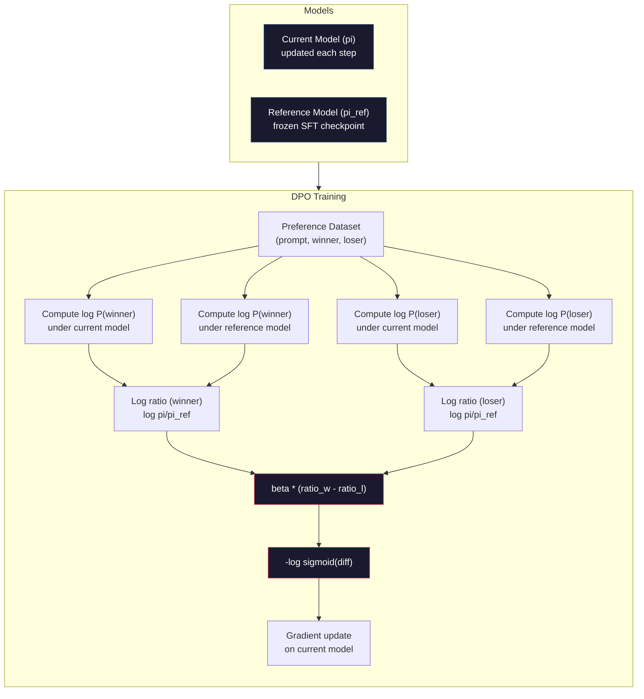

# DPO：直接偏好优化（Direct Preference Optimization）

> RLHF 有效，但它需要训练三个模型（SFT、奖励模型、策略模型），需要处理 PPO 的不稳定性，还要调优 KL 惩罚。DPO 提出了一个问题：如果跳过这一切会怎样？DPO 直接在偏好对上优化语言模型。不需要奖励模型，不需要 PPO，只有一个训练循环，效果却相同。

**类型：** Build
**语言：** Python（使用 numpy）
**前置知识：** Phase 10, Lesson 07（RLHF）
**时间：** ~90 分钟

## 学习目标

- 实现 DPO 训练，直接在没有单独奖励模型的情况下，基于偏好对优化语言模型
- 推导 DPO 损失函数，并解释它如何通过策略模型的对数概率隐式表示奖励模型
- 从训练稳定性、计算成本和所需模型数量等方面对比 DPO 与 RLHF
- 调节 beta 参数，控制训练后的策略模型与参考模型的偏离程度

## 问题背景

你在第 07 课中构建了一个 RLHF 流程。三个阶段，三个模型：SFT 模型、奖励模型，以及使用 PPO 优化的策略模型。仅奖励模型就需要数千对人类偏好对和一个独立的训练循环。PPO 则需要精心调节 KL 系数、学习率、裁剪比例和训练轮数。

在实践中，PPO 训练出了名的不稳定。超参数的微小变化就会导致训练发散。奖励模型是人类偏好的不完美代理，策略模型会找到利用其弱点的方法。KL 惩罚有所帮助，但它本身也需要调节——太低会导致奖励作弊（reward hacking），太高则模型几乎学不到东西。

这种复杂性就是为什么 InstructGPT 发表多年后，大多数开源模型仍在 RLHF 上挣扎。三阶段流程很脆弱，每个阶段都有自己的失效模式，而且错误会累积。

2023 年 5 月，斯坦福大学的 Rafael Rafailov、Archit Sharma 及其同事发表了《Direct Preference Optimization: Your Language Model is Secretly a Reward Model》。核心洞见：你不需要单独的奖励模型。最优奖励函数在数学上由语言模型自身的词元概率决定。你可以完全跳过奖励模型，直接在偏好对上优化语言模型。

DPO 将 RLHF 简化为一个监督学习步骤。一个模型、一个损失函数、一个训练循环，不需要强化学习。Zephyr-7B 是最早大规模使用 DPO 的模型之一，在多个基准测试上达到或超过了使用完整 RLHF 训练的模型。Meta 在 Llama 3 的对齐流程中也使用了 DPO。Anthropic 在其对齐研究中引用了 DPO 风格的方法。

## 核心概念

### 关键洞见

RLHF 优化以下目标：

```
maximize: E[R(x, y)] - beta * KL(pi || pi_ref)
```

其中 R 是奖励模型，pi 是策略模型，pi_ref 是参考模型，beta 是 KL 系数。

DPO 论文证明，这个目标有一个闭式最优解。对于任意奖励函数 R，最优策略为：

```
pi*(y | x) = pi_ref(y | x) * exp(R(x, y) / beta) / Z(x)
```

其中 Z(x) 是归一化常数。整理后：

```
R(x, y) = beta * log(pi*(y | x) / pi_ref(y | x)) + beta * log Z(x)
```

这就是突破点。奖励完全用策略模型的概率和参考模型的概率来表示。你不需要训练单独的奖励模型。奖励隐含在概率比中。

将其代入 Bradley-Terry 偏好模型：

```
P(y_w > y_l | x) = sigmoid(R(x, y_w) - R(x, y_l))
                  = sigmoid(beta * (log pi(y_w|x)/pi_ref(y_w|x) - log pi(y_l|x)/pi_ref(y_l|x)))
```

Z(x) 项会相互抵消，因为两个回答都基于同一个提示 x。剩下的部分仅是策略模型和参考模型在偏好回答与拒绝回答上的对数概率的函数。

### DPO 损失

```
L_DPO = -log(sigmoid(beta * (log pi(y_w|x)/pi_ref(y_w|x) - log pi(y_l|x)/pi_ref(y_l|x))))
```

我们来拆解每个部分：

- **y_w** = 偏好（获胜）回答
- **y_l** = 拒绝（失败）回答
- **x** = 提示
- **pi** = 当前模型（正在训练）
- **pi_ref** = 参考模型（冻结的 SFT 检查点）
- **beta** = 温度参数，控制与参考模型的偏离程度（通常为 0.1 到 0.5）

`log pi(y|x) / pi_ref(y|x)` 是对数概率比。当这个比值为正时，当前模型对回答 y 赋予的概率高于参考模型；为负时则更低。

DPO 损失推动模型增大偏好回答的对数概率比，减小拒绝回答的对数概率比。beta 参数控制模型偏离参考模型的激进程度——较小的 beta 允许较大的偏离，较大的 beta 使模型保持在参考模型附近。



### 为什么 DPO 更简单

| 方面 | RLHF（PPO） | DPO |
|--------|-----------|-----|
| 需要训练的模型 | 3 个（SFT + 奖励模型 + 策略模型） | 1 个（仅策略模型） |
| 训练循环 | 3 个（SFT、奖励模型训练、PPO） | 2 个（SFT、DPO） |
| 超参数 | 学习率、KL 系数、裁剪比例、奖励模型学习率、三轮轮数 | 学习率、beta、轮数 |
| 奖励模型 | 需要（单独训练） | 隐含在模型概率中 |
| 强化学习算法 | PPO（复杂、不稳定） | 监督学习（稳定） |
| GPU 显存 | PPO 期间需加载 3-4 个模型 | 2 个模型（当前模型 + 参考模型） |
| 训练稳定性 | 对超参数敏感 | 稳健，类似于 SFT |

DPO 在训练期间只需要在显存中加载两个模型——当前模型和冻结的参考模型。RLHF 需要三个或四个：策略模型、参考模型、奖励模型，以及可选的价值函数基线。对于 70B 模型，每个副本在 FP16 下占用 140GB。消除奖励模型所带来的显存节省非常可观。

### DPO 胜过 RLHF 的场景

**小型数据集。** 当只有 5,000 到 20,000 对偏好数据时，DPO 通常能达到或超过 RLHF 的效果。RLHF 中的奖励模型需要足够的数据来泛化——数据有限时它会过拟合，产生不可靠的奖励信号。DPO 通过根本不需要奖励模型来绕过这个问题。

**计算资源有限。** DPO 所需计算量约为完整 RLHF 的三分之一（一个训练循环而非三个）。对于没有大型 GPU 集群的团队来说，这是更实际的选择。

**快速迭代。** 想尝试 10 个不同的偏好数据集以找出效果最好的？DPO 让你在数小时内完成每次实验。RLHF 则需要为每个数据集重新训练奖励模型。

### RLHF 胜过 DPO 的场景

**大规模训练。** 在 GPT-4 或 Claude 的规模下，RLHF 的独立奖励模型能够捕捉更细微的偏好信号。奖励模型充当一种可学习的损失函数，能够适应复杂的质量标准。

**复杂奖励信号。** 当“更好”涉及多个维度（有帮助性、无害性、诚实性）时，奖励模型可以学习这种多目标权衡。DPO 将每个偏好对视为一个二值信号——一个更好，一个更差——而不建模为什么更好。

**迭代对齐。** RLHF 流程可以用当前策略生成新回答，让人类评分，然后在在线循环中重新训练奖励模型。DPO 则作用于固定的偏好数据集。Anthropic 的宪法 AI（Constitutional AI）方法大量利用了 RLHF 的这种迭代特性。

### DPO 之外：KTO、ORPO、SimPO

DPO 启发了一系列简化的对齐方法。

**KTO（Kahneman-Tversky Optimization，2024）：** 你甚至不需要成对数据。KTO 使用非成对反馈——只需将每个回答标记为“好”或“坏”，无需与另一个回答比较。这极大地简化了数据收集。不再是给标注者展示两个回答并问“哪个更好？”，而是只展示一个回答并问“这个好吗？” 其损失函数运用了前景理论中的损失厌恶：坏回答受到的惩罚大于好回答获得的奖励。

**ORPO（Odds Ratio Preference Optimization，2024）：** 将 SFT 和对齐合并为单个训练步骤。不是先 SFT 再 DPO，ORPO 修改了 SFT 损失以包含偏好信号。损失由两项组成：偏好回答上的标准下一词元预测损失，以及一个赔率比项，用于增大偏好回答与拒绝回答概率之间的差距。一个训练循环替代两个。

**SimPO（Simple Preference Optimization，2024）：** 完全消除参考模型。SimPO 不再计算相对于冻结参考模型的对数概率比，而是使用回答的平均对数概率（按长度归一化）作为隐式奖励。这节省了显存（不需要参考模型）并简化了训练。长度归一化防止模型偏向更短的回答。

| 方法 | 年份 | 显存中的模型数 | 需要成对数据？ | 需要参考模型？ | 训练循环数 |
|--------|------|-----------------|-------------|-----------------|----------------|
| RLHF | 2022 | 3-4 | 是（用于奖励模型） | 是 | 3 |
| DPO | 2023 | 2 | 是 | 是 | 2 |
| KTO | 2024 | 2 | 否（非成对） | 是 | 2 |
| ORPO | 2024 | 1 | 是 | 否 | 1 |
| SimPO | 2024 | 1 | 是 | 否 | 1 |

趋势很明显：每种方法都消除了一个复杂度来源。RLHF 需要奖励模型和 PPO。DPO 消除了两者。KTO 消除了成对数据。ORPO 消除了单独的 SFT 阶段。SimPO 消除了参考模型。对齐税（alignment tax）—— 从基础模型到对齐模型所需的计算和复杂度成本 —— 持续下降。

### 真实 DPO 部署案例

**Zephyr-7B（HuggingFace，2023 年 10 月）：** 基于 Mistral 7B，在 UltraChat（200K 样本）上进行 SFT，然后在 UltraFeedback（60K 偏好对）上进行 DPO。MT-Bench 得分 6.47 —— 当时最高的 7B 模型。作为对比，Llama 2 Chat 70B 得分 6.86，意味着 Zephyr 仅凭 DPO 对齐，就达到了体积 10 倍于它的模型的 6% 以内。

**Llama 3（Meta，2024 年 4 月）：** 在初始 RLHF 阶段后使用了 DPO。这表明 DPO 和 RLHF 可以是互补的 —— RLHF 用于广泛对齐，DPO 用于针对性微调。

**Neural Magic / nm-chat（2024）：** 将 DPO 应用于多个开源模型，在多个对齐基准测试上持续比仅 SFT 的基线提升 5-15%。

## 动手实现

### 步骤 1：偏好数据集

格式与 RLHF 相同 —— （prompt, preferred, rejected）三元组。DPO 直接消费这些数据，无需中间的奖励模型。

```python
import numpy as np
import sys
import os
sys.path.insert(0, os.path.join(os.path.dirname(__file__), "..", "..", "04-pre-training-mini-gpt", "code"))
from main import MiniGPT, LayerNorm, Embedding, TransformerBlock

PREFERENCE_DATA = [
    {
        "prompt": "What is the capital of France?",
        "preferred": "The capital of France is Paris.",
        "rejected": "France is a country in Europe. It has many cities. The capital is Paris. Paris is known for the Eiffel Tower.",
    },
    {
        "prompt": "Explain gravity in one sentence.",
        "preferred": "Gravity is the force that attracts objects with mass toward each other.",
        "rejected": "Gravity is something that makes things fall down when you drop them.",
    },
    {
        "prompt": "What is 15 times 7?",
        "preferred": "15 times 7 is 105.",
        "rejected": "Let me think about this. 15 times 7. Well, 10 times 7 is 70, and 5 times 7 is 35, so the answer might be around 105.",
    },
    {
        "prompt": "Name three programming languages.",
        "preferred": "Python, Rust, and TypeScript.",
        "rejected": "There are many programming languages. Some popular ones include various languages like Python and others.",
    },
    {
        "prompt": "What year did World War II end?",
        "preferred": "World War II ended in 1945.",
        "rejected": "World War II was a major global conflict. It involved many countries. The war ended in the mid-1940s, specifically in 1945.",
    },
    {
        "prompt": "Define machine learning.",
        "preferred": "Machine learning is a field where algorithms learn patterns from data to make predictions without being explicitly programmed.",
        "rejected": "Machine learning is a type of AI. AI stands for artificial intelligence. Machine learning uses data to learn.",
    },
]
```

### 步骤 2：序列对数概率

DPO 损失需要计算给定提示下回答的总对数概率。这意味着将模型运行在完整的（prompt + response）序列上，并对每个回答词元的对数概率求和。

```python
def tokenize_sequence(text, vocab_size=256):
    return [min(t, vocab_size - 1) for t in list(text.encode("utf-8"))]


def compute_sequence_log_prob(model, prompt_tokens, response_tokens, max_seq_len=128):
    full_sequence = prompt_tokens + response_tokens
    if len(full_sequence) > max_seq_len:
        full_sequence = full_sequence[:max_seq_len]

    if len(full_sequence) < 2:
        return 0.0

    input_ids = np.array(full_sequence[:-1]).reshape(1, -1)
    target_ids = np.array(full_sequence[1:])

    logits = model.forward(input_ids)
    logits = logits[0]

    max_logits = logits.max(axis=-1, keepdims=True)
    log_probs = logits - max_logits - np.log(
        np.exp(logits - max_logits).sum(axis=-1, keepdims=True)
    )

    prompt_len = len(prompt_tokens)
    response_start = max(0, prompt_len - 1)
    response_end = len(target_ids)

    if response_start >= response_end:
        return 0.0

    response_log_probs = log_probs[response_start:response_end, :]
    response_targets = target_ids[response_start:response_end]

    total_log_prob = 0.0
    for i, target in enumerate(response_targets):
        total_log_prob += response_log_probs[i, target]

    return total_log_prob
```

这个函数是 DPO 的主力。对于每个偏好对，它运行四次：当前模型在偏好回答上、当前模型在拒绝回答上、参考模型在偏好回答上、参考模型在拒绝回答上。每个训练样本需要 4 次前向传播，而 RLHF 需要生成 + 奖励评分 + 价值估计 + PPO 更新。更简单、更快、更稳定。

### 步骤 3：DPO 损失

论文核心，代码实现。一个函数，一个损失，没有奖励模型。

```python
def sigmoid(x):
    return np.where(
        x >= 0,
        1.0 / (1.0 + np.exp(-x)),
        np.exp(x) / (1.0 + np.exp(x))
    )


def dpo_loss(policy_logprob_preferred, policy_logprob_rejected,
             ref_logprob_preferred, ref_logprob_rejected, beta=0.1):
    preferred_ratio = policy_logprob_preferred - ref_logprob_preferred
    rejected_ratio = policy_logprob_rejected - ref_logprob_rejected

    logit = beta * (preferred_ratio - rejected_ratio)

    loss = -np.log(sigmoid(logit) + 1e-8)

    preferred_reward = beta * preferred_ratio
    rejected_reward = beta * rejected_ratio

    return loss, {
        "preferred_ratio": float(preferred_ratio),
        "rejected_ratio": float(rejected_ratio),
        "logit": float(logit),
        "implicit_preferred_reward": float(preferred_reward),
        "implicit_rejected_reward": float(rejected_reward),
        "reward_margin": float(preferred_reward - rejected_reward),
    }
```

`preferred_ratio` 和 `rejected_ratio` 来自 DPO 推导的对数概率比。当当前模型相对于参考模型赋予偏好回答更高概率、赋予拒绝回答更低概率时，logit 为正，损失较低。训练信号正是推动模型朝这个方向变化。

`implicit_preferred_reward` 和 `implicit_rejected_reward` 是 DPO 损失隐式分配的奖励。你可以提取它们来验证训练是否有效 —— 偏好回答与拒绝回答之间的奖励间隔应随训练逐渐增大。

### 步骤 4：DPO 训练循环

一个标准的监督训练循环。没有 PPO，没有奖励模型，只有前向传播和梯度更新。

```python
def copy_model_weights(source, target):
    target.embedding.token_embed = source.embedding.token_embed.copy()
    target.embedding.pos_embed = source.embedding.pos_embed.copy()
    target.ln_f.gamma = source.ln_f.gamma.copy()
    target.ln_f.beta = source.ln_f.beta.copy()
    for s_block, t_block in zip(source.blocks, target.blocks):
        t_block.attn.W_q = s_block.attn.W_q.copy()
        t_block.attn.W_k = s_block.attn.W_k.copy()
        t_block.attn.W_v = s_block.attn.W_v.copy()
        t_block.attn.W_out = s_block.attn.W_out.copy()
        t_block.ffn.W1 = s_block.ffn.W1.copy()
        t_block.ffn.W2 = s_block.ffn.W2.copy()
        t_block.ffn.b1 = s_block.ffn.b1.copy()
        t_block.ffn.b2 = s_block.ffn.b2.copy()
        t_block.ln1.gamma = s_block.ln1.gamma.copy()
        t_block.ln1.beta = s_block.ln1.beta.copy()
        t_block.ln2.gamma = s_block.ln2.gamma.copy()
        t_block.ln2.beta = s_block.ln2.beta.copy()


def dpo_train(policy_model, reference_model, preference_data,
              num_epochs=5, lr=5e-6, beta=0.1, max_seq_len=128):
    print(f"DPO Training: {len(preference_data)} pairs, {num_epochs} epochs, "
          f"lr={lr}, beta={beta}")
    print()

    losses = []
    margins = []

    for epoch in range(num_epochs):
        epoch_loss = 0.0
        epoch_margin = 0.0
        num_examples = 0

        indices = np.random.permutation(len(preference_data))

        for idx in indices:
            pair = preference_data[idx]

            prompt_tokens = tokenize_sequence(pair["prompt"])
            preferred_tokens = tokenize_sequence(pair["preferred"])
            rejected_tokens = tokenize_sequence(pair["rejected"])

            pi_logprob_w = compute_sequence_log_prob(
                policy_model, prompt_tokens, preferred_tokens, max_seq_len
            )
            pi_logprob_l = compute_sequence_log_prob(
                policy_model, prompt_tokens, rejected_tokens, max_seq_len
            )
            ref_logprob_w = compute_sequence_log_prob(
                reference_model, prompt_tokens, preferred_tokens, max_seq_len
            )
            ref_logprob_l = compute_sequence_log_prob(
                reference_model, prompt_tokens, rejected_tokens, max_seq_len
            )

            loss, metrics = dpo_loss(
                pi_logprob_w, pi_logprob_l,
                ref_logprob_w, ref_logprob_l, beta
            )

            update_direction = 1.0 if metrics["logit"] < 0 else -0.1
            for block in policy_model.blocks:
                block.ffn.W1 += lr * update_direction * np.random.randn(*block.ffn.W1.shape) * 0.01
                block.ffn.W2 += lr * update_direction * np.random.randn(*block.ffn.W2.shape) * 0.01

            epoch_loss += loss
            epoch_margin += metrics["reward_margin"]
            num_examples += 1
            losses.append(float(loss))
            margins.append(metrics["reward_margin"])

        avg_loss = epoch_loss / max(num_examples, 1)
        avg_margin = epoch_margin / max(num_examples, 1)

        print(f"  Epoch {epoch + 1}/{num_epochs} | Loss: {avg_loss:.4f} | "
              f"Avg Margin: {avg_margin:.4f}")

    return policy_model, losses, margins
```

与 RLHF 相比，这个训练循环令人耳目一新地简单。对于每个偏好对：计算四个对数概率（两个模型、两个回答），代入 DPO 损失，计算梯度，更新策略模型。没有生成步骤，没有奖励模型推理，没有优势估计，没有裁剪。

### 步骤 5：对比 DPO 与 RLHF

测量隐式奖励间隔和对数概率偏移，将 DPO 与第 07 课的 RLHF 模型进行比较。

```python
def evaluate_preference_accuracy(model, reference_model, preference_data, beta=0.1, max_seq_len=128):
    correct = 0
    total = 0

    for pair in preference_data:
        prompt_tokens = tokenize_sequence(pair["prompt"])
        preferred_tokens = tokenize_sequence(pair["preferred"])
        rejected_tokens = tokenize_sequence(pair["rejected"])

        pi_w = compute_sequence_log_prob(model, prompt_tokens, preferred_tokens, max_seq_len)
        pi_l = compute_sequence_log_prob(model, prompt_tokens, rejected_tokens, max_seq_len)
        ref_w = compute_sequence_log_prob(reference_model, prompt_tokens, preferred_tokens, max_seq_len)
        ref_l = compute_sequence_log_prob(reference_model, prompt_tokens, rejected_tokens, max_seq_len)

        preferred_reward = beta * (pi_w - ref_w)
        rejected_reward = beta * (pi_l - ref_l)

        if preferred_reward > rejected_reward:
            correct += 1
        total += 1

    return correct / max(total, 1)


def analyze_implicit_rewards(model, reference_model, preference_data, beta=0.1, max_seq_len=128):
    print("Implicit Reward Analysis:")
    print("-" * 65)
    print(f"  {'Prompt':<30} {'Pref Reward':>12} {'Rej Reward':>12} {'Margin':>10}")
    print("  " + "-" * 60)

    for pair in preference_data:
        prompt_tokens = tokenize_sequence(pair["prompt"])
        preferred_tokens = tokenize_sequence(pair["preferred"])
        rejected_tokens = tokenize_sequence(pair["rejected"])

        pi_w = compute_sequence_log_prob(model, prompt_tokens, preferred_tokens, max_seq_len)
        pi_l = compute_sequence_log_prob(model, prompt_tokens, rejected_tokens, max_seq_len)
        ref_w = compute_sequence_log_prob(reference_model, prompt_tokens, preferred_tokens, max_seq_len)
        ref_l = compute_sequence_log_prob(reference_model, prompt_tokens, rejected_tokens, max_seq_len)

        pref_reward = beta * (pi_w - ref_w)
        rej_reward = beta * (pi_l - ref_l)
        margin = pref_reward - rej_reward

        truncated = pair["prompt"][:28] + ".." if len(pair["prompt"]) > 30 else pair["prompt"]
        print(f"  {truncated:<30} {pref_reward:>12.4f} {rej_reward:>12.4f} {margin:>10.4f}")

    print()
```

### 步骤 6：Beta 敏感性分析

beta 参数相当于 RLHF 中的 KL 系数。它控制模型偏离参考模型的程度。这个实验展示了它的效果。

```python
def beta_sensitivity_analysis(sft_model, preference_data, betas, max_seq_len=128):
    print("Beta Sensitivity Analysis")
    print("-" * 60)
    print(f"  {'Beta':>8} {'Final Loss':>12} {'Final Margin':>14} {'Accuracy':>10}")
    print("  " + "-" * 55)

    results = []

    for beta in betas:
        policy = MiniGPT(
            vocab_size=256, embed_dim=128, num_heads=4,
            num_layers=4, max_seq_len=max_seq_len, ff_dim=512
        )
        reference = MiniGPT(
            vocab_size=256, embed_dim=128, num_heads=4,
            num_layers=4, max_seq_len=max_seq_len, ff_dim=512
        )
        copy_model_weights(sft_model, policy)
        copy_model_weights(sft_model, reference)

        policy, losses, margins_list = dpo_train(
            policy, reference, preference_data,
            num_epochs=3, lr=5e-6, beta=beta, max_seq_len=max_seq_len
        )

        accuracy = evaluate_preference_accuracy(
            policy, reference, preference_data, beta, max_seq_len
        )

        final_loss = losses[-1] if losses else 0
        final_margin = margins_list[-1] if margins_list else 0

        print(f"  {beta:>8.3f} {final_loss:>12.4f} {final_margin:>14.4f} {accuracy:>10.1%}")
        results.append({
            "beta": beta,
            "final_loss": final_loss,
            "final_margin": final_margin,
            "accuracy": accuracy,
        })

        print()

    return results
```

小的 beta（0.01）让模型自由偏离参考模型 —— 学习快但有退化解的风险。大的 beta（1.0）使模型保持在参考模型附近 —— 稳定但学习慢。大多数应用的最佳点在 0.1 到 0.3 之间。

## 使用它

### 完整 DPO 流程演示

```python
if __name__ == "__main__":
    np.random.seed(42)

    print("=" * 70)
    print("DPO: DIRECT PREFERENCE OPTIMIZATION")
    print("=" * 70)
    print()

    print("STEP 1: Initialize SFT Model (from Lesson 06)")
    print("-" * 50)
    sft_model = MiniGPT(
        vocab_size=256, embed_dim=128, num_heads=4,
        num_layers=4, max_seq_len=128, ff_dim=512
    )
    print(f"  Parameters: {sft_model.count_parameters():,}")
    print()

    print("STEP 2: DPO Training")
    print("-" * 50)

    policy_model = MiniGPT(
        vocab_size=256, embed_dim=128, num_heads=4,
        num_layers=4, max_seq_len=128, ff_dim=512
    )
    reference_model = MiniGPT(
        vocab_size=256, embed_dim=128, num_heads=4,
        num_layers=4, max_seq_len=128, ff_dim=512
    )
    copy_model_weights(sft_model, policy_model)
    copy_model_weights(sft_model, reference_model)

    policy_model, losses, margins = dpo_train(
        policy_model, reference_model, PREFERENCE_DATA,
        num_epochs=5, lr=5e-6, beta=0.1
    )
    print()

    print("=" * 70)
    print("STEP 3: Evaluate")
    print("=" * 70)
    print()

    pre_accuracy = evaluate_preference_accuracy(
        sft_model, reference_model, PREFERENCE_DATA, beta=0.1
    )
    post_accuracy = evaluate_preference_accuracy(
        policy_model, reference_model, PREFERENCE_DATA, beta=0.1
    )

    print(f"  Preference accuracy (pre-DPO):  {pre_accuracy:.1%}")
    print(f"  Preference accuracy (post-DPO): {post_accuracy:.1%}")
    print()

    analyze_implicit_rewards(policy_model, reference_model, PREFERENCE_DATA, beta=0.1)

    print("=" * 70)
    print("STEP 4: Training Dynamics")
    print("=" * 70)
    print()

    if losses:
        print("  Loss curve:")
        window = max(1, len(losses) // 5)
        for i in range(0, len(losses), window):
            chunk = losses[i:i + window]
            avg = sum(chunk) / len(chunk)
            print(f"    Steps {i:3d}-{i + len(chunk) - 1:3d}: loss = {avg:.4f}")
        print()

    if margins:
        print("  Reward margin curve:")
        window = max(1, len(margins) // 5)
        for i in range(0, len(margins), window):
            chunk = margins[i:i + window]
            avg = sum(chunk) / len(chunk)
            print(f"    Steps {i:3d}-{i + len(chunk) - 1:3d}: margin = {avg:.4f}")
        print()

    print("=" * 70)
    print("STEP 5: Beta Sensitivity")
    print("=" * 70)
    print()

    beta_results = beta_sensitivity_analysis(
        sft_model, PREFERENCE_DATA, betas=[0.01, 0.1, 0.3, 1.0]
    )

    print("=" * 70)
    print("DPO vs RLHF COMPARISON")
    print("=" * 70)
    print()
    print("  DPO advantages:")
    print("    - 1 training loop (vs 3 for RLHF)")
    print("    - 2 models in memory (vs 3-4 for RLHF)")
    print("    - Supervised learning (vs RL, more stable)")
    print("    - No reward model to train or maintain")
    print()
    print("  RLHF advantages:")
    print("    - Separate reward model captures complex preferences")
    print("    - Online learning: generate, rate, retrain")
    print("    - Better for multi-objective alignment")
    print("    - Proven at largest scales (GPT-4, Claude)")
    print()
    print("  Practical guidance:")
    print("    - Start with DPO. It's simpler and often sufficient.")
    print("    - Switch to RLHF if DPO plateaus on your eval metrics.")
    print("    - Many production systems use both: RLHF first, DPO to refine.")
```

## 交付物

本课生成 `outputs/prompt-alignment-method-selector.md` —— 一个帮助你根据用例选择合适的对齐方法（SFT、RLHF、DPO、KTO、ORPO、SimPO）的提示词。根据你的数据可用性、计算预算和对齐目标，它会推荐一种方法及训练计划。

## 练习题

1. 实现 KTO（Kahneman-Tversky Optimization）。KTO 不需要成对数据 —— 只需将每个回答标记为“好”或“坏”。好回答的损失为 `-log(sigmoid(beta * log_ratio))`，坏回答的损失为 `-log(1 - sigmoid(beta * log_ratio))`，并对坏回答的损失乘以损失厌恶系数（通常为 1.5 倍）。在相同数据上训练（将偏好回答独立地视为“好”，拒绝回答独立地视为“坏”），并与 DPO 的准确率进行对比。

2. 实现长度归一化的 DPO。不使用原始对数概率，而是除以回答词元数量：`normalized_logprob = total_logprob / num_tokens`。这可以防止模型偏向更短的回答（因为短回答的总对数概率更高）。比较使用与不使用归一化时的隐式奖励间隔。

3. 构建一个 ORPO 风格的联合损失。在 DPO 损失上加上偏好回答上的标准下一词元预测损失：`L = L_sft(preferred) + alpha * L_dpo`。尝试 alpha 取 0.1、0.5 和 1.0。联合损失应使模型既能遵循指令（来自 SFT 项），又能偏好更好的回答（来自 DPO 项），从而无需单独的 SFT 阶段。

4. 实现迭代 DPO。先用 DPO 训练 3 个轮次，然后从训练好的模型生成新回答，将它们与原始偏好回答组成新的偏好对，再次运行 DPO。进行两轮这种“自对弈”过程。比较第一轮和第二轮后的偏好准确率，看看迭代微调是否有帮助。

5. 比较使用不同参考模型的 DPO。除了使用 SFT 检查点作为参考模型，还可以尝试：(a) 基础模型（SFT 前），(b) DPO 第 1 个轮次结束时的检查点，(c) 策略模型的指数移动平均。报告哪种参考模型产生最高的偏好准确率以及最稳定的训练曲线。

## 关键术语

| 术语 | 人们的说法 | 实际含义 |
|------|----------------|----------------------|
| DPO | “没有 RL 的 RLHF” | 直接偏好优化（Direct Preference Optimization）：一种监督学习算法，直接在偏好对上优化语言模型，绕过奖励模型和 PPO |
| 隐式奖励（Implicit reward） | “奖励在模型里” | 奖励函数由策略模型与参考模型之间的对数概率比决定 —— 不需要单独的奖励模型 |
| Beta（DPO） | “温度参数” | 控制策略模型偏离参考模型的程度 —— 小的 beta 允许大的偏离，大的 beta 使模型保持接近 |
| 对数概率比（Log-probability ratio） | “模型变化了多少” | log pi(y\|x) - log pi_ref(y\|x) —— 正值表示当前模型比参考模型赋予更高的概率 |
| 参考模型（Reference model） | “冻结的检查点” | SFT 模型的一份副本，权重永不改变 —— 作为计算概率比的锚点 |
| KTO | “不需要成对数据的 DPO” | Kahneman-Tversky Optimization：使用非成对的“好”或“坏”标签，而不需要偏好对 |
| ORPO | “一步对齐” | Odds Ratio Preference Optimization：通过在对 SFT 损失中添加偏好项，将 SFT 和对齐合并为单个训练循环 |
| SimPO | “不需要参考模型” | Simple Preference Optimization：通过使用长度归一化的平均对数概率作为隐式奖励，完全消除参考模型 |
| 对齐税（Alignment tax） | “让模型变安全的代价” | 从基础模型到对齐模型所需的额外计算、数据和复杂度 —— DPO 显著降低了这一成本 |

## 延伸阅读

- [Rafailov et al., 2023 -- "Direct Preference Optimization: Your Language Model is Secretly a Reward Model"](https://arxiv.org/abs/2305.18290) —— 将 RLHF 简化为监督学习的 DPO 论文
- [Tunstall et al., 2023 -- "Zephyr: Direct Distillation of LM Alignment"](https://arxiv.org/abs/2310.16944) —— Zephyr-7B，展示 UltraFeedback 上的 DPO 可达到与 RLHF 相当的基准表现
- [Ethayarajh et al., 2024 -- "KTO: Model Alignment as Prospect Theoretic Optimization"](https://arxiv.org/abs/2402.01306) —— eliminating the need for paired preferences
- [Hong et al., 2024 -- "ORPO: Monolithic Preference Optimization without Reference Model"](https://arxiv.org/abs/2403.07691) —— 将 SFT 和对齐合并为一步
- [Meng et al., 2024 -- "SimPO: Simple Preference Optimization with a Reference-Free Reward"](https://arxiv.org/abs/2405.14734) —— 完全消除参考模型
- [Llama 3 Technical Report](https://arxiv.org/abs/2407.21783) —— Meta 结合 RLHF 与 DPO 的对齐流程
