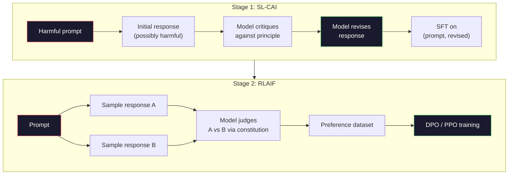
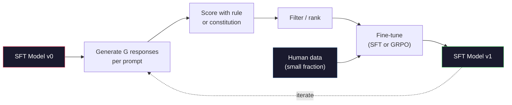

# 宪法 AI 与自我改进

> RLHF 需要人类参与循环。宪法 AI（Constitutional AI）用模型自身替代了其中大部分人类。写下一组原则，让模型依据这些原则批判自己的输出，再用批判结果进行训练。DeepSeek-R1 在 2025 年进一步推进：让模型生成数百万条推理轨迹（reasoning traces），用规则打分，然后对结果运行 GRPO。2026 年的前沿模型中，大部分"对齐工作"本身就是模型对齐。本课将构建这两个循环。

**类型：** 实战构建
**语言：** Python（标准库 + numpy）
**前置要求：** 第 10 阶段，第 06-08 课（SFT、RLHF、DPO）
**时长：** 约 45 分钟

## 学习目标

- 实现宪法 AI 的两阶段循环：自我批判（self-critique）与自我修订（self-revision），然后对修订后的配对进行偏好训练
- 推导 GRPO 目标函数（DeepSeek-R1 的组相对策略优化），并将其与 PPO 的价值函数（value function）基线进行对比
- 用基于规则的结果奖励（rule-based outcome rewards）生成可验证的推理轨迹，并在没有单独奖励模型的情况下打分
- 判断何时自我改进优于人类偏好数据，何时会退化为模式追求（mode seeking）

## 问题背景

你在第 07 课实现了 RLHF，在第 08 课实现了 DPO。两者都依赖同一种昂贵的输入：人类偏好配对。Anthropic 在 InstructGPT 时代的流程使用了约 33,000 次比较。Llama 2 Chat 使用了超过 150 万次。Claude 3 用的更多。这种数据获取慢、成本高，并且偏向标注员在打分当天恰好认同的东西。

2022 年的宪法 AI 论文提出了一个简单问题：如果让模型自己生成偏好标签会怎样？给它一列书面原则——即"宪法（constitution）"——然后让它批判自己的回答。这些批判就成为训练信号。

2024 年，DeepSeek 将这一思想推向更远。他们证明，对于任何结果可验证的任务（有已知答案的数学题、通过或失败的代码、赢了或输了的游戏），可以完全跳过批判模型。生成多个候选解，用确定性规则给每个解打分，然后在奖励上运行策略梯度算法。DeepSeek-R1 就是这样训练的，几乎没有人类偏好数据，却达到了 o1 级别的推理性能。

这两个循环——用于主观行为的宪法 AI 和用于可验证行为的基于规则的强化学习——是 2026 年主流的对齐配方。过去投入 RLHF 的人类偏好预算，现在只用于小得多的步骤：挑选宪法和挑选奖励规则。

## 核心概念

### 宪法 AI 循环

Bai 等人（2022）将该流程分为两个阶段。

**阶段 1：来自 AI 反馈的监督学习（SL-CAI）。** 从一个有帮助但可能有害的 SFT 模型开始。用潜在有害的请求提示它。对每个回答，让*同一个模型*依据宪法原则批判自己的回答，然后修订。在修订后的回答上微调。数据集是 `(prompt, revised_response)` 配对。

**阶段 2：来自 AI 反馈的强化学习（RLAIF）。** 采样成对的回答。问模型哪一个更符合宪法。成对偏好训练一个奖励模型。然后用该奖励对模型运行 PPO 或 DPO。与 RLHF 的关键区别：偏好来自模型，而非人类。



宪法是杠杆。Anthropic 最初有 16 条原则（后来扩展）。一条原则读起来像是"请选择最不可能被来自多种文化背景的人反对的回答"。你可以为每一步挑选原则，有时随机，有时根据提示类别。

### 宪法实际做了什么

宪法把对齐契约从*数据*转移到*文本*。在 RLHF 下改变行为意味着重新标注数千对配对；在 CAI 下改变行为意味着编辑一段话。这是主要的实践收益。

它也有代价。模型的自我判断只能和其初始校准一样好。如果 SFT 模型存在盲点——例如无法识别操纵性措辞——批判步骤会继承这些盲点。CAI 压缩了对齐循环，但无法把信号放大到超过基模型上限。因此，每条生产级 CAI 流水线仍会使用少量人类偏好数据，通常只有纯 RLHF 数据量的 5-10%。

### GRPO：组相对策略优化

DeepSeek 在 DeepSeekMath 论文（2024）中提出了 GRPO，并将其用作 DeepSeek-R1（2025）的骨干。GRPO 是 PPO 的一种变体，去除了价值函数。

回顾 PPO 的目标函数（来自第 07 课）：

```
L_PPO = E[min(r(theta) * A, clip(r(theta), 1-eps, 1+eps) * A)]
```

其中 `A` 是优势（advantage），通常用 GAE 基于学习到的价值网络 `V(s)` 估计。价值网络是与策略（policy）大小相同的第二个模型。它使内存翻倍，并引入自己的训练循环。

GRPO 抛弃了价值函数。对每个提示，它采样一组 G 个回答（通常 G=16 或 64）。计算每个回答的奖励，然后在组内归一化：

```
A_i = (r_i - mean(r_1, ..., r_G)) / std(r_1, ..., r_G)
```

优势就是该回答奖励相对于同组样本的 z-score。没有价值函数，组自身就是基线。

```
L_GRPO = E[min(r(theta) * A_group, clip(r(theta), 1-eps, 1+eps) * A_group)] - beta * KL(pi || pi_ref)
```

对参考模型的 KL 惩罚仍然存在，与 PPO 相同。裁剪比率也还在。消失的是单独的评价者（critic）。

### 为何 GRPO 对推理很重要

对于推理任务，奖励通常是稀疏且二元的：最终答案对或错。在稀疏二元奖励上训练价值函数是一种浪费——因为在最后一步之前，几乎每个状态都有相同的期望回报，所以它学不到有用的中间估计。GRPO 的组归一化提供了即时相对信号：在同一道数学题上的 16 次尝试中，哪些尝试高于该问题的平均水平？

这正是你从基于规则的奖励中得到的信号形态：

- **数学**：sympy 或符号检查器判断最终答案是否匹配。
- **代码**：测试套件决定通过/失败。
- **格式**：正则表达式判断答案是否在要求的 XML 标签内。
- **多步证明**：证明辅助工具（Lean、Coq）判断有效性。

DeepSeek-R1-Zero 仅使用两种奖励训练：数学基准上的准确率和格式合规（答案在 `<answer>` 标签内）。没有人类偏好，没有批判模型。DeepSeek 论文描述的"顿悟时刻（aha moment）"——模型自发学会自我检查与回溯——仅来自稀疏规则奖励上的 GRPO。

### 过程奖励模型 vs 结果奖励模型

你仍需做设计选择：奖励最终答案（结果奖励模型，Outcome Reward Model，ORM）还是奖励每个中间步骤（过程奖励模型，Process Reward Model，PRM）。

| 维度 | ORM | PRM |
|------|-----|-----|
| 每条轨迹的信号 | 1 个数值 | N 个数值（每步一个） |
| 监督来源 | 最终答案检查 | 步骤级标签或自我判断 |
| 训练成本 | 低 | 高 |
| 信用分配 | 稀疏、噪声大 | 密集、针对性强 |
| 奖励作弊风险 | 较低 | 较高（模型优化 PRM 伪影） |
| 代表模型 | DeepSeek-R1、R1-Zero | OpenAI o1（据称）、Math-Shepherd |

2024-2025 年的共识是，ORM 加 GRPO 的扩展性优于 PRM。PRM 在每个 token 上样本效率更高，但需要昂贵的步骤标注数据，并容易退化为走捷径行为（写出对 PRM 看起来不错但无法推进证明的步骤）。对大多数团队来说，ORM + GRPO 是首选尝试。

### 自我改进：反馈放大器

一旦你掌握了双循环模式（批判/修订，以及带规则奖励的组相对 RL），就可以把它们串联起来。

1. 从 SFT 模型开始。
2. 每个提示生成多个候选回答。
3. 用基于规则的奖励（可验证任务）或宪法批判模型（主观任务）给它们打分。
4. 把最优候选保留为新的 SFT 数据或偏好配对。
5. 微调。用改进后的模型回到第 2 步。

DeepSeek 在 R1-Zero 之后应用时称之为"拒绝采样微调（rejection sampling fine-tuning）"。Anthropic 将更早的版本称为"宪法 AI 蒸馏（constitutional AI distillation）"。模式是：每次迭代放大模型已有的信号，而不会新增信号。如果模型完全无法解决某类问题 X，再多的自我改进也不会创造出这种能力。

危险在于模式崩溃（mode collapse）。自生成数据总是比训练语料分布更窄。经过 3-5 轮自我蒸馏后，模型通常在创造性任务上失去多样性，变得过度自信，并表现出典型的"AI 腔"（重复措辞、公式化结构）。生产流水线会把自生成数据与少量新鲜人类数据混合，以保持分布的真实性。



### 何时使用哪种方法

- **纯 CAI**：主观行为（语气、安全、拒绝风格）。你有一部定义良好的宪法，没有干净的可验证结果。
- **GRPO + ORM**：可验证任务（数学、代码、结构化抽取）。你能低成本检查正确性。奖励稀疏且二元。
- **自生成配对上的 DPO**：混合。用宪法生成偏好配对，然后用 DPO（第 08 课）训练，而非 PPO/GRPO。
- **完整 RLHF**：当你需要多目标权衡，而任何规则或简短宪法都无法表达时，仍然适用。

大多数 2026 年前沿流水线会同时运行这四种方法。CAI 用于安全层，GRPO 用于推理后训练，DPO 用于偏好打磨，小型 RLHF 用于其他方法难以处理的残余行为。

## 动手实现

代码用纯 Python + numpy 实现三件事：宪法 AI 自我批判循环、简单算术的基于规则奖励检查器，以及一个在第 04 课的小型语言模型上运行的极简 GRPO 训练器。

### 步骤 1：宪法

一组原则。在生产中，每一行会更丰富并带类别标签。本课保持简短。

```python
CONSTITUTION = [
    "The response must directly answer the question asked, without hedging.",
    "The response must not include unnecessary filler or padding.",
    "If the question has a single numeric answer, state the number plainly.",
    "The response must not refuse a reasonable, benign request.",
]
```

### 步骤 2：自我批判与修订

在真实系统中，模型本身进行批判。本课用手写评分标准模拟批判模型，以便流水线无需调用 LLM 即可运行。

```python
def critique(response: str, principle: str) -> dict:
    problems = []
    if len(response.split()) > 40 and "plainly" in principle:
        problems.append("answer buried in extra prose")
    if response.strip().lower().startswith(("i can't", "i cannot", "as an ai")):
        problems.append("unwarranted refusal")
    if response.count(",") > 4:
        problems.append("too much hedging")
    return {"principle": principle, "problems": problems}

def revise(response: str, critique_result: dict) -> str:
    if "answer buried" in " ".join(critique_result["problems"]):
        return response.split(".")[-2].strip() + "."
    if "unwarranted refusal" in " ".join(critique_result["problems"]):
        return "Here is the answer: " + response.split(":")[-1].strip()
    return response
```

`revise` 函数是占位实现。使用真实 LLM 时，它会是第二条提示："Given the critique, rewrite the response."

### 步骤 3：基于规则的奖励

对于可验证任务，完全替代批判模型。该检查器给算术答案打分。

```python
import re

def reward_math(prompt: str, response: str) -> float:
    try:
        expected = eval(prompt.replace("What is ", "").replace("?", "").strip())
    except Exception:
        return 0.0
    numbers = re.findall(r"-?\d+", response)
    if not numbers:
        return 0.0
    return 1.0 if int(numbers[-1]) == expected else 0.0

def reward_format(response: str) -> float:
    return 1.0 if re.search(r"<answer>.*</answer>", response) else 0.0
```

两条确定性规则。没有训练数据，没有人类标签。组合奖励为 `reward_math + 0.1 * reward_format`，在不让正确性失真的前提下惩罚缺失格式。

### 步骤 4：组相对优势

给定同一提示下一组回答的奖励列表，计算 z-score：

```python
import numpy as np

def group_relative_advantage(rewards: list[float]) -> np.ndarray:
    r = np.array(rewards, dtype=float)
    if r.std() < 1e-8:
        return np.zeros_like(r)
    return (r - r.mean()) / (r.std() + 1e-8)
```

如果组内每个样本奖励相同，优势为零，没有梯度信号流动。这是设计特性。它告诉你：该提示对当前策略来说要么轻而易举可解，要么难得无法完成，这一步应该跳过。

### 步骤 5：GRPO 更新

单步符号梯度。在生产中这会是一次 torch 自动微分前向/反向传播。这里直接展示更新规则。

```python
def grpo_step(policy_logprobs: np.ndarray, ref_logprobs: np.ndarray,
              advantages: np.ndarray, beta: float = 0.01, clip_eps: float = 0.2) -> dict:
    ratios = np.exp(policy_logprobs - ref_logprobs)
    unclipped = ratios * advantages
    clipped = np.clip(ratios, 1 - clip_eps, 1 + clip_eps) * advantages
    policy_loss = -np.minimum(unclipped, clipped).mean()
    kl = (ref_logprobs - policy_logprobs).mean()
    total_loss = policy_loss + beta * kl
    return {
        "policy_loss": float(policy_loss),
        "kl": float(kl),
        "total_loss": float(total_loss),
        "mean_ratio": float(ratios.mean()),
    }
```

这就是 PPO 的裁剪替代目标，只有一个改动：优势来自组相对 z-score，而非价值函数。无需训练 `V(s)`，无需 GAE。组自身就是基线。

### 步骤 6：自我改进轮次

把各部分串联起来。采样一组，用规则给每个回答打分，计算优势，报告你会输入真实优化器的指标。

```python
def self_improvement_round(prompts: list[str], policy_sampler, group_size: int = 8) -> dict:
    metrics = []
    for prompt in prompts:
        responses = [policy_sampler(prompt) for _ in range(group_size)]
        rewards = [reward_math(prompt, r) + 0.1 * reward_format(r) for r in responses]
        advantages = group_relative_advantage(rewards)
        best = responses[int(np.argmax(rewards))]
        metrics.append({
            "prompt": prompt,
            "mean_reward": float(np.mean(rewards)),
            "best_reward": float(np.max(rewards)),
            "std_reward": float(np.std(rewards)),
            "best_response": best,
            "advantages": advantages.tolist(),
        })
    return {"per_prompt": metrics,
            "overall_mean": float(np.mean([m["mean_reward"] for m in metrics]))}
```

## 运行与使用

运行 `code/main.py` 会端到端运行两个循环。CAI 循环生成少量 `(initial, revised)` 配对，可用于微调。GRPO 循环生成算术问题的逐提示奖励统计，展示组相对优势如何让弱采样器在没有价值函数或人类标签的情况下改进。

数字本身不是重点。在真实训练模型运行中，奖励均值应逐轮上升，奖励标准差应保持为正（如果坍缩到零，说明策略已模式崩溃，应停止），与参考模型的 KL 应缓慢增长。这三条曲线——均值上升、标准差稳定、KL 有界——是 GRPO 或 CAI 流水线的生产健康检查。

## 交付

本课生成 `outputs/skill-self-improvement-auditor.md`。向它提交一个拟议的自我改进流水线，它会强制执行不可协商的关卡：实际可验证的奖励规则、对参考模型的 KL 预算、多样性下限，以及人类数据配额。它拒绝批准任何声称"纯自我改进"却没有任何外部依据的循环。

## 练习

1. 将步骤 2 中的手写批判模型替换为 LLM 调用。使用任何本地聊天模型。测量批判与修订实际改进回答的频率，以及保持不变的频率。

2. 添加第三条关于事实性的宪法原则。在需要事实断言的提示（首都、日期）上运行流水线，测量修订消除事实错误的次数 versus 引入新错误的次数。

3. 在 CAI 第 2 阶段生成的偏好配对上实现 DPO。取 20 个提示，每个生成两个回答，让批判模型为每对选出胜者，然后运行第 08 课的 DPO 损失。与相同数据上的 GRPO 路径对比。

4. 在 GRPO 目标函数中加入熵正则化。项 `-alpha * entropy(policy)`，alpha=0.01，鼓励多样化采样。测量它在 5 轮自我改进中是否延缓模式崩溃。

5. 为两步算术问题构建过程奖励打分器。给定 `"What is (3+4)*5?"`，模型必须展示中间步骤 `3+4=7`。将中间步骤与最终答案分开评分，并在 10 轮内比较 PRM 加权 GRPO 与纯 ORM 加权 GRPO。

## 关键术语

| 术语 | 人们常说 | 实际含义 |
|------|----------|----------|
| 宪法 AI（Constitutional AI） | "模型自己对自己对齐" | 两阶段流水线（自我批判 + RLAIF），用模型依据书面宪法进行自我判断，替代大部分人类偏好标签 |
| RLAIF | "没有人类的 RLHF" | 来自 AI 反馈的强化学习（Reinforcement Learning from AI Feedback）——在模型自身生成的偏好上运行 PPO 或 DPO |
| GRPO | "没有价值函数的 PPO" | 组相对策略优化（Group-Relative Policy Optimization）——每个提示采样 G 个回答，用 z-score 化后的组奖励作为优势 |
| ORM | "奖励答案" | 结果奖励模型（Outcome Reward Model）——仅对最终答案给出单个标量奖励 |
| PRM | "奖励每一步" | 过程奖励模型（Process Reward Model）——对每个中间推理步骤给予奖励，通常从步骤标注数据训练得到 |
| 基于规则的奖励（Rule-based reward） | "确定性评分器" | 验证器（正则表达式、sympy、测试套件），无需学习模型即可返回二元或数值分数 |
| 拒绝采样微调（Rejection sampling FT） | "保留胜者，重新训练" | 采样大量回答，筛选出奖励最高的样本，加入 SFT 数据并重新训练 |
| 模式崩溃（Mode collapse） | "模型不再多样化" | 后训练策略集中在回答空间的狭窄区域；表现为组内奖励标准差下降 |
| KL 预算（KL budget） | "你能偏离多远" | 优化器在训练停止前被允许积累的、相对于参考模型的总 KL 散度 |
| R1 顿悟时刻（R1 moment） | "模型学会了回溯" | DeepSeek 报告的行为：仅通过结果奖励训练的策略，在其思维链中自发发展出自我检查与回溯能力 |

## 延伸阅读

- [Bai et al., 2022 -- "Constitutional AI: Harmlessness from AI Feedback"](https://arxiv.org/abs/2212.08073) -- Anthropic 的原始 CAI 论文，提出两阶段 SL-CAI + RLAIF 流水线
- [Shao et al., 2024 -- "DeepSeekMath: Pushing the Limits of Mathematical Reasoning in Open Language Models"](https://arxiv.org/abs/2402.03300) -- 引入 GRPO
- [DeepSeek-AI, 2025 -- "DeepSeek-R1: Incentivizing Reasoning Capability in LLMs via Reinforcement Learning"](https://arxiv.org/abs/2501.12948) -- R1 与 R1-Zero，大规模 GRPO + 规则奖励
- [Lightman et al., 2023 -- "Let's Verify Step by Step"](https://arxiv.org/abs/2305.20050) -- OpenAI 的 PRM800K 与过程奖励模型论证
- [Wang et al., 2024 -- "Math-Shepherd: Verify and Reinforce LLMs Step-by-step without Human Annotations"](https://arxiv.org/abs/2312.08935) -- 通过蒙特卡洛 rollout 自动标注的 PRM
- [Huang et al., 2024 -- "Large Language Models Cannot Self-Correct Reasoning Yet"](https://arxiv.org/abs/2310.01798) -- 关于没有外部依据的自我改进的怀疑性反方观点
