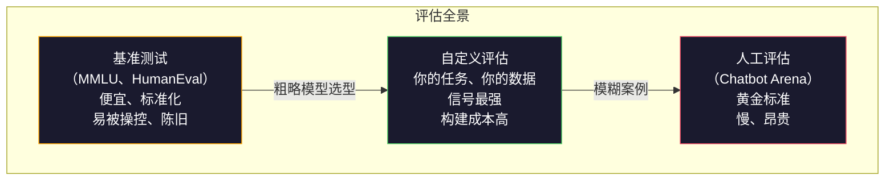
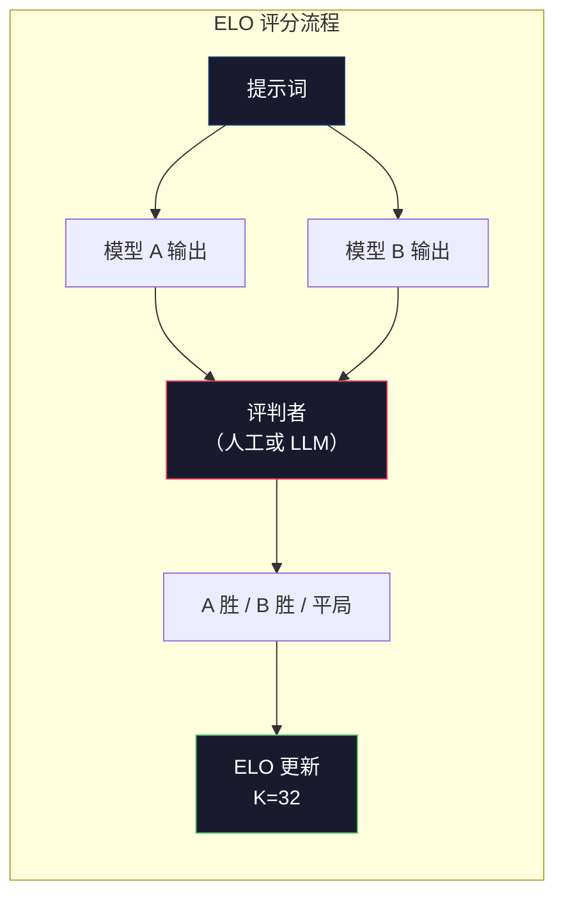

# 评估：基准测试、Evals 与 LM Harness

> 古德哈特定律（Goodhart's Law）：当一项指标成为目标时，它就不再是好的指标。每个前沿实验室（frontier lab）都会钻基准测试的空子。MMLU 分数节节攀升，但模型仍然无法可靠地数出 "strawberry" 中有多少个字母 R。唯一重要的评估，是你的评估——在你的任务上、用你的数据、针对你的失败模式。

**Type:** 构建
**Languages:** Python
**Prerequisites:** 第 10 阶段，第 01-05 课（从零开始构建大语言模型）
**Time:** 约 90 分钟

## 学习目标

- 构建一个自定义评估框架（evaluation harness），针对语言模型运行多项选择与开放式基准测试
- 解释为什么标准基准测试（MMLU、HumanEval）会饱和，从而无法区分前沿模型
- 实现带有恰当指标的任务专属评估：精确匹配（exact match）、F1、BLEU 以及 LLM-as-judge 评分
- 设计面向你具体用例的自定义评估套件，而不是仅依赖公开排行榜

## 问题所在

MMLU（大规模多任务语言理解，Massive Multitask Language Understanding）于 2020 年发布，包含 15,908 道题目，涵盖 57 个学科。短短三年内，前沿模型就在它上面达到了饱和。GPT-4 得分 86.4%，Claude 3 Opus 得分 86.8%，Llama 3 405B 得分 88.6%。排行榜被压缩到 3 分的区间内，差异只是统计噪声，而非真实能力差距。

与此同时，这些模型在 10 岁儿童不假思索就能完成的任务上依然失败。Claude 3.5 Sonnet 在 MMLU 上得分 88.7%，最初却数不清 "strawberry" 中有几个字母——这项任务不需要任何世界知识，也不需要推理，只要逐字符迭代即可。HumanEval 用 164 道题目测试代码生成，模型得分超过 90%，却仍然会产生在任何初级开发者都能发现的边界情况下崩溃的代码。

基准测试表现与真实世界可靠性之间的差距，正是大语言模型评估（LLM evaluation）的核心问题。基准测试只能告诉你模型在基准测试上的表现，几乎无法说明它在你具体任务、具体数据、具体失败模式下的表现。如果你正在构建客服机器人，MMLU 毫无意义；如果你正在构建代码助手，HumanEval 只覆盖函数级生成——它对跨文件的调试、重构或代码解释只字未提。

你需要自定义评估（custom evals）。不是因为基准测试没用——它们在粗略模型选型时有用——而是因为最终评估必须与你的部署条件完全一致。

## 核心概念

### 评估全景

评估可分为三类，每类的成本与信号质量各不相同。

**基准测试（benchmarks）** 是标准化的测试套件：MMLU、HumanEval、SWE-bench、MATH、ARC、HellaSwag 等。你让模型跑一遍基准，得到一个分数。优点是人人使用同一套测试，可以横向比较模型；缺点是模型和训练数据越来越污染这些基准。实验室会在包含基准题目的数据上训练，分数上涨，能力却未必提升。

**自定义评估（custom evals）** 是为你具体用例构建的测试套件。你定义输入、期望输出和评分函数。法律文档摘要工具就用法律文档来评估，SQL 生成器就用你的数据库模式（database schema）来评估。构建成本高，但它们是唯一能够预测生产环境表现的评估方式。

**人工评估（human evals）** 聘请付费标注员，根据有用性、正确性、流畅性、安全性等标准评判模型输出。开放式任务中自动评分失效时的黄金标准。Chatbot Arena 已经收集了超过 200 万张针对 100 多个模型的人工偏好投票。缺点是成本（每次判断 0.10–2.00 美元）和速度（数小时到数天）。



### 基准测试为什么会失效

有三种机制导致基准分数不再反映真实能力。

**数据污染（data contamination）。** 训练语料库会抓取互联网内容，而基准题目也挂在互联网上。模型在训练期间就见过答案。这并不是传统意义上的作弊——实验室并非故意纳入基准数据——但网络规模的数据抓取让完全排除变得几乎不可能。

**应试教学（teaching to the test）。** 实验室会针对基准表现优化训练混合比例。如果训练混合中有 5% 是 MMLU 风格的多选题，模型就会学习题目格式和答案分布。MMLU 是四选一，模型会学到答案在 A/B/C/D 上大致均匀分布，即便不知道答案也能受益。

**饱和（saturation）。** 当每个前沿模型都在某个基准上考到 85–90% 时，这个基准就失去了区分度。剩下的 10–15% 题目可能本身有歧义、标注错误，或需要极其冷门的领域知识。MMLU 从 87% 提升到 89%，可能只是因为模型多记住了两道冷门题，而不是变得更聪明。

### 困惑度：快速健康检查

困惑度（perplexity）衡量模型对一段词元序列的惊讶程度。形式上，它是平均负对数似然的指数：

```
PPL = exp(-1/N * sum(log P(token_i | context)))
```

困惑度为 10，意味着模型平均而言相当于在每个词元位置面对 10 个均匀选项一样不确定。越低越好。GPT-2 在 WikiText-103 上的困惑度约为 30，GPT-3 约为 20，Llama 3 8B 约为 7。

困惑度适合在同一测试集上比较不同模型，但它有盲点。模型可以通过擅长预测常见模式来获得低困惑度，却在罕见但重要的模式上表现糟糕。它也无法反映指令遵循、推理或事实准确性。把它当作快速检查，而非最终裁决。

### LLM-as-judge

用大模型来评估小模型输出。思路很简单：让 GPT-4o 或 Claude Sonnet 在 1–5 分的量表上，从正确性、有用性和安全性等维度给回答打分。使用 GPT-4o-mini 每次判断大约花费 0.01 美元，而与人类判断的相关性却出奇地高——大多数任务上的一致性约为 80%。

评分提示词（scoring prompt）比模型本身更重要。模糊的提示词（"给这条回答打分"）会产生噪声很大的分数；而带有评分标准（rubric）的结构化提示词（"5 分：答案事实正确并引用来源；4 分：正确但未引用来源；3 分：部分正确……"）则能产生一致、可复现的分数。

失败模式：评判模型存在位置偏差（position bias，在成对比较中偏好第一个回答）、冗长偏差（verbosity bias，偏好更长的回答）和自我偏好（self-preference，GPT-4 给 GPT-4 的输出打分高于同等质量的 Claude 输出）。缓解方法：随机化顺序、按长度归一化、使用与被评估模型不同的评判模型。

### 成对比较与 ELO 评分

Chatbot Arena 的做法。对同一提示词，展示来自两个不同模型的回答，由人类（或 LLM 评判者）选出更好的一个。从成千上万次这样的比较中，计算每个模型的 ELO 评分——与象棋排名使用的系统相同。

ELO 评分的优势：相对排名比绝对分数更可靠，能优雅处理平局，并且比独立为每个输出打分所需的比较次数更少。截至 2026 年初，Chatbot Arena 的排行榜显示 GPT-4o、Claude 3.5 Sonnet 和 Gemini 1.5 Pro 在榜首的 ELO 差距在 20 分以内。



### 评估框架

**lm-evaluation-harness**（EleutherAI）：开源评估框架的事实标准。支持 200 多个基准。一条命令即可让任意 Hugging Face 模型跑 MMLU、HellaSwag、ARC 等。Open LLM Leaderboard 也在使用它。

**RAGAS**：专门评估 RAG 流程的框架。衡量忠实度（faithfulness，答案是否与检索到的上下文一致？）、相关性（relevance，检索到的上下文是否与问题相关？）以及答案正确性（answer correctness）。

**promptfoo**：面向提示词工程的配置驱动型评估。用 YAML 定义测试用例，在多个模型上运行，得到通过/失败报告。适合对提示词进行回归测试——确保某次提示词修改不会破坏已有的测试用例。

### 构建自定义评估

这是生产环境中唯一重要的评估。流程如下：

1. **定义任务。** 模型到底应该做什么？要精确。"回答问题"太模糊；"给定一封客户投诉邮件，提取产品名称、问题类别和情感"才是可以评估的任务。

2. **创建测试用例。** 原型评估至少 50 条，生产环境 200 条以上。每条测试用例都是（输入，期望输出）对。要包含边界案例：空输入、对抗性输入、歧义输入、其他语言输入。

3. **定义评分方式。** 结构化输出用精确匹配；文本相似度用 BLEU/ROUGE；开放式质量用 LLM-as-judge；信息抽取任务用 F1。可以把多个指标加权组合。

4. **自动化。** 评估只需一条命令即可运行，没有手动步骤。以支持长期对比的格式存储结果。

5. **持续追踪。** 孤立的评估分数毫无意义，你需要趋势线。上次修改提示词后分数提升了吗？换模型后退化了吗？把评估与提示词一起进行版本控制。

| 评估类型 | 单次判断成本 | 与人类一致性 | 最适用场景 |
|----------|-------------:|-------------:|----------|
| 精确匹配 | ~$0 | 100%（适用时） | 结构化输出、分类 |
| BLEU/ROUGE | ~$0 | ~60% | 翻译、摘要 |
| LLM-as-judge | ~$0.01 | ~80% | 开放式生成 |
| 人工评估 | $0.10–$2.00 | N/A（本身就是标准） | 模糊、高风险任务 |

## 动手实现

### 第一步：最小化评估框架

定义核心抽象。一个评估用例（eval case）包含输入、期望输出和一个可选的元数据字典。一个评分器（scorer）接收预测结果和参考答案，返回 0 到 1 之间的分数。

```python
import json
from collections import Counter

class EvalCase:
    def __init__(self, input_text, expected, metadata=None):
        self.input_text = input_text
        self.expected = expected
        self.metadata = metadata or {}

class EvalSuite:
    def __init__(self, name, cases, scorers):
        self.name = name
        self.cases = cases
        self.scorers = scorers

    def run(self, model_fn):
        results = []
        for case in self.cases:
            prediction = model_fn(case.input_text)
            scores = {}
            for scorer_name, scorer_fn in self.scorers.items():
                scores[scorer_name] = scorer_fn(prediction, case.expected)
            results.append({
                "input": case.input_text,
                "expected": case.expected,
                "prediction": prediction,
                "scores": scores,
            })
        return results
```

### 第二步：评分函数

实现精确匹配、词元 F1 和一个模拟的 LLM-as-judge 评分器。

```python
def exact_match(prediction, expected):
    return 1.0 if prediction.strip().lower() == expected.strip().lower() else 0.0

def token_f1(prediction, expected):
    pred_tokens = set(prediction.lower().split())
    exp_tokens = set(expected.lower().split())
    if not pred_tokens or not exp_tokens:
        return 0.0
    common = pred_tokens & exp_tokens
    precision = len(common) / len(pred_tokens)
    recall = len(common) / len(exp_tokens)
    if precision + recall == 0:
        return 0.0
    return 2 * (precision * recall) / (precision + recall)

def llm_judge_simulated(prediction, expected):
    pred_words = set(prediction.lower().split())
    exp_words = set(expected.lower().split())
    if not exp_words:
        return 0.0
    overlap = len(pred_words & exp_words) / len(exp_words)
    length_penalty = min(1.0, len(prediction) / max(len(expected), 1))
    return round(overlap * 0.7 + length_penalty * 0.3, 3)
```

### 第三步：ELO 评分系统

实现成对比较与 ELO 更新。这正是 Chatbot Arena 用来给模型排名的系统。

```python
class ELOTracker:
    def __init__(self, k=32, initial_rating=1500):
        self.ratings = {}
        self.k = k
        self.initial_rating = initial_rating
        self.history = []

    def _ensure_player(self, name):
        if name not in self.ratings:
            self.ratings[name] = self.initial_rating

    def expected_score(self, rating_a, rating_b):
        return 1 / (1 + 10 ** ((rating_b - rating_a) / 400))

    def record_match(self, player_a, player_b, outcome):
        self._ensure_player(player_a)
        self._ensure_player(player_b)

        ea = self.expected_score(self.ratings[player_a], self.ratings[player_b])
        eb = 1 - ea

        if outcome == "a":
            sa, sb = 1.0, 0.0
        elif outcome == "b":
            sa, sb = 0.0, 1.0
        else:
            sa, sb = 0.5, 0.5

        self.ratings[player_a] += self.k * (sa - ea)
        self.ratings[player_b] += self.k * (sb - eb)

        self.history.append({
            "a": player_a, "b": player_b,
            "outcome": outcome,
            "rating_a": round(self.ratings[player_a], 1),
            "rating_b": round(self.ratings[player_b], 1),
        })

    def leaderboard(self):
        return sorted(self.ratings.items(), key=lambda x: -x[1])
```

### 第四步：困惑度计算

用词元概率计算困惑度。实际应用中，这些概率来自模型的对数几率（logits）。这里我们用概率分布来模拟。

```python
import numpy as np

def perplexity(log_probs):
    if not log_probs:
        return float("inf")
    avg_neg_log_prob = -np.mean(log_probs)
    return float(np.exp(avg_neg_log_prob))

def token_log_probs_simulated(text, model_quality=0.8):
    np.random.seed(hash(text) % 2**31)
    tokens = text.split()
    log_probs = []
    for i, token in enumerate(tokens):
        base_prob = model_quality
        if len(token) > 8:
            base_prob *= 0.6
        if i == 0:
            base_prob *= 0.7
        prob = np.clip(base_prob + np.random.normal(0, 0.1), 0.01, 0.99)
        log_probs.append(float(np.log(prob)))
    return log_probs
```

### 第五步：聚合结果

计算一次评估运行的汇总统计：均值、中位数、阈值通过率，以及按指标拆解。

```python
def summarize_results(results, threshold=0.8):
    all_scores = {}
    for r in results:
        for metric, score in r["scores"].items():
            all_scores.setdefault(metric, []).append(score)

    summary = {}
    for metric, scores in all_scores.items():
        arr = np.array(scores)
        summary[metric] = {
            "mean": round(float(np.mean(arr)), 3),
            "median": round(float(np.median(arr)), 3),
            "std": round(float(np.std(arr)), 3),
            "min": round(float(np.min(arr)), 3),
            "max": round(float(np.max(arr)), 3),
            "pass_rate": round(float(np.mean(arr >= threshold)), 3),
            "n": len(scores),
        }
    return summary

def print_summary(summary, suite_name="Eval"):
    print(f"\n{'=' * 60}")
    print(f"  {suite_name} Summary")
    print(f"{'=' * 60}")
    for metric, stats in summary.items():
        print(f"\n  {metric}:")
        print(f"    Mean:      {stats['mean']:.3f}")
        print(f"    Median:    {stats['median']:.3f}")
        print(f"    Std:       {stats['std']:.3f}")
        print(f"    Range:     [{stats['min']:.3f}, {stats['max']:.3f}]")
        print(f"    Pass rate: {stats['pass_rate']:.1%} (threshold >= 0.8)")
        print(f"    N:         {stats['n']}")
```

### 第六步：运行完整流程

把所有模块串联起来。定义任务、创建测试用例、模拟两个模型、运行评估、根据成对比较计算 ELO，并打印排行榜。

```python
def demo_model_good(prompt):
    responses = {
        "What is the capital of France?": "Paris",
        "What is 2 + 2?": "4",
        "Who wrote Hamlet?": "William Shakespeare",
        "What language is PyTorch written in?": "Python and C++",
        "What is the boiling point of water?": "100 degrees Celsius",
    }
    return responses.get(prompt, "I don't know")

def demo_model_bad(prompt):
    responses = {
        "What is the capital of France?": "Paris is the capital city of France",
        "What is 2 + 2?": "The answer is four",
        "Who wrote Hamlet?": "Shakespeare",
        "What language is PyTorch written in?": "Python",
        "What is the boiling point of water?": "212 Fahrenheit",
    }
    return responses.get(prompt, "Unknown")

cases = [
    EvalCase("What is the capital of France?", "Paris"),
    EvalCase("What is 2 + 2?", "4"),
    EvalCase("Who wrote Hamlet?", "William Shakespeare"),
    EvalCase("What language is PyTorch written in?", "Python and C++"),
    EvalCase("What is the boiling point of water?", "100 degrees Celsius"),
]

suite = EvalSuite(
    name="General Knowledge",
    cases=cases,
    scorers={
        "exact_match": exact_match,
        "token_f1": token_f1,
        "llm_judge": llm_judge_simulated,
    },
)

results_good = suite.run(demo_model_good)
results_bad = suite.run(demo_model_bad)

print_summary(summarize_results(results_good), "Model A (concise)")
print_summary(summarize_results(results_bad), "Model B (verbose)")
```

"好"模型给出精确答案；"差"模型给出冗长的改写。精确匹配对冗长模型惩罚很重，而词元 F1 与 LLM-as-judge 则更宽容。这说明了指标选择的重要性：同一模型，取决于你如何评分，可能看起来很好，也可能看起来很糟。

### 第七步：ELO 锦标赛

在多个轮次中，对模型进行成对比较。

```python
elo = ELOTracker(k=32)

for case in cases:
    pred_a = demo_model_good(case.input_text)
    pred_b = demo_model_bad(case.input_text)

    score_a = token_f1(pred_a, case.expected)
    score_b = token_f1(pred_b, case.expected)

    if score_a > score_b:
        outcome = "a"
    elif score_b > score_a:
        outcome = "b"
    else:
        outcome = "tie"

    elo.record_match("model_a_concise", "model_b_verbose", outcome)

print("\nELO Leaderboard:")
for name, rating in elo.leaderboard():
    print(f"  {name}: {rating:.0f}")
```

### 第八步：困惑度比较

比较不同质量水平"模型"之间的困惑度。

```python
test_text = "The quick brown fox jumps over the lazy dog in the garden"

for quality, label in [(0.9, "Strong model"), (0.7, "Medium model"), (0.4, "Weak model")]:
    log_probs = token_log_probs_simulated(test_text, model_quality=quality)
    ppl = perplexity(log_probs)
    print(f"  {label} (quality={quality}): perplexity = {ppl:.2f}")
```

## 应用实践

### lm-evaluation-harness（EleutherAI）

在任何模型上运行基准测试的标准工具。

```python
# pip install lm-eval
# Command line:
# lm_eval --model hf --model_args pretrained=meta-llama/Llama-3.1-8B --tasks mmlu --batch_size 8

# Python API:
# import lm_eval
# results = lm_eval.simple_evaluate(
#     model="hf",
#     model_args="pretrained=meta-llama/Llama-3.1-8B",
#     tasks=["mmlu", "hellaswag", "arc_easy"],
#     batch_size=8,
# )
# print(results["results"])
```

### promptfoo

面向提示词工程的配置驱动型评估。用 YAML 定义测试，并在多个服务商上运行。

```yaml
# promptfoo.yaml
providers:
  - openai:gpt-4o-mini
  - anthropic:claude-3-haiku

prompts:
  - "Answer in one word: {{question}}"

tests:
  - vars:
      question: "What is the capital of France?"
    assert:
      - type: contains
        value: "Paris"
  - vars:
      question: "What is 2 + 2?"
    assert:
      - type: equals
        value: "4"
```

### 用 RAGAS 评估 RAG

```python
# pip install ragas
# from ragas import evaluate
# from ragas.metrics import faithfulness, answer_relevancy, context_precision
#
# result = evaluate(
#     dataset,
#     metrics=[faithfulness, answer_relevancy, context_precision],
# )
# print(result)
```

RAGAS 衡量的是通用评估容易忽略的东西：模型回答是否有检索到的上下文作为依据，而不仅仅是抽象意义上的"正确"。

## 成果交付

本课将生成 `outputs/prompt-eval-designer.md`——一个可复用的提示词，用于为任意任务设计自定义评估套件。你给它任务描述，它会生成测试用例、评分函数以及通过/失败阈值建议。

同时还会生成 `outputs/skill-llm-evaluation.md`——一个决策框架，根据你的任务类型、预算和延迟要求，选择正确的评估策略。

## 练习

1. 添加一个"一致性"评分器：把同一输入输入模型 5 次，衡量输出一致的频率。确定性输入上的不一致回答，暴露了提示词脆弱或温度（temperature）设置过高的问题。

2. 扩展 ELO 追踪器，使其支持多种评判函数（精确匹配、F1、LLM-as-judge）并加权。比较当精确匹配权重很高与 F1 权重很高时，排行榜会如何变化。

3. 为具体任务构建一个评估套件：把邮件分类为 5 个类别。创建 100 条测试用例，包括边缘案例（可能属于多个类别的邮件、空邮件、其他语言邮件），并衡量不同"模型"（基于规则、关键词匹配、模拟 LLM）的表现。

4. 实现污染检测：给定一组评估题目和一个训练语料库，检查有多少比例的评估题目（或近义改写）出现在训练数据中。研究人员就是这样审计基准有效性的。

5. 构建一个"模型差异"工具。给定两个模型版本的评估结果，高亮哪些测试用例提升了、哪些退化了、哪些保持不变。这相当于评估领域的代码 diff——对于理解改动是利是弊至关重要。

## 关键术语

| 术语 | 别人怎么说 | 实际含义 |
|------|-----------|----------|
| MMLU | "那个基准" | Massive Multitask Language Understanding——57 个学科共 15,908 道多选题，到 2025 年已被前沿模型刷到 88% 以上饱和 |
| HumanEval | "代码评估" | OpenAI 发布的 164 道 Python 函数补全题，只测试孤立的函数生成 |
| SWE-bench | "真实编程评估" | 来自 12 个 Python 仓库的 2,294 个 GitHub issue，衡量端到端 bug 修复，包括测试生成 |
| Perplexity | "模型有多懵" | exp(-avg(log P(token_i \| context)))——越低表示模型给真实词元赋予的概率越高 |
| ELO rating | "模型的象棋排名" | 根据成对胜负记录计算的相对技能评分，Chatbot Arena 用它给 100 多个模型排名 |
| LLM-as-judge | "用 AI 给 AI 打分" | 强模型按评分标准给弱模型输出打分，大多数任务上与人类判断一致性约 80%，每次判断约 $0.01 |
| Data contamination | "模型见过考题" | 训练数据包含基准题目，分数虚高但真实能力未提升 |
| Eval suite | "一堆测试" | 由（输入、期望输出、评分器）三元组组成的版本化集合，用于衡量特定能力 |
| Pass rate | "有多少做对了" | 分数超过阈值的评估用例占比——比平均分更可操作，因为它衡量的是可靠性 |
| Chatbot Arena | "模型排名网站" | LMSYS 平台，拥有超过 200 万张人工偏好投票，通过 ELO 评分产出最可信的大语言模型排行榜 |

## 延伸阅读

- [Hendrycks et al., 2021 -- "Measuring Massive Multitask Language Understanding"](https://arxiv.org/abs/2009.03300) —— MMLU 论文，尽管已饱和，仍是被引用最多的大语言模型基准
- [Chen et al., 2021 -- "Evaluating Large Language Models Trained on Code"](https://arxiv.org/abs/2107.03374) —— OpenAI 的 HumanEval 论文，奠定了代码生成评估方法
- [Zheng et al., 2023 -- "Judging LLM-as-a-Judge"](https://arxiv.org/abs/2306.05685) —— 系统分析用大语言模型评估大语言模型，包括位置偏差和冗长偏差的发现
- [LMSYS Chatbot Arena](https://chat.lmsys.org/) —— 众包模型比较平台，拥有超过 200 万张投票，是最可信的真实世界大语言模型排名
