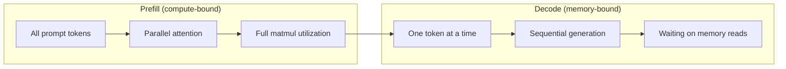
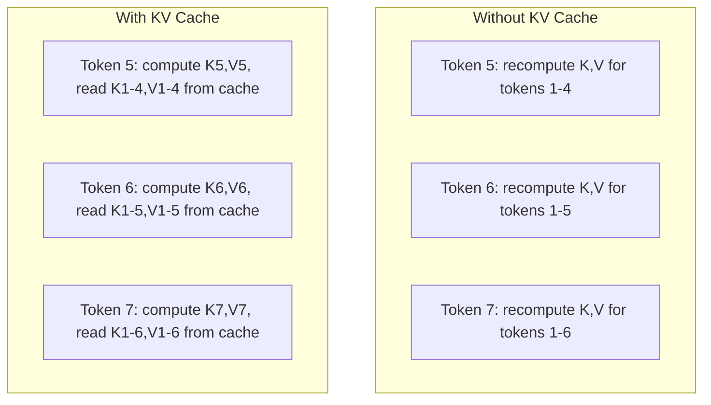
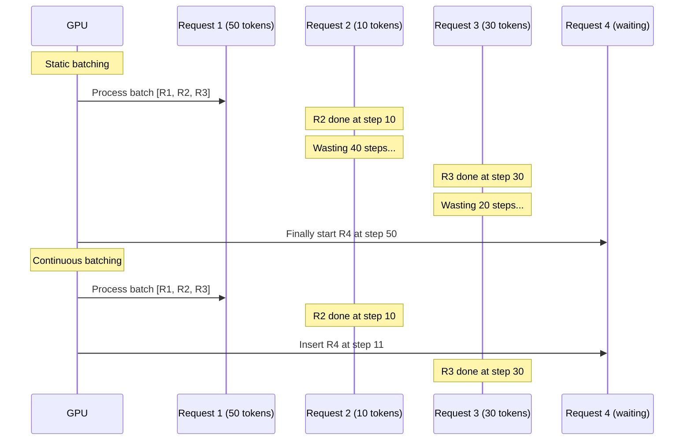
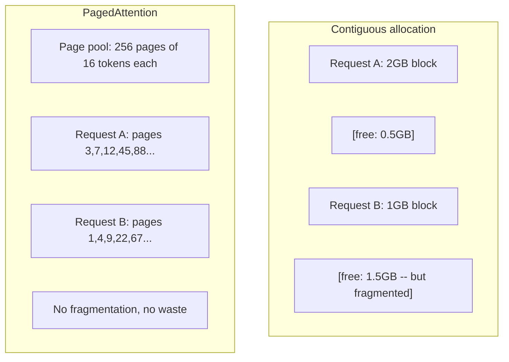
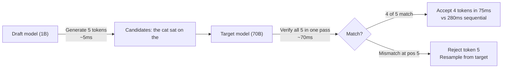

# 推理优化

> 大语言模型（LLM）的推理分为两个阶段。预填充（prefill）阶段并行处理你的提示词——受限于计算能力。解码（decode）阶段逐个生成词元（token）——受限于内存带宽。每一项优化都针对其中至少一个阶段。

**类型：** 动手实践
**语言：** Python
**前置知识：** 阶段 10，第 01-08 课（Transformer 架构、注意力机制）
**时间：** 约 120 分钟

## 学习目标

- 实现键值缓存（KV cache），以消除自回归（autoregressive）词元生成过程中的冗余计算
- 解释 LLM 推理的预填充（prefill）与解码（decode）阶段，以及为什么各自的瓶颈不同（计算受限 vs 内存受限）
- 实现连续批处理（continuous batching）与分页注意力（PagedAttention）的核心思想，以在并发请求下最大化 GPU 利用率
- 对比推理优化技术（KV 缓存、投机解码、Flash Attention）及其吞吐量和延迟权衡

## 问题背景

你把 Llama 3 70B 部署在 4 块 A100 GPU 上。单个用户每秒大约能获得 50 个词元，感觉很快。但当 100 个用户同时请求接口时，每个用户的吞吐量骤降到每秒 3 个词元。你每月 25,000 美元的 GPU 账单，输出的响应却比人打字还慢。

从 1 个用户到 100 个用户，模型本身并没有变：权重相同、架构相同、数学运算相同。变化的是你如何调度工作。朴素推理会浪费 90% 以上的可用 GPU 算力。等待第 47 个词元的用户占据了一个完整的批处理槽位，而 GPU 内存总线在两个矩阵乘法之间处于空闲状态。与此同时，另一位用户的 2,000 词元提示词本可以利用这段空闲时间进行有效计算。

这不是扩展（scaling）问题，而是调度（scheduling）问题。本节课介绍的这些技术——KV 缓存、连续批处理、PagedAttention、投机解码、前缀缓存——正是区分每月 2.5 万美元和 5 千美元推理账单的关键，后者却能服务同样的流量。

在 4 块 A100-80GB 上，vLLM  serving Llama 3 70B 在低并发时每个用户约 50 词元/秒，在 100 个并发请求下依靠连续批处理和 PagedAttention 仍能维持每个用户 15-25 词元/秒。没有这些优化，同样的硬件在该并发度下只能达到每个用户 5 词元/秒。同样的 GPU、同样的模型，吞吐量相差约 4 倍。

## 核心概念

### 预填充 vs 解码

每个 LLM 推理请求都有两个不同的阶段。

**预填充（prefill）** 阶段处理整个输入提示词。所有词元都已知，因此可以在完整序列上并行计算注意力。这是一次大规模的矩阵乘法——GPU 计算核心保持忙碌。瓶颈在于计算：硬件每秒能提供的浮点运算次数（FLOPS）。一块 A100 可提供 312 TFLOPS（BF16）。在单张 A100 上，对 70B 模型进行 4,096 个词元的预填充大约需要 400 毫秒。

**解码（decode）** 阶段逐一生成输出词元。每个新词元都要关注之前所有词元，但每次前向传播只产生一个词元。权重矩阵与预填充阶段一样大，但你却把它们与单个向量相乘，而不是矩阵。GPU 计算核心在微秒内完成运算，然后等待下一批权重从内存中送达。瓶颈在于内存带宽：把模型权重从高带宽内存（HBM）传输到计算单元的速度。一块 A100 的带宽为 2 TB/s。FP16 下的 70B 模型占 140 GB。完整读取一次模型需要 70 毫秒——这就是单个解码步骤的理论下限。



**ops:byte 比**（也称为算术强度，arithmetic intensity）捕捉了这种权衡。它衡量从内存中读取每字节数据时执行了多少次运算。

```
ops:byte ratio = FLOPs per token / bytes read from memory
```

在批大小为 4,096 的预填充阶段，每次加载权重会执行约 4,096 次乘加运算。这个比值很高——你受限于计算。在批大小为 1 的解码阶段，每次加载权重只执行约 1 次运算。这个比值很低——你受限于内存。

核心洞察：*解码受限于内存，因为你每次都要读取整个模型来生成一个词元*。下面每一项优化要么减少读取量，要么增加每次读取处理的词元数量，要么完全避免读取。

### KV 缓存

在注意力计算中，每个词元的查询（query）都会关注所有前面词元的键（key）和值（value）向量。如果不使用缓存，生成第 N 个词元时需要重新计算前 N-1 个词元的键和值投影。词元 1 在生成词元 2 时已被投影，到词元 3 又要投影一次，到词元 4 再投影一次。到第 1,000 个词元时，词元 1 已经被投影了 999 次。

KV 缓存会存储所有先前词元的键和值投影。生成第 N 个词元时，你只需计算第 N 个词元的键和值，然后将它们与词元 1 到 N-1 的缓存 K/V 拼接起来。



**KV 缓存的内存公式：**

```
KV cache size = 2 * num_layers * num_kv_heads * head_dim * seq_len * bytes_per_param
```

以 Llama 3 70B 为例（80 层、GQA 下 8 个 KV 头、head_dim=128、BF16）：

```
per token: 2 * 80 * 8 * 128 * 2 bytes = 327,680 bytes = 320 KB
at 4,096 tokens: 320 KB * 4,096 = 1.28 GB
at 128K tokens: 320 KB * 131,072 = 40 GB
```

单条 128K 上下文的 Llama 3 70B 对话会消耗 40 GB 的 KV 缓存——占掉半块 A100 的显存。100 个并发用户、每人 4K 词元，仅 KV 缓存就需要 128 GB。这就是为什么 KV 缓存管理是推理优化的中心挑战。

### 连续批处理

静态批处理会等到凑齐 N 个请求后一起处理，并且必须等到*所有*请求完成后才接收新请求。如果一个请求需要 500 个词元，另一个只需要 10 个词元，那么短请求完成后还要空等 490 个解码步骤。

连续批处理（continuous batching，也称为迭代级批处理，iteration-level batching）会在任意请求完成时立即插入新请求。每个解码步骤都会重新评估当前批次。一个 10 个词元就完成的请求会立刻被等待中的请求替代。



吞吐量的提升程度取决于输出长度的变化幅度。如果长度一致，连续批处理与静态批处理相当。如果长度差异很大（常见情况），连续批处理可达 2-5 倍吞吐量，因为 GPU 槽位永远不会空闲。

### 分页注意力（PagedAttention）

每个请求的 KV 缓存是内存中一块连续的区域。随着请求的到达和离开，内存会产生碎片——就像操作系统中的 RAM 碎片一样。一个 4K 词元的请求需要 1.28 GB 的连续内存。即使总共有 2 GB 空闲，也未必能找到 1.28 GB 的*连续*空间。你要么浪费内存，要么拒绝请求。

PagedAttention（来自 vLLM）将操作系统式的虚拟内存思想应用于 KV 缓存。它不再为每个请求分配一个连续块，而是分配固定大小的“页”（page，通常为 16 个词元）。页可以位于 GPU 物理内存的任意位置。页表（page table）将每个请求的逻辑序列位置映射到物理页位置。



PagedAttention 还支持共享前缀的**写时复制（copy-on-write）**。如果 50 个请求共用同一个系统提示词，那么该系统提示词的 KV 缓存页只存储一次，被 50 个请求共同引用。只有当请求出现分歧（例如不同用户消息）时，才会分配独立的页。这能大幅削减具有共享系统提示词的应用的内存占用。

vLLM 报告显示，通过 PagedAttention，内存浪费接近零（约 4%），而朴素分配方式的浪费约为 60-80%。

### 投机解码（Speculative Decoding）

解码慢是因为它顺序执行——你生成一个词元，把它喂回去，再生成下一个。但如果你能廉价地猜测出接下来 5 个词元，然后一次性验证它们呢？

投机解码使用一个小的、快速的**草稿模型（draft model）**生成 K 个候选词元。然后**目标模型（target model）**在单次前向传播中处理这 K 个候选词元（这看起来像预填充——并行、计算受限、高效）。如果目标模型同意草稿模型的预测，你就能在一次目标模型前向传播的时间里接受全部 K 个词元。如果它在位置 j 处不同意，就接受第 1 到 j-1 个词元并丢弃剩余部分。



加速效果取决于**接受率（acceptance rate）**——即草稿模型预测与目标模型一致的频率。在自然语言上，用 Llama 3 8B 为 Llama 3 70B 做草稿，典型接受率为 70-85%。这通常可带来 2-3 倍的解码加速。

三种投机解码方案：

| 方法 | 草稿来源 | 接受率 | 额外开销 |
|------|----------|--------|----------|
| Draft-target（Leviathan 等） | 独立小模型 | 70-85% | 草稿模型内存 |
| EAGLE（Li 等） | 目标模型上的轻量头 | 75-90% | 约 1% 额外参数 |
| N-gram 查找 | 词元 n-gram 表 | 40-60% | 可忽略 |

**EAGLE** 在目标模型的隐藏状态上训练一个小的自回归头。它利用目标模型倒数第二层特征预测下一个词元的嵌入（embedding）。由于它基于目标模型自身的表征工作（而不是一个独立模型），因此以极小的额外内存获得更高的接受率。EAGLE-2 增加了动态草稿树，可根据上下文调整候选数量。

**N-gram 投机解码**维护一个从当前上下文或预建语料中得到的 n-gram 延续表。如果草稿与对话中之前出现的内容一致（重复模式、代码、结构化输出），它几乎不需要神经网络开销就能命中。平均接受率较低，但每次猜测的成本几乎为零。

投机解码在数学上是精确的——输出分布与目标模型的分布完全相同，不是一种近似。验证步骤确保每个被接受的词元都具有目标模型会赋予的精确概率。

### 前缀缓存（Prefix Caching）

许多请求共享相同的前缀。聊天机器人的系统提示词、检索增强生成（RAG）的上下文块、少样本示例集。没有前缀缓存时，每个请求都要从头开始重新计算这些共享词元的 KV 缓存。

前缀缓存会存储常见前缀的 KV 缓存，并在多个请求之间复用。当一个带有已知前缀的新请求到达时，系统复制（或引用）缓存的 KV 条目，并只计算唯一后缀部分的 KV。

对于所有请求共享的 2,000 词元系统提示词，前缀缓存可以消除每个请求约 400 毫秒的预填充时间。在每秒 100 个请求的流量下，这每秒可节省 40 秒的 GPU 计算——超过一块 GPU 的处理能力。

SGLang 的 RadixAttention 使用基数树（radix tree，即 trie）按词元内容索引前缀。任何与已存储前缀匹配的请求都能免费获得其 KV 缓存。该树支持部分前缀匹配：如果你与缓存条目共享 2,000 个前缀词元中的 1,500 个，就可以复用这 1,500 个，只重新计算 500 个。

### 推理引擎

生产环境中 LLM 服务主要由三个引擎主导：

| 引擎 | 核心创新 | 最适用场景 |
|------|----------|------------|
| vLLM | PagedAttention、连续批处理 | 通用服务、最高兼容性 |
| SGLang | RadixAttention（前缀缓存）、结构化生成 | 多轮聊天机器人、约束解码 |
| TensorRT-LLM | NVIDIA 算子融合、FP8 量化 | 在 NVIDIA 硬件上实现最大单 GPU 吞吐量 |

**vLLM** 是默认的起点。它支持最广泛的模型，能在任何 GPU 厂商（NVIDIA、AMD、Intel）上运行，并通过 PagedAttention + 连续批处理实现强劲吞吐量。它兼容 OpenAI API，因此可以直接替换任何 OpenAI API 调用。

**SGLang** 建立在 vLLM 相同的基础之上，但增加了 RadixAttention 前缀缓存，以及用于结构化 LLM 程序的领域特定语言。如果你的工作负载涉及多轮对话、工具调用或约束解码（JSON 输出、正则引导生成），SGLang 通常能通过前缀复用比 vLLM 快 2-5 倍。

**TensorRT-LLM** 将模型编译成优化的 NVIDIA GPU 内核。它融合算子（注意力 + 线性层 + 激活在一个内核中）、在 H100 GPU 上使用 FP8，并与 NVIDIA Triton Inference Server 集成用于生产部署。它在 NVIDIA 硬件上实现最高的单 GPU 吞吐量，但需要更多配置工作，且仅支持 NVIDIA GPU。

Llama 3 70B 在 4xA100-80GB、BF16 下的真实数据：

| 指标 | vLLM | SGLang | TensorRT-LLM |
|------|------|--------|--------------|
| 吞吐量（1 个用户） | ~50 TPS | ~55 TPS | ~65 TPS |
| 吞吐量（100 个用户） | ~2,500 总 TPS | ~3,200 总 TPS | ~3,000 总 TPS |
| 首词元时间 | ~400ms | ~300ms（命中前缀） | ~350ms |
| 最大上下文 | 128K | 128K | 128K |

### Ops:Byte 分析框架

你无法优化无法度量的东西。ops:byte 比告诉你当前是计算受限还是内存受限，从而决定哪些优化措施有效。

```
Compute roof: peak FLOPS of the GPU
Memory roof:  peak bandwidth * ops:byte ratio
```

当 ops:byte 较低时（解码、小批次），你会撞到内存带宽天花板。增加计算能力（更高频率、更多核心）没有帮助。你需要减少内存读取（量化、KV 缓存压缩）或增加批大小，把一次读取分摊到更多有效工作上。

当 ops:byte 较高时（预填充、大批次），你会撞到计算天花板。内存带宽优化没有帮助。你需要更快的 GPU、内核融合或降低精度来挤出更多 FLOPS。

| 场景 | ops:byte | 瓶颈 | 优化方向 |
|------|----------|------|----------|
| 预填充，batch=1 | ~4,096 | 计算 | 内核融合、FP8 |
| 解码，batch=1 | ~1 | 内存 | 量化、KV 压缩 |
| 解码，batch=32 | ~32 | 内存 | 更大批次、连续批处理 |
| 解码，batch=256 | ~256 | 过渡阶段 | 两者都重要 |
| 解码，batch=1024 | ~1,024 | 计算 | 内核融合、张量并行 |

在 A100 上，交叉点大约在 ops:byte = 156 处（312 TFLOPS / 2 TB/s）。低于 156 时受内存限制，高于 156 时受计算限制。连续批处理通过在每次迭代中塞入更多词元，把解码推向这个交叉点。

## 动手实现

### 步骤 1：从零实现 KV 缓存

我们构建一个多头 KV 缓存，按层、按头存储键和值投影，并展示内存增长规律。

```python
import numpy as np

class KVCache:
    def __init__(self, num_layers, num_heads, head_dim, max_seq_len, dtype=np.float16):
        self.num_layers = num_layers
        self.num_heads = num_heads
        self.head_dim = head_dim
        self.max_seq_len = max_seq_len
        self.dtype = dtype

        self.k_cache = np.zeros(
            (num_layers, num_heads, max_seq_len, head_dim), dtype=dtype
        )
        self.v_cache = np.zeros(
            (num_layers, num_heads, max_seq_len, head_dim), dtype=dtype
        )
        self.seq_len = 0

    def update(self, layer_idx, new_keys, new_values):
        num_new = new_keys.shape[1]
        end = self.seq_len + num_new
        self.k_cache[layer_idx, :, self.seq_len:end, :] = new_keys
        self.v_cache[layer_idx, :, self.seq_len:end, :] = new_values
        return (
            self.k_cache[layer_idx, :, :end, :],
            self.v_cache[layer_idx, :, :end, :]
        )

    def advance(self, num_tokens):
        self.seq_len += num_tokens

    def memory_bytes(self):
        return self.k_cache.nbytes + self.v_cache.nbytes

    def used_bytes(self):
        per_token = 2 * self.num_layers * self.num_heads * self.head_dim * np.dtype(self.dtype).itemsize
        return per_token * self.seq_len
```

### 步骤 2：带 KV 缓存的注意力

一个简化的多头注意力实现，在解码步骤中使用 KV 缓存。

```python
def scaled_dot_product_attention(query, keys, values):
    head_dim = query.shape[-1]
    scores = np.matmul(query, keys.transpose(0, 1, 3, 2)) / np.sqrt(head_dim)
    seq_len_q = scores.shape[-2]
    seq_len_k = scores.shape[-1]
    if seq_len_q > 1:
        mask = np.triu(np.ones((seq_len_q, seq_len_k), dtype=np.float32), k=seq_len_k - seq_len_q + 1)
        scores = scores + mask * (-1e9)
    max_scores = np.max(scores, axis=-1, keepdims=True)
    exp_scores = np.exp(scores - max_scores)
    attn_weights = exp_scores / np.sum(exp_scores, axis=-1, keepdims=True)
    return np.matmul(attn_weights, values)


class MultiHeadAttention:
    def __init__(self, d_model, num_heads):
        self.num_heads = num_heads
        self.head_dim = d_model // num_heads
        scale = np.sqrt(2.0 / d_model)
        self.W_q = np.random.randn(d_model, d_model).astype(np.float32) * scale
        self.W_k = np.random.randn(d_model, d_model).astype(np.float32) * scale
        self.W_v = np.random.randn(d_model, d_model).astype(np.float32) * scale
        self.W_o = np.random.randn(d_model, d_model).astype(np.float32) * scale

    def forward(self, x, kv_cache=None, layer_idx=0):
        batch, seq_len, d_model = x.shape
        Q = np.matmul(x, self.W_q).reshape(batch, seq_len, self.num_heads, self.head_dim).transpose(0, 2, 1, 3)
        K = np.matmul(x, self.W_k).reshape(batch, seq_len, self.num_heads, self.head_dim).transpose(0, 2, 1, 3)
        V = np.matmul(x, self.W_v).reshape(batch, seq_len, self.num_heads, self.head_dim).transpose(0, 2, 1, 3)

        if kv_cache is not None:
            K_full, V_full = kv_cache.update(layer_idx, K[0], V[0])
            K = K_full[np.newaxis, :, :, :]
            V = V_full[np.newaxis, :, :, :]
            if seq_len == 1:
                kv_cache.advance(1)

        attn_out = scaled_dot_product_attention(Q, K, V)
        attn_out = attn_out.transpose(0, 2, 1, 3).reshape(batch, -1, d_model)
        return np.matmul(attn_out, self.W_o)
```

### 步骤 3：连续批处理模拟器

以下代码模拟静态批处理和连续批处理之间的调度差异。

```python
import heapq

class Request:
    def __init__(self, request_id, prompt_tokens, output_tokens, arrival_step):
        self.request_id = request_id
        self.prompt_tokens = prompt_tokens
        self.output_tokens = output_tokens
        self.arrival_step = arrival_step
        self.tokens_generated = 0
        self.start_step = None
        self.end_step = None

    def is_done(self):
        return self.tokens_generated >= self.output_tokens


def simulate_static_batching(requests, batch_size):
    step = 0
    completed = []
    queue = list(requests)
    queue.sort(key=lambda r: r.arrival_step)

    while queue:
        batch = []
        while queue and len(batch) < batch_size:
            r = queue.pop(0)
            r.start_step = max(step, r.arrival_step)
            batch.append(r)

        if batch:
            step = max(step, max(r.start_step for r in batch))
            max_output = max(r.output_tokens for r in batch)
            for r in batch:
                r.tokens_generated = r.output_tokens
                r.end_step = step + max_output
            step += max_output
            completed.extend(batch)

    return completed


def simulate_continuous_batching(requests, batch_size):
    step = 0
    completed = []
    queue = sorted(requests, key=lambda r: r.arrival_step)
    queue_idx = 0
    active = []
    waiting = []

    while queue_idx < len(queue) or active or waiting:
        while queue_idx < len(queue) and queue[queue_idx].arrival_step <= step:
            waiting.append(queue[queue_idx])
            queue_idx += 1

        while waiting and len(active) < batch_size:
            r = waiting.pop(0)
            r.start_step = step
            active.append(r)

        if not active:
            if waiting:
                step += 1
                continue
            elif queue_idx < len(queue):
                step = queue[queue_idx].arrival_step
                continue
            else:
                break

        for r in active:
            r.tokens_generated += 1

        done = [r for r in active if r.is_done()]
        for r in done:
            r.end_step = step + 1
            completed.append(r)
        active = [r for r in active if not r.is_done()]

        step += 1

    return completed


def batching_stats(completed):
    latencies = [r.end_step - r.arrival_step for r in completed]
    total_time = max(r.end_step for r in completed) - min(r.arrival_step for r in completed)
    total_tokens = sum(r.output_tokens for r in completed)
    return {
        "avg_latency": np.mean(latencies),
        "p50_latency": np.median(latencies),
        "p99_latency": np.percentile(latencies, 99),
        "total_time": total_time,
        "throughput": total_tokens / total_time if total_time > 0 else 0,
    }
```

### 步骤 4：前缀缓存

一个基于 trie 的前缀缓存，用于存储共享前缀的 KV 条目。

```python
class TrieNode:
    def __init__(self):
        self.children = {}
        self.kv_data = None
        self.hit_count = 0


class PrefixCache:
    def __init__(self, max_entries=1000):
        self.root = TrieNode()
        self.max_entries = max_entries
        self.total_entries = 0
        self.hits = 0
        self.misses = 0

    def _walk(self, token_ids):
        node = self.root
        depth = 0
        for tid in token_ids:
            if tid not in node.children:
                break
            node = node.children[tid]
            depth += 1
        return node, depth

    def lookup(self, token_ids):
        node, depth = self._walk(token_ids)
        if depth > 0:
            self.hits += 1
            current = self.root
            for tid in token_ids[:depth]:
                current = current.children[tid]
                current.hit_count += 1
            kv_entries = []
            current = self.root
            for tid in token_ids[:depth]:
                current = current.children[tid]
                if current.kv_data is not None:
                    kv_entries.append(current.kv_data)
            return depth, kv_entries
        self.misses += 1
        return 0, []

    def insert(self, token_ids, kv_per_token):
        node = self.root
        for i, tid in enumerate(token_ids):
            if tid not in node.children:
                if self.total_entries >= self.max_entries:
                    return i
                node.children[tid] = TrieNode()
                self.total_entries += 1
            node = node.children[tid]
            if i < len(kv_per_token):
                node.kv_data = kv_per_token[i]
        return len(token_ids)

    def hit_rate(self):
        total = self.hits + self.misses
        return self.hits / total if total > 0 else 0.0
```

### 步骤 5：投机解码模拟器

我们模拟可配置接受率的草稿-目标投机解码。

```python
class DraftModel:
    def __init__(self, vocab_size, acceptance_rate=0.8):
        self.vocab_size = vocab_size
        self.acceptance_rate = acceptance_rate

    def generate(self, context, num_tokens):
        tokens = np.random.randint(0, self.vocab_size, size=num_tokens)
        return tokens

    def get_probs(self, context, token):
        probs = np.random.dirichlet(np.ones(self.vocab_size))
        return probs


class TargetModel:
    def __init__(self, vocab_size):
        self.vocab_size = vocab_size

    def get_probs(self, context, tokens=None):
        if tokens is not None:
            return [np.random.dirichlet(np.ones(self.vocab_size)) for _ in tokens]
        return np.random.dirichlet(np.ones(self.vocab_size))


def speculative_decode(draft_model, target_model, context, num_speculative=5,
                       draft_cost=1.0, target_cost=10.0, verify_cost=12.0):
    total_tokens = 0
    total_cost = 0.0
    accepted_counts = []
    context = list(context)

    max_tokens = 100

    while total_tokens < max_tokens:
        draft_tokens = draft_model.generate(context, num_speculative)
        total_cost += draft_cost * num_speculative

        target_probs = target_model.get_probs(context, draft_tokens)
        total_cost += verify_cost

        accepted = 0
        for i, token in enumerate(draft_tokens):
            draft_p = draft_model.get_probs(context + list(draft_tokens[:i]), token)
            target_p = target_probs[i]

            r = np.random.random()
            acceptance_prob = min(1.0, target_p[token] / (draft_p[token] + 1e-10))

            if r < draft_model.acceptance_rate:
                accepted += 1
                context.append(token)
                total_tokens += 1
            else:
                new_token = np.random.choice(draft_model.vocab_size, p=target_p)
                context.append(new_token)
                total_tokens += 1
                break

        accepted_counts.append(accepted)

        if accepted == num_speculative:
            bonus_probs = target_model.get_probs(context)
            bonus_token = np.random.choice(draft_model.vocab_size, p=bonus_probs)
            context.append(bonus_token)
            total_tokens += 1

    sequential_cost = total_tokens * target_cost
    return {
        "total_tokens": total_tokens,
        "speculative_cost": total_cost,
        "sequential_cost": sequential_cost,
        "speedup": sequential_cost / total_cost if total_cost > 0 else 1.0,
        "avg_accepted": np.mean(accepted_counts),
        "acceptance_rate": np.mean(accepted_counts) / num_speculative,
    }


def compare_speculation_strategies(vocab_size=1000, num_trials=20):
    results = {}

    for name, acceptance_rate, spec_tokens in [
        ("Draft-target (8B->70B)", 0.78, 5),
        ("EAGLE", 0.85, 6),
        ("N-gram", 0.50, 4),
        ("No speculation", 0.0, 0),
    ]:
        if spec_tokens == 0:
            results[name] = {
                "speedup": 1.0,
                "acceptance_rate": 0.0,
                "avg_accepted": 0.0,
            }
            continue

        trial_results = []
        for _ in range(num_trials):
            draft = DraftModel(vocab_size, acceptance_rate=acceptance_rate)
            target = TargetModel(vocab_size)
            context = list(np.random.randint(0, vocab_size, size=10))
            result = speculative_decode(draft, target, context, num_speculative=spec_tokens)
            trial_results.append(result)

        results[name] = {
            "speedup": np.mean([r["speedup"] for r in trial_results]),
            "acceptance_rate": np.mean([r["acceptance_rate"] for r in trial_results]),
            "avg_accepted": np.mean([r["avg_accepted"] for r in trial_results]),
        }

    return results
```

### 步骤 6：KV 缓存内存分析器

计算真实模型配置下的 KV 缓存内存需求。

```python
MODEL_CONFIGS = {
    "Llama-3-8B": {
        "num_layers": 32, "num_kv_heads": 8, "head_dim": 128,
        "model_params_b": 8, "gqa": True,
    },
    "Llama-3-70B": {
        "num_layers": 80, "num_kv_heads": 8, "head_dim": 128,
        "model_params_b": 70, "gqa": True,
    },
    "Llama-3-405B": {
        "num_layers": 126, "num_kv_heads": 8, "head_dim": 128,
        "model_params_b": 405, "gqa": True,
    },
    "Mistral-7B": {
        "num_layers": 32, "num_kv_heads": 8, "head_dim": 128,
        "model_params_b": 7, "gqa": True,
    },
    "GPT-4-est": {
        "num_layers": 120, "num_kv_heads": 96, "head_dim": 128,
        "model_params_b": 1800, "gqa": False,
    },
}


def kv_cache_memory(config, seq_len, dtype_bytes=2):
    per_token = 2 * config["num_layers"] * config["num_kv_heads"] * config["head_dim"] * dtype_bytes
    total = per_token * seq_len
    return {
        "per_token_bytes": per_token,
        "per_token_kb": per_token / 1024,
        "total_bytes": total,
        "total_mb": total / (1024 ** 2),
        "total_gb": total / (1024 ** 3),
    }


def memory_budget(config, gpu_memory_gb, model_dtype_bytes=2, kv_dtype_bytes=2):
    model_memory_gb = config["model_params_b"] * 1e9 * model_dtype_bytes / (1024 ** 3)
    overhead_gb = gpu_memory_gb * 0.1
    available_for_kv = gpu_memory_gb - model_memory_gb - overhead_gb

    if available_for_kv <= 0:
        return {"error": "Model does not fit in GPU memory", "model_memory_gb": model_memory_gb}

    per_token = 2 * config["num_layers"] * config["num_kv_heads"] * config["head_dim"] * kv_dtype_bytes
    max_tokens = int(available_for_kv * (1024 ** 3) / per_token)

    return {
        "gpu_memory_gb": gpu_memory_gb,
        "model_memory_gb": round(model_memory_gb, 1),
        "overhead_gb": round(overhead_gb, 1),
        "available_for_kv_gb": round(available_for_kv, 1),
        "max_total_tokens": max_tokens,
        "max_users_at_2k": max_tokens // 2048,
        "max_users_at_4k": max_tokens // 4096,
        "max_users_at_32k": max_tokens // 32768,
    }
```

## 实际使用

使用 vLLM：

```python
from vllm import LLM, SamplingParams

llm = LLM(
    model="meta-llama/Llama-3-70B-Instruct",
    tensor_parallel_size=4,
    enable_prefix_caching=True,
    max_model_len=8192,
    gpu_memory_utilization=0.9,
)

params = SamplingParams(temperature=0.7, max_tokens=256)
outputs = llm.generate(["Explain inference optimization in one paragraph."], params)
```

使用 SGLang 实现前缀缓存 + 结构化输出：

```python
import sglang as sgl

@sgl.function
def classify(s, text):
    s += sgl.system("You are a classifier. Output JSON only.")
    s += sgl.user(f"Classify this text: {text}")
    s += sgl.assistant(sgl.gen("result", regex=r'\{"label": "(positive|negative|neutral)"\}'))

runtime = sgl.Runtime(model_path="meta-llama/Llama-3-70B-Instruct", tp_size=4)
sgl.set_default_backend(runtime)

results = classify.run_batch([
    {"text": "This product is amazing!"},
    {"text": "Terrible experience."},
    {"text": "It was okay I guess."},
])
```

使用 TensorRT-LLM：

```python
import tensorrt_llm
from tensorrt_llm.runtime import ModelRunner

runner = ModelRunner.from_dir("./llama-70b-trt-engine/", rank=0)

outputs = runner.generate(
    batch_input_ids=[tokenizer.encode("Explain KV caching.")],
    max_new_tokens=256,
    temperature=0.7,
)
```

## 交付成果

本节课产出：
- `outputs/skill-inference-optimization.md` —— 一份用于诊断和优化 LLM 推理服务的技能文档

## 练习题

1. 修改 KV 缓存分析器，比较 FP16、FP8 和 INT4 的 KV 缓存量化。计算在 4 块 A100-80GB 上，Llama 3 70B 在 4K 上下文下每种精度的最大并发用户数。INT4 KV 量化大约能把用户容量提升 4 倍。

2. 扩展连续批处理模拟器，跟踪 GPU 利用率（每步批处理槽位被占用的比例）。针对 50 个请求分别绘制静态批处理和连续批处理的利用率随时间变化曲线，这些请求的输出长度服从帕累托分布（Pareto distribution，shape=1.5，scale=20）。连续批处理应能保持 80% 以上的利用率。

3. 实现一个分组查询注意力（GQA）版本的 KV 缓存，其中 `num_kv_heads < num_query_heads`。Llama 3 70B 使用 64 个查询头但只使用 8 个 KV 头。计算相比完整多头注意力的内存节省（KV 缓存大小减少 8 倍）。

4. 构建一个采用 LRU 驱逐策略的前缀缓存。将 max_entries 设为 500，并生成 1,000 个请求，其中 60% 共享 5 个常见前缀之一。测量命中率，并与无限制缓存对比。使用良好的驱逐策略后，命中率应保持在 55% 以上。

5. 扩展投机解码模拟器，实现基于树的投机（EAGLE-2 风格）。不再使用单条 K 个词元的草稿链，而是生成候选树（例如 3 层每层 2 个分支 = 8 个叶子候选）。比较每轮验证所接受的总词元数与线性投机的差异。

## 关键术语

| 术语 | 人们常说 | 实际含义 |
|------|----------|----------|
| 预填充（prefill） | "处理提示词" | 在所有输入词元上并行计算注意力——计算受限，因为完整矩阵乘法让 GPU 计算核心保持忙碌 |
| 解码（decode） | "生成词元" | 每次前向传播生成一个词元，每次都读取完整模型权重——内存受限，因为计算完成后要等待下一批权重送达 |
| KV 缓存（KV cache） | "缓存注意力状态" | 存储所有先前词元的键和值投影，避免在每个解码步骤重复计算——用内存换取计算 |
| 连续批处理（continuous batching） | "动态批处理" | 任意请求完成时立即将新请求插入运行中的批次，在每个解码迭代进行评估，而不是等待整个批次结束 |
| 分页注意力（PagedAttention） | "KV 缓存的虚拟内存" | 以固定大小的页而非连续块分配 KV 缓存，消除内存碎片，并支持共享前缀的写时复制 |
| 投机解码（speculative decoding） | "草稿并验证" | 使用快速的草稿模型提出多个候选词元，然后在目标模型的一次前向传播中全部验证——数学精确，可加速 2-3 倍 |
| EAGLE | "自投机解码" | 投机解码的一种变体，在目标模型自身的隐藏状态上训练一个轻量头，相比独立草稿模型获得更高接受率 |
| 前缀缓存（prefix caching） | "复用系统提示词 KV" | 为常见前缀（系统提示词、少样本示例）存储已计算的 KV 缓存条目，并在请求间复用，跳过冗余预填充 |
| Ops:byte 比 | "算术强度" | 计算操作数与从内存读取字节数的比值——决定工作负载是计算受限（比值高）还是内存受限（比值低） |
| 首词元时间（time to first token） | "TTFT" | 从接收到请求到生成第一个输出词元之间的延迟——长提示词下主要由预填充时间决定 |

## 延伸阅读

- Kwon 等，"Efficient Memory Management for Large Language Model Serving with PagedAttention"（2023）——vLLM 论文，提出了分页式 KV 缓存管理，如今已成为推理服务的行业标准
- Leviathan 等，"Fast Inference from Transformers via Speculative Decoding"（2023）——奠基性论文，证明草稿-验证式投机能生成与目标模型完全一致的分布，同时实现 2-3 倍加速
- Li 等，"EAGLE: Speculative Sampling Requires Rethinking Feature Uncertainty"（2024）——通过在目标模型自身特征上训练一个头，实现比独立草稿模型更高的接受率
- Zheng 等，"SGLang: Efficient Execution of Structured Language Model Programs"（2024）——提出 RadixAttention 前缀缓存，以及面向多调用 LLM 程序的程序设计模型
- Williams 等，"Roofline: An Insightful Visual Performance Model for Multicore Architectures"（2009）——最初的 Roofline 论文，形式化了用于分析计算与内存瓶颈的 ops:byte 框架
