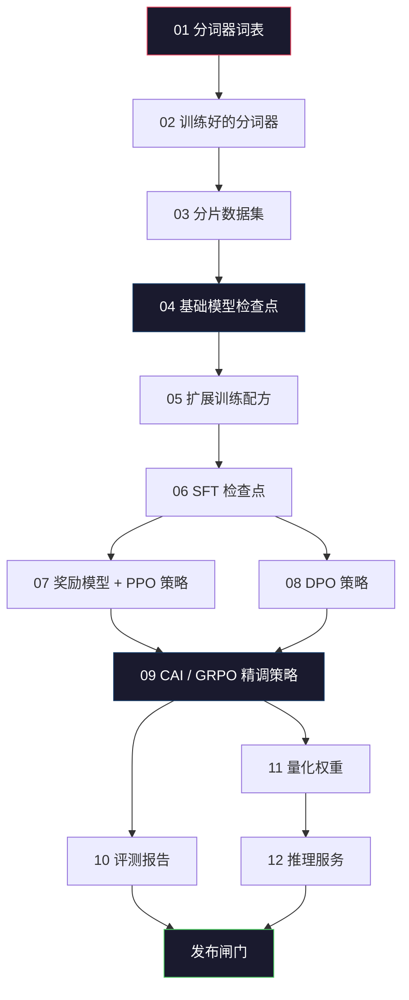
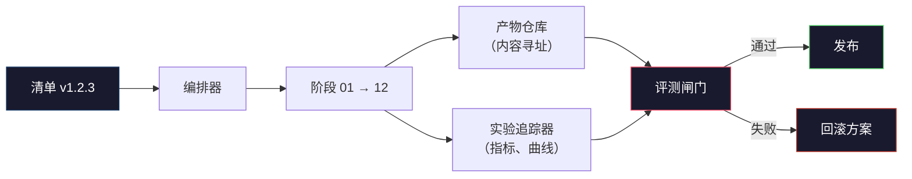

# 构建完整的大语言模型（LLM）流程

> 第 01 到 12 课的所有内容都是同一个流程的不同阶段。本课是将这些阶段串联成端到端运行的脚手架：分词、预训练、扩展、监督微调（SFT）、对齐、评测、量化、部署服务。你不会在笔记本电脑上训练一个 700 亿参数的模型；你将产出 2026 年前沿团队用于决定“什么可以发布”的编排层（orchestration layer）、清单（manifest）、评测闸门（eval gate）和回滚方案（rollback plan）。这是压轴项目。

**类型：** 构建
**语言：** Python（标准库）
**前置要求：** 第 10 阶段第 01-12 课
**时长：** 约 120 分钟

## 学习目标

- 将前十一个课时（分词器、数据、预训练、扩展、SFT、RLHF、DPO、CAI、评测、量化、推理）组合成一份可复现的流程规范
- 定义阶段之间的产物契约：每个阶段消耗什么、产出什么、下一阶段如何验证输入
- 构建一个编排器（orchestrator），用于追踪实验、哈希产物，并根据评测阈值决定是否发布
- 设计回滚方案（rollback plan）：哪些产物重跑成本低、哪些成本高，以及一个损坏的检查点（checkpoint）代价几何

## 问题所在

前面的课程各自都能跑通。分词器训练好了。小型 GPT 完成了预训练。SFT 数据集组装完毕。奖励模型训练完成。DPO 跑完了。评测指标量化了。量化权重导出了。推理服务启动了。每一课都是一份笔记本，各自有各自的约定、输出路径和随机种子。

前沿训练跑不是笔记本。Llama 3 405B 在约 54 天内消耗了 3000 万 H100 小时。DeepSeek-V3 使用了约 280 万 H800 小时。在此期间，一个损坏的检查点、一次数据污染、一次评测回退（regression），都可能让团队损失一周的挂钟时间和一个月的 GPU 预算。团队能 survive 下来靠的是流程卫生（pipeline hygiene）：每个阶段都有确定性输入、确定性输出、清单、哈希和闸门。

这是压轴项目。你不会在笔记本电脑上端到端运行整个流程；你会编写协调各阶段的编排器、描述运行的清单、决定能否发布的验证器，以及让第三方仅凭一个文件就能复现你工作的重放计划。代码很小；纪律很大。

这种模式从 1 亿到 1 万亿参数都保持不变。同样是四个组件——清单、编排器、评测闸门、产物仓库——既能驱动 Llama 3，也能驱动你的爱好级 GPT。区别只在于每个阶段配置里数字的大小，而不是流程的形状。

## 核心概念

### 十二个阶段

第 10 阶段的每一课都是一个阶段。下面是完整的依赖图。



阶段 07 和 08 可以并行运行，其余都是硬依赖。阶段 02（分词器）的变更会使所有下游产物失效。阶段 10（评测）的变更只会使发布决定失效。

### 清单（Manifest）

清单（manifest）是一个足以完整重放某次运行的单一文件。流程产出的任何东西都不应依赖清单之外的状态。字段枯燥且强制。

```
pipeline_version: 1.2.3
seed: 42
git_commit: a1b2c3d4
stages:
  01_tokenizer:
    recipe: bpe_32k
    input_hash: sha256:...
    output_hash: sha256:...
    wall_clock_sec: 3600
    cost_usd: 12
```

阶段 N 的输出哈希（output hash）就是阶段 N+1 的输入哈希（input hash）。任何偏差都会让流程 halt。这样就能尽早发现数据损坏；也能让远在另一大洲的队友验证他们的重放是否产出了与你相同的产物。

实践中，团队会使用一个小型 YAML 模式（schema）加上一个清单检查器，与上一次成功运行做 diff。任何预期字段之外的变化（成本、挂钟时间）都是危险信号。

### 产物类型化（Artifact Typing）

每个阶段的输出都是类型化产物（typed artifact）。不是目录 blob，也不是 pickle，而是具有已知模式的具名类型。

| 阶段 | 产物类型 | 关键字段 |
|------|----------|----------|
| 01-02 | 分词器（Tokenizer） | vocab.json、merges.txt、config.json、hash |
| 03 | 数据集（Dataset） | shards[]、行数、token 数、去重统计 |
| 04-05 | 检查点（Checkpoint） | weights.safetensors、config.json、优化器状态、步数 |
| 06 | SFT 模型 | 检查点 + SFT 配方 + 数据混合 |
| 07 | 奖励模型（Reward Model） | RM 检查点 + 偏好数据哈希 |
| 08-09 | 策略模型（Policy） | 检查点 + 参考模型哈希 + beta + 已消耗 KL 预算 |
| 10 | 评测报告（Eval Report） | 基准分数 + 回退差异 + 评测数据哈希 |
| 11 | 量化模型（Quantized Model） | 量化权重 + 校准数据 + 相对 FP16 的精度差异 |
| 12 | 服务规范（Server Spec） | 端点 + 模型哈希 + 配置 + 可观测钩子 |

类型化防止了最常见的失败模式：把阶段 08 的输出当作阶段 06 的输入，把 DPO 训练好的模型塞进 SFT 路径。类型化产物加类型化阶段签名让这些错误在“编译期”就失败，而不是第五天才发现。

### 评测闸门（Eval Gate）

发布不是“训练完成了”。发布是“训练完成且评测闸门（eval gate）通过”。闸门在运行开始前就定义好了。

```
gates:
  mmlu:      >= baseline + 0.5   # 不回退
  humaneval: >= baseline + 1.0
  truthfulqa: >= baseline         # 不下降
  safety_refusal_rate: <= 0.05
  kl_from_reference: <= 25.0
  cost_total_usd: <= 50000
```

每个闸门都是数值阈值。没有“看起来不错”的闸门，没有主观签字。如果所有闸门都通过，产物被标记为可发布（shippable）；如果有任何闸门失败，流程进入暂停（hold）状态，等待具名审查者显式覆盖，且覆盖本身也会被记录到清单中。

两个闸门能拦住大多数灾难。*回退闸门（regression gate）*（新模型在核心基准上必须至少不逊于旧模型）能捕获训练 bug。*KL 预算闸门（KL budget gate）*（对齐后的策略模型相对参考模型不能漂移超过 X）能捕获对齐过度（alignment overcooking）。每个生产流程都应同时具备这两者。

### 编排器（Orchestrator）

一小段代码：读取清单、调度阶段、追踪产物、在任何契约违反时 halt。这不是 Airflow，也不是 Kubeflow。为了流程卫生，你需要自己写一个无聊的小东西。

编排器的工作范围很窄：

1. 从清单中解析有向无环图（DAG）。
2. 对每个阶段，检查期望输出是否已以正确哈希存在（存在则跳过）。
3. 运行阶段，捕获 stdout/stderr，测量挂钟时间和成本。
4. 验证输出哈希与下游阶段期望的输入哈希是否一致。
5. 失败时写出部分清单，精确记录失败阶段，并以非零状态退出。

这就是 200 行 Python。它看起来会像本课 `code/main.py` 文件里的样子。在真实流程底层，各个阶段使用 `torchrun` 或 `ray` 在集群上执行，但编排器本身运行在单机。

### 实验追踪与产物存储

两个外部系统锚定整个流程。

**实验追踪器（wandb、neptune、mlflow）。** 每个阶段记录损失曲线、评测指标、系统遥测。当你需要在三周后对比运行 A 和运行 B 时，追踪器就是你要去的地方。团队几乎总是使用托管追踪器——自己写会浪费本应用于训练的时间。

**产物仓库（S3、R2、GCS）。** 检查点、数据集、分词器、评测报告的不可变对象存储。产物按哈希（hash）寻址，而不是按文件名。像 `latest.pt` 这样的文件名是隐形炸弹；`ckpt-7b-step-20000-sha256:abc123.safetensors` 才是一份契约。

编排器会同时写入两者。追踪器是给人类看图表用的；产物仓库是给下一阶段查找输入用的。

### 成本核算

前沿训练跑都挂着一个美元数字。预算纪律体现在两个地方。

**运行前估算。** 根据清单计算预期浮点运算次数（FLOPs）（预训练：6 × 参数量 × token 数）、预期 GPU 小时数（FLOPs ÷ 峰值吞吐 ÷ 利用率），以及按当前租赁价折算的美元成本。如果估算超过预算闸门，流程拒绝启动。

**运行中追踪。** 每个阶段的挂钟时间和成本都记录到清单里。每完成一个阶段，都会检查剩余预算。如果某个阶段超支，就用新的剩余预算评估下一阶段闸门。你不会在 VC 打电话来时才突然发现没钱了。

Llama 3 的公开成本是 6100 万美元。DeepSeek-V3 主预训练运行的公开成本是 560 万美元。这个比例主要源于硬件效率和混合专家（mixture-of-experts / MoE）——但具体成本之所以可见，是因为两个团队都按阶段追踪，而不是只按整个运行统计。

### 可复现性（Reproducibility）与确定性（Determinism）

二者不是一回事。*可复现（reproducible）* 指相同的清单 + 相同的代码 + 相同的基础设施能产出下游指标等价的检查点。*确定性（deterministic）* 指比特级完全一致的输出。

现代大语言模型训练是可复现但非确定性的。分布式训练的 reduce 顺序、GPU 内核非确定性（cuBLAS、flash-attn）以及混合精度（mixed precision）舍入，会导致不同运行间的浮点数在 1e-5 级别出现差异。这对最终指标没有影响；但若要用比特级差异调试，则是致命的。解药是记录每个阶段的输入哈希、输出哈希和 headline 指标——如果这些匹配，即便权重不是比特一致，也算“复现”成功。



### 回滚方案（Rollback Plan）

在运行开始前，写下每个阶段失败时该怎么办。分为三类。

- **重跑成本低**（小时级）：分词器、评测、量化、推理服务。直接重跑。
- **中等成本**（天级）：SFT、DPO、CAI。保留基础模型，只重跑对齐阶段。
- **昂贵**（周级、百万美元级）：预训练。这里的回滚方案不是“重跑”，而是“使用上一个完好的检查点，用修订后的数据重跑更便宜的下游阶段”。

由于阶段依赖是类型化且带哈希的，编排器可以自动计算回滚集合：使失败阶段及其所有后代失效。阶段 06（SFT）失败会失效 06、07、08、09、10、11、12。阶段 11（量化）失败只失效 11 和 12。提前命名这些集合，能避免团队在凌晨 4 点精疲力竭时临场发挥。

### 2026 年观察到的生产配方

大多数前沿团队都收敛到了同一套骨架。

- 分词器：128k BPE，带字节回退（byte fallback）。在小型平衡多语言切片上训练。
- 预训练：10-20T token，主要是网页、代码和合成数据。Muon 或 AdamW 优化器。FSDP2 或 DeepSpeed ZeRO-3。梯度检查点（gradient checkpointing）。BF16 权重，FP32 主权重。
- SFT：50 万到 200 万指令对（instruction pairs），人工与合成混合，并对评测集严格去重（dedup）。
- 对齐：DPO 或 CAI + GRPO。只有在偏好信号过于多维、DPO 搞不定时才使用 RLHF。
- 评测：MMLU-Pro、MATH、HumanEval+、GPQA、SWE-Bench Verified、LiveBench，再加上一个公众永远看不到的私有留出集。
- 量化：4-bit GPTQ 或 AWQ 用于服务，8-bit 用于安全评测等对精度差异敏感的场景。
- 服务：vLLM、TensorRT-LLM 或自研引擎。连续批处理（continuous batching）、投机解码（speculative decoding）、KV 缓存逐出（KV cache eviction）。

数字每六个月都会变。骨架不会。

## 动手构建

本课的代码是一个编排器加一个清单检查器，而不是十二个训练脚本。每个阶段用一个占位符模拟，产生正确形状和哈希的输出产物。端到端运行编排器可以证明流程的管道在真实阶段烧钱之前是可工作的。

完整实现见 `code/main.py`。关键部分：

- `Manifest` 数据类（dataclass）：流程版本、随机种子、git commit、阶段、闸门。
- `Stage` 数据类（dataclass）：名称、类型、输入（哈希）、输出（哈希）、挂钟时间、成本。
- `Orchestrator.run()`：解析 DAG、调度阶段、验证哈希、更新清单。
- `EvalGate.check()`：读取阈值、与最新评测报告对比、返回通过/失败。
- `ArtifactStore`（内存存根）：按哈希存取，模拟 S3。
- `CostTracker`：按阶段和累计追踪成本，超出上限时 halt。

`main.py` 中的流程会运行十二个占位阶段，生成一份清单，并触发一个失败的评测闸门以展示暂停状态长什么样。把每个占位符替换成对应课时里的真实训练脚本，你就得到了真实前沿流程使用的骨架。

## 使用方式

典型工作流有三个命令。

```
python code/main.py plan    # 验证清单、估算成本、打印 DAG
python code/main.py run     # 执行阶段，写入 manifest.out.yaml
python code/main.py gate    # 读取 manifest.out.yaml，应用评测闸门，决定发布或暂停
```

每次先跑 `plan`。大多数流程 bug 会在 plan 阶段暴露——缺失的闸门阈值、过期的哈希、预算超支。跑 `plan` 是免费的，跑 `run` 是昂贵的。在便宜侧抓 bug 能省钱。

`gate` 的输出要么是 `SHIP`，要么是 `HOLD: <原因>`。被暂停的运行不是失败，而是一个决策点。具名审查者要么覆盖（覆盖会被记录），要么批准回滚。

## 发布产物

本课产出 `outputs/skill-llm-pipeline-reviewer.md`。向它提交一份拟议的流程清单，它会检查所有契约：阶段类型、哈希链、闸门、回滚方案、成本估算。如果清单缺失评测闸门、KL 预算无上限，或把评测数据和训练数据混在一起，它会拒绝批准。

## 练习题

1. 扩展编排器以支持阶段 07 和 08 的并行执行。使用标准库 `concurrent.futures` 模块。确认最终清单记录了两个阶段的输出，并且阶段 09 的输入哈希是两者确定性的组合。

2. 增加一个“污染检查”闸门。给定评测数据集哈希和训练数据分片，计算重叠（精确字符串匹配或 13-gram 匹配）。如果重叠超过 0.1%，闸门失败。喂给它一份被污染的训练集，确认闸门会暂停运行。

3. 从零开始实现成本估算器。对于阶段 04（预训练），将 FLOPs 估算为 6 × 参数量 × token 数，假设 H100 BF16 峰值 989 TFLOPs 下 MFU（model FLOPs utilization）为 40%，GPU 小时成本 $2.50。报告一个 70 亿参数模型在 2T token 上训练的估算值，并与公布的 Llama 2 数字对比。

4. 实现部分回滚。模拟阶段 09（CAI）失败，然后只重跑阶段 09 到 12，同时保留 01-08 的缓存产物。编排器应通过哈希检测到缓存产物并跳过它们。测量相比完整重跑节省的挂钟时间。

5. 增加可观测性。为每个阶段发出 OpenTelemetry 跨度（span），属性包括参数量、已见 token 数、损失和成本。将跨度发送到本地收集器。重点不是仪表盘，而是每个阶段的健康状况都能从一个 trace ID 追踪到。

## 关键术语

| 术语 | 大家怎么说 | 实际含义 |
|------|------------|----------|
| 清单（Manifest） | “配方文件” | YAML 或 JSON，描述流程版本、随机种子、每阶段配置和闸门阈值——足以重放一次运行 |
| 内容寻址（Content-addressed） | “按哈希不按名字” | 产物按内容 SHA-256 存储，因此永远不会混淆版本 A 和版本 B |
| 评测闸门（Eval gate） | “发布标准” | 对基准指标和安全分数的数值阈值，产物必须通过才标记为可发布 |
| KL 预算（KL budget） | “对齐漂移了多远” | 对齐阶段累计 KL(policy \|\| reference) 的上限，作为闸门强制执行 |
| MFU | “GPU 用了多少” | Model FLOPs Utilization —— 实际 FLOPs 除以理论峰值。700 亿规模通常 40%，70 亿规模通常 55% |
| 回滚方案（Rollback plan） | “坏了怎么办” | 每阶段失败时预先写好的操作集合：重跑、回退、用修订输入重新训练 |
| 编排器（Orchestrator） | “指挥者” | 读取清单、调度阶段、验证哈希、在契约违反时 halt 的进程 |
| 产物仓库（Artifact store） | “权重的版本化 S3” | 不可变的内容寻址对象存储——检查点、数据集、评测报告的唯一事实来源 |
| 可复现（Reproducible） | “重跑指标一样” | 比特级权重不同，但下游指标等价——这是分布式大语言模型训练的现实目标 |
| 成本闸门（Cost gate） | “不能超过 X” | 运行前成本估算 + 运行中追踪——估算超出预算时流程拒绝启动 |

## 延伸阅读

- [Dubey et al., 2024 -- "The Llama 3 Herd of Models"](https://arxiv.org/abs/2407.21783) -- 关于前沿流程最详细的公开描述，涵盖数据、训练、对齐、评测
- [DeepSeek-AI, 2024 -- "DeepSeek-V3 Technical Report"](https://arxiv.org/abs/2412.19437) -- 效率优先的流程，成本约为 Llama 3 同级训练的十分之一
- [Kaplan et al., 2020 -- "Scaling Laws for Neural Language Models"](https://arxiv.org/abs/2001.08361) -- 最初的算力-数据-参数扩展关系
- [Hoffmann et al., 2022 -- "Training Compute-Optimal Large Language Models (Chinchilla)"](https://arxiv.org/abs/2203.15556) -- 对 Kaplan 的修正，重新校准了现代数据预算
- [PyTorch FSDP2 documentation](https://pytorch.org/docs/stable/fsdp.html) -- PyTorch 2.4+ 中取代 FSDP1 的分布式训练原语
- [Weights & Biases LLM Reports](https://wandb.ai/site/llms) -- 开源大语言模型运行的真实清单和实验追踪器输出，可作为可直接套用的模板
