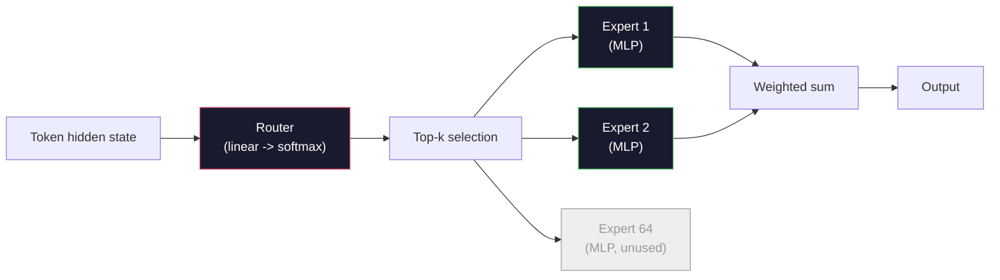

# 开源模型：架构逐行解析

> 你在第 04 课从零实现了一个 GPT-2 Small。2026 年的前沿开源模型与它是同一家族，只不过有五到六项具体改动：用均方根归一化（RMSNorm）代替层归一化（LayerNorm），用 SwiGLU 代替 GELU，用旋转位置编码（Rotary Position Embedding，RoPE）代替可学习位置编码，用组查询注意力（Grouped-Query Attention，GQA）或多头潜在注意力（Multi-Head Latent Attention，MLA）代替完整的多头注意力（Multi-Head Attention，MHA），以及在规模化时使用混合专家（Mixture-of-Experts，MoE）。你学过的数学已经覆盖了其中 95%。本课将并排阅读 Llama 3、DeepSeek-V3、Mixtral、Qwen 和 Gemma 的架构，并指出每种模型在哪一行偏离了基准。

**类型：** 学习
**语言：** Python（标准库）
**前置知识：** Phase 10、第 04/05/12 课（预训练、扩展、推理）
**时间：** 约 45 分钟

## 学习目标

- 阅读 Llama 3、Mistral、Mixtral、Gemma 2、Qwen 2.5 和 DeepSeek-V3 的 config.json，并解释其中每个字段
- 说出每个模型相比 GPT-2 Small 做出的具体架构改动，并从第一性原理说明理由
- 仅根据配置计算任何开源模型的参数量、KV 缓存（KV cache）大小和激活显存
- 在给定延迟、显存和能力约束下，为部署目标挑选合适的开源模型

## 问题

第 04 课你用 350 行 numpy 写出了一个 GPT-2 形状的模型。Llama 3 405B 有一份 200 页的技术报告。你的直觉可能觉得它们是完全不同的东西。并非如此。那 200 页描述的仍是同一个对象，只不过有五到六项动机明确的改动，以及大量关于扩展的实现细节。骨架——嵌入（embedding）、Transformer 块、注意力（attention）、MLP、归一化（normalization）、输出头——没有变。

本课是一份“diff”。对于每个主要开源模型家族，我们会精确列出它与 GPT-2 相比改了什么、为什么改、代价是什么。学完后，你就能阅读一份新的模型卡，并在心里把它翻译回 GPT-2 基准。

实际的收益是：当 Meta 发布 Llama 5 或 DeepSeek 发布 V4 时，你不需要新的心智模型。你查看配置，看哪些已知旋钮被拨动，就知道下游影响是什么。2026 年的架构是一个有限工具箱，每个新模型只是选择不同的子集。

## 概念

### 不变的核心

所有自回归开源模型都共享：

- 词嵌入矩阵（`vocab_size` × `hidden_dim`）。
- N 个解码器块的堆叠：归一化、自注意力（self-attention）、残差、归一化、MLP、残差。
- 最终归一化和映射到 `vocab_size` 的线性输出头（通常与嵌入权重共享）。
- 因果掩码、下一词交叉熵损失（next-token cross-entropy loss）。

这就是形状。其余都是旋钮。

### 真正会动的六个旋钮

在 2024–2026 年的每个前沿开源模型中，以下六项设计选择反复出现：

1. **归一化。** LayerNorm → RMSNorm。
2. **位置编码。** 可学习绝对位置 → RoPE（及变体：YaRN、NTK）。
3. **激活函数。** GELU → SwiGLU（或 GeGLU）。
4. **注意力头共享。** MHA → GQA → 多查询注意力（Multi-Query Attention，MQA）→ MLA。
5. **稠密 vs 稀疏 MLP。** 稠密 → 混合专家（MoE）。
6. **Pre-norm 放置。** 仍使用 Pre-norm。Post-norm 已消失。

其余一切（学习率调度、数据混合、批次大小、上下文长度）都活在训练配置里，而非架构中。六个旋钮。

### 旋钮 1：RMSNorm

层归一化（LayerNorm）减去均值、除以标准差、缩放并平移。均方根归一化（RMSNorm）只保留缩放：

```
RMSNorm(x) = x / sqrt(mean(x^2) + eps) * gamma
```

不减均值、无偏置、每个 token 少一次矩阵乘法。Zhang and Sennrich（2019）认为它在机器翻译上匹敌 LayerNorm，同时快约 10%。每个现代开源模型都用它。

代价：几乎没有。收益：轻微吞吐提升、代码更简单。

### 旋钮 2：RoPE

可学习位置嵌入在 GPT-2 中是一张 1024 槽的查找表。上下文到 1025 就超出表尾。模型无法外推到训练长度之外。

旋转位置编码（RoPE，Su et al. 2021）在注意力点积前把每个 Q 和 K 向量成对旋转。旋转角度是位置的确定性函数，因此没有可学习参数，也不会“用完”。配合缩放技巧（NTK-aware 插值、YaRN），一个在 8k 上下文上训练的模型可以在推理时拉伸到 128k，仅带来适度的精度损失。

```
q_rotated = rotate(q, angle(pos))
k_rotated = rotate(k, angle(pos))
score = q_rotated . k_rotated
```

每个 Llama、Mistral、Qwen、DeepSeek 和 Gemma 都用 RoPE。Gemma 2 使用混合方案（大部分层用 RoPE，部分层用局部滑动窗口注意力）。

### 旋钮 3：SwiGLU

GPT-2 的 MLP 是 `x -> gelu(xW1 + b1) -> (...)W2 + b2`。SwiGLU（Shazeer 2020）把激活替换为门控乘积：

```
SwiGLU(x) = (xW1) * sigmoid(xW1) * xV
```

两条投影并行，由 Swish 激活门控。经验上每参数困惑度（perplexity）更强。Llama 2 采用后，大家纷纷跟进。MLP 的隐藏尺寸通常按总参数量与原稠密 MLP 相等来设置：若 GPT-2 使用 `ff_dim = 4 * hidden`，SwiGLU 使用 `ff_dim = (2/3) * 4 * hidden = 8/3 * hidden`。

### 旋钮 4：注意力头共享

GPT-2 使用 **多头注意力（MHA）**：每个头有自己的 Q、K、V 投影。

**多查询注意力（MQA，Shazeer 2019）** 在所有头之间共享一个 K 和一个 V。KV 缓存按头数减少，在典型模型中是 12–32 倍。在困难基准上精度略有下降。

**组查询注意力（GQA，Ainslie et al. 2023）** 是折中：G 组 Q 头共享一个 K 和一个 V。Llama 3 8B 使用 GQA，32 个 Q 头和 8 个 KV 头（G=8），因此 KV 缓存相比完整 MHA 缩小 4 倍。

**多头潜在注意力（MLA，DeepSeek 2024）** 把 K 和 V 压缩到一个共享的低秩潜在向量，再按头解压缩。进一步减少 KV 缓存，同时保留每头的表达能力。DeepSeek-V2 和 V3 靠它实现长上下文性能。

| 方案 | KV 头数 | KV 缓存 | 精度 |
|--------|----------|----------|----------|
| MHA    | num_heads | 完整 | 最佳 |
| GQA    | num_groups（G < num_heads） | num_heads / G 倍缩减 | 接近 MHA |
| MQA    | 1 | num_heads 倍缩减 | 轻微下降 |
| MLA    | 潜在，按头解压 | 比 MQA 更小 | 接近 MHA |

对于任何超过约 130 亿参数的模型，GQA 或 MLA 实际上是必需的。大规模完整 MHA 是 KV 缓存灾难。

### 旋钮 5：混合专家（MoE）

稠密 MLP 为每个 token 激活所有参数。MoE MLP 每个块有 K 个专家（expert）和一个路由（router），为每个 token 挑选 top-k 专家（通常是 top-2）。只有这些专家的权重会参与该 token 的前向传播。

```
router_logits = xW_r
indices, weights = top_k(router_logits, k=2)
output = sum_i weights[i] * expert[indices[i]](x)
```

诱人之处在于：你可以拥有 64 个各 7B 规模的专家（总参数量巨大），但每个 token 只运行其中 2 个（每 token 计算量与一个稠密 7B 模型相当）。Mixtral 8x7B 总参数量 470 亿，但每 token 只激活 130 亿。DeepSeek-V3 总参数量 6710 亿，但每 token 只激活 370 亿。



优缺点：相同计算量、更多参数、更强容量。缺点：专家权重仍要占某处内存（因此服务时比稠密等效模型需要更多 VRAM）、路由负载均衡困难，对齐阶段微调路由本身也是研究课题。

### 旋钮 6：Pre-norm 保留

原始 Transformer 在每个子层后应用层归一化。GPT-2 之后的每个开源模型都把它放在每个子层 *之前*。Pre-norm 在深层训练上严格更简单。无需争论。

### 模型对比表

下面是让一切具体化的表格。

| Model | Year | Total Params | Active Params | Norm | Activation | Position | Attention | MoE | Context |
|-------|------|-------------|---------------|------|-----------|----------|-----------|-----|---------|
| GPT-2 Small | 2019 | 124M | 124M | LayerNorm | GELU | Learned | MHA (12 heads) | no | 1k |
| Llama 3 8B | 2024 | 8B | 8B | RMSNorm | SwiGLU | RoPE | GQA (32/8) | no | 128k |
| Llama 3 70B | 2024 | 70B | 70B | RMSNorm | SwiGLU | RoPE | GQA (64/8) | no | 128k |
| Llama 3 405B | 2024 | 405B | 405B | RMSNorm | SwiGLU | RoPE | GQA (128/16) | no | 128k |
| Mistral 7B | 2023 | 7.2B | 7.2B | RMSNorm | SwiGLU | RoPE | GQA | no | 32k |
| Mixtral 8x7B | 2023 | 47B | 13B | RMSNorm | SwiGLU | RoPE | GQA | yes (8 experts, top-2) | 32k |
| Gemma 2 9B | 2024 | 9B | 9B | RMSNorm (pre+post) | GeGLU | RoPE + sliding | GQA | no | 8k |
| Qwen 2.5 72B | 2024 | 72B | 72B | RMSNorm | SwiGLU | RoPE (YaRN) | GQA (64/8) | no | 128k |
| DeepSeek V2 236B | 2024 | 236B | 21B | RMSNorm | SwiGLU | RoPE | MLA | yes (160 experts, top-6) | 128k |
| DeepSeek V3 | 2024 | 671B | 37B | RMSNorm | SwiGLU | RoPE | MLA | yes (256 experts, top-8) | 128k |

扫一遍列。RMSNorm 是普适的。SwiGLU 或其表亲 GeGLU 是普适的。RoPE 是普适的。GQA 在 7B 以上普适，除非被 MLA 取代。MoE 是高端模型的差异化因素。

### 阅读 config.json

Llama 3 8B 配置：

```
{
  "hidden_size": 4096,
  "intermediate_size": 14336,
  "num_hidden_layers": 32,
  "num_attention_heads": 32,
  "num_key_value_heads": 8,
  "max_position_embeddings": 131072,
  "rope_theta": 500000.0,
  "rms_norm_eps": 1e-5,
  "vocab_size": 128256
}
```

每个字段都对应你已经实现过的东西。

- `hidden_size`：嵌入维度。
- `intermediate_size`：MLP 隐藏尺寸（hidden 的 3.5 倍——SwiGLU 数学）。
- `num_hidden_layers`：堆叠深度。
- `num_attention_heads`：Q 头数量。
- `num_key_value_heads`：KV 头数量（GQA）。
- `max_position_embeddings`：训练上下文长度。
- `rope_theta`：RoPE 基础频率。Meta 把它从默认的 10k 提高到 500k，用于长上下文外推。
- `rms_norm_eps`：数值稳定性。
- `vocab_size`：token 数量。

仅凭这些你就能计算总参数量、KV 缓存和峰值激活显存。精确公式见 `code/main.py`。

### 激活显存预算

激活在几十亿参数以上的模型训练中占据显存主导地位。预训练（配合梯度检查点）的经验公式：

```
activation_mem ~ batch_size * seq_len * hidden_size * num_layers * bytes_per_element
```

Llama 3 8B，`batch` 1、`seq` 8192、BF16、32 层、hidden 4096：仅激活就约 8 GB（带检查点），不带约 40 GB。这就是 FlashAttention 和 Ring Attention 重要的原因——它们重写注意力计算，让激活装得下。

### KV 缓存预算

最大上下文下的推理：

```
kv_cache = 2 * num_layers * num_kv_heads * head_dim * max_seq_len * bytes_per_element
```

Llama 3 8B 在 128k 上下文、BF16、`head_dim = hidden / num_heads = 128`：
`2 * 32 * 8 * 128 * 131072 * 2 = 17.2 GB` 每条序列。

80 亿参数的权重在 BF16 下是 16 GB。单条 128k 序列的 KV 缓存比权重还大。这就是推动 GQA、MLA 和 KV 缓存量化的显存压力。

### 每种模型何时胜出

- **单卡 80GB GPU，无 MoE**：Llama 3 8B、Mistral 7B、Gemma 2 9B。易于部署，工具链丰富。
- **单节点（8×80GB），大容量**：Llama 3 70B、Qwen 2.5 72B。最高的稠密开源能力。
- **最强开源能力，接受 MoE 复杂度**：DeepSeek V3、Mixtral 8x22B。每激活 FLOP 的最佳能力。
- **长上下文需求**：Llama 3（128k 配合 RoPE 缩放）、DeepSeek（MLA 优势）。
- **低延迟服务**：Gemma 2 9B（滑动窗口降低长上下文计算）。

## 动手实现

本课代码是一个计算器。给定任意 config.json，它会按组件打印参数量、最大上下文下的 KV 缓存、SwiGLU MLP 比例，以及对架构的简短判断（dense / GQA / MLA / MoE）。

```python
config = {
    "hidden_size": 4096, "intermediate_size": 14336,
    "num_hidden_layers": 32, "num_attention_heads": 32,
    "num_key_value_heads": 8, "vocab_size": 128256,
    "max_position_embeddings": 131072,
}
```

脚本逐字段遍历架构，计算嵌入、注意力（含 GQA 缩减）、MLP（含 SwiGLU 扩展）、层归一化和输出头的参数量；然后计算声明上下文长度下的 KV 缓存并打印摘要。

实现见 `code/main.py`。

## 使用它

用脚本中自带的 Llama 3 8B、Mistral 7B、Mixtral 8x7B 和 DeepSeek V3 配置运行计算器。比较参数量分解。注意 MoE 模型的总参数量远超稠密模型，但激活参数量往往更小。注意 DeepSeek V3 的 KV 缓存比 Llama 3 405B 还小，尽管总参数量更多——这就是 MLA 在起作用。

然后把你本地任意模型的配置填进去，读取摘要，判断它是否装得下你的 GPU。

## 交付成果

本课产出 `outputs/skill-open-model-picker.md`。给定部署目标（GPU 类型、VRAM、上下文长度、延迟预算）和任务画像（聊天、代码、推理、长上下文），它会推荐一款开源模型、第 11 课的一种量化方案，以及第 12 课的一个推理栈，并围绕六个架构旋钮给出明确的推理。

## 练习

1. 从 HuggingFace 读取 Qwen 2.5 72B 的配置。从零计算总参数量，与 HF 报告值对比，找出差异来源（头维度取整、KV 共享因子等）。

2. DeepSeek V3 使用 256 个专家、top-8 路由。计算激活专家数与总专家数的比例，并与 Mixtral 8x7B 的 8 个专家 top-2 对比。从稀疏（25%）到更密的稀疏（约 3%）转变，对每 FLOP 容量意味着什么？

3. 计算 Llama 3 405B 在 128k 上下文下使用 FP8 和 BF16 的 KV 缓存。FP8 是 BF16 数值的一半。在单节点 8×H100（每卡 80GB，共 640GB，减去权重占用）上能同时服务多少条序列？

4. Gemma 2 交替使用全注意力层和滑动窗口注意力层。写出一半层使用 4096 token 滑动窗口而非全上下文时的 KV 缓存公式。在总上下文 8k 时能节省多少显存？

5. 找一份本课撰写之后发布的最新前沿开源模型。识别它选择了六个旋钮中的哪些，是否引入了第七个旋钮。新架构一旦发布，课程表就会显得过时——目标是在不重建心智模型的情况下更新你的表格。

## 关键术语

| 术语 | 常见说法 | 实际含义 |
|------|----------------|----------------------|
| RMSNorm | “去掉均值的 LayerNorm” | 只用均方根归一化并带可学习缩放 —— 更便宜，效果与 LayerNorm 相当 |
| RoPE | “旋转位置编码” | 将每个 Q 和 K 向量按 2D 成对旋转，旋转角度取决于位置 —— 配合缩放技巧可外推到训练长度之外 |
| SwiGLU | “新的 MLP 激活” | 带 Swish 门控的线性单元：`(xW1) * sigmoid(xW1) * xV` —— 2024 年后每个开源模型的标准选择 |
| GQA | “折中注意力” | 组查询注意力：G 组 Q 头共享一个 K 头和一个 V 头 —— 在不牺牲 MQA 精度的情况下缩减 KV 缓存 |
| MLA | “DeepSeek 的注意力” | 多头潜在注意力：把 K/V 压缩到共享的低秩潜在向量，再按头解压 —— 大模型下最小的 KV 缓存 |
| MoE | “稀疏专家” | 混合专家：每个块有 N 个 MLP，路由为每个 token 挑选 top-k —— 总参数量巨大，激活参数量很小 |
| Top-k routing | “为每个 token 选 k 个专家” | 路由计算每个专家的分数，激活最高的 k 个 —— 典型 k 为 2（Mixtral）到 8（DeepSeek） |
| YaRN | “拉伸 RoPE” | 又一个 RoPE 扩展（Yet another RoPE extension）—— 在推理时对旋转角度插值，把上下文从 8k 扩展到 128k+ |
| Sliding-window attention | “不全看” | 每个 token 只关注最近 W 个 token —— 把每 token 注意力成本限制在 O(W)，用于 Gemma 2 和早期 Mistral |
| Active params | “每 token 实际运行的参数” | 对 MoE 模型，参与每个 token 前向传播的参数量（远小于总参数量）—— 决定每 token FLOP |

## 扩展阅读

- [Dubey et al., 2024 —— “Llama 3 模型群”](https://arxiv.org/abs/2407.21783) —— 稠密 Llama 3 家族的架构与训练参考
- [DeepSeek-AI, 2024 —— “DeepSeek-V3 技术报告”](https://arxiv.org/abs/2412.19437) —— MLA、无辅助损失负载均衡与 671B MoE
- [Jiang et al., 2024 —— “Mixtral of Experts”](https://arxiv.org/abs/2401.04088) —— 经典 MoE 开源模型论文
- [Su et al., 2021 —— “RoFormer：基于旋转位置编码的增强 Transformer”](https://arxiv.org/abs/2104.09864) —— RoPE 论文
- [Shazeer, 2020 —— “GLU Variants Improve Transformer”](https://arxiv.org/abs/2002.05202) —— SwiGLU、GeGLU 等
- [Ainslie et al., 2023 —— “GQA：训练广义多查询 Transformer 模型”](https://arxiv.org/abs/2305.13245) —— GQA 论文
- [Gemma 2 Team, 2024 —— “Gemma 2：在实用尺寸上改进开放语言模型”](https://arxiv.org/abs/2408.00118) —— 全注意力 + 滑动窗口注意力混合、pre+post-norm
- [Qwen Team, 2024 —— “Qwen 2.5 技术报告”](https://arxiv.org/abs/2412.15115) —— YaRN 上下文扩展与长上下文训练配方
