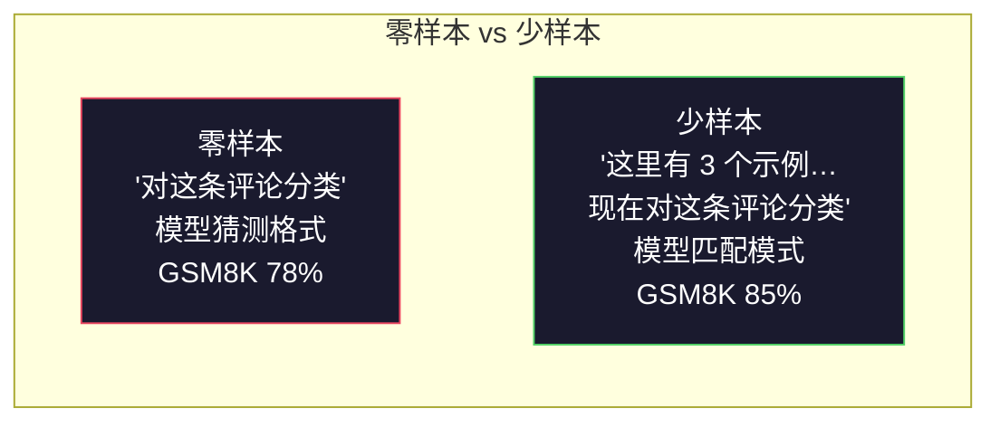
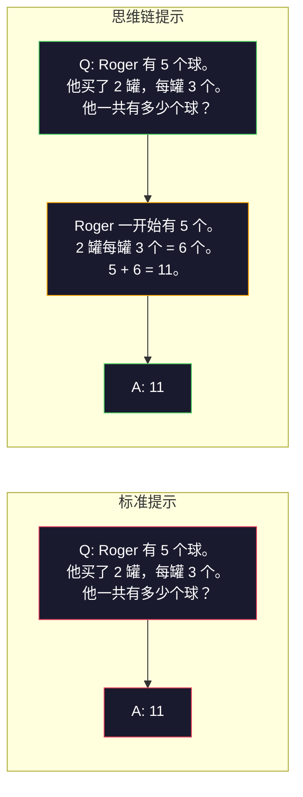
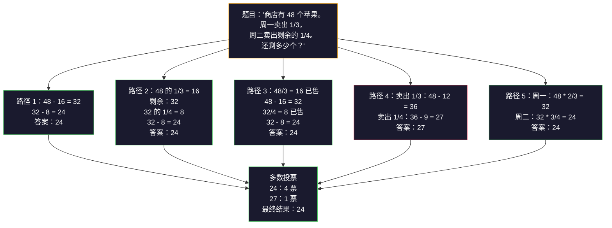
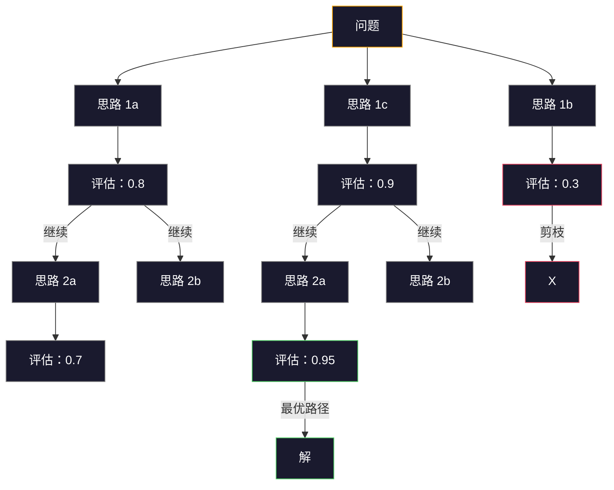

# 少样本提示、思维链与思维树

> 告诉模型该做什么，是提示；教会模型如何思考，是工程。在相同模型、相同任务、相同数据上，准确率从 78% 提升到 91%，靠的不是更强大的模型，而是更优秀的推理策略。

**类型：** 实践  
**语言：** Python  
**前置：** 第 11.01 课（提示工程）  
**时长：** 约 45 分钟

## 学习目标

- 通过挑选并格式化示例演示，实现能最大化任务准确率的少样本提示（few-shot prompting）
- 将思维链（Chain-of-Thought, CoT）推理应用于数学应用题等多步问题，以提升准确率
- 构建思维树（Tree-of-Thought, ToT）提示，探索多条推理路径并选出最优路径
- 在标准基准上测量零样本、少样本与思维链相比带来的准确率提升

## 问题背景

你正在开发一款数学辅导应用。你的提示词是：“解这道应用题。”GPT-5 在 GSM8K（标准小学数学基准）上的准确率达到 94%。你以为已经到顶了。其实没有——思维链仍能再提升 3–4 个百分点。

加上五个词——“Let's think step by step”——准确率跃升至 91%。再补充几道带推理过程的示例，准确率达到 95%。模型相同、温度相同、API 成本相同。唯一的区别是你给了模型“草稿纸”。

这不是技巧。这正是推理的本质。人类不会一步跃迁式地解决多步问题，Transformer 也不会。当你强制模型生成中间词元时，这些词元会成为下一个词元的上下文。每一步推理都喂养下一步。模型 literally 通过计算得出答案。

但“think step by step”只是起点，不是终点。如果你采样五条推理路径并取多数票会怎样？如果你让模型探索一棵可能性的树，并评估、剪枝会怎样？如果你把推理与工具使用交错进行会怎样？这些不是假设，而是已发表论文中带有实测提升的技术。在本课中，你将亲手实现它们。

## 核心概念

### 零样本 vs 少样本：示例何时胜过指令

零样本提示（zero-shot prompting）只给模型任务，不加其他内容。少样本提示则先给模型若干示例。

Wei 等人（2022）在 8 个基准上测量了这一点。对于情感分类等简单任务，零样本与少样本的差距在 2% 以内。对于多步算术和符号推理等复杂任务，少样本提升了 10–25% 的准确率。

直觉是：示例就是压缩后的指令。与其描述输出格式，不如直接展示；与其解释推理过程，不如演示推理过程。模型对示例的模式匹配，比它对抽象指令的理解更可靠。



**少样本更优的场景：** 对格式敏感的任务、分类、结构化抽取、领域特定术语，以及任何需要模型匹配特定模式的任务。

**零样本更优的场景：** 简单事实性问题、示例会限制创造力的创意任务，以及寻找优质示例比编写优质指令更困难的任务。

### 示例选择：相似优于随机

并非所有示例都同样有效。选择与目标输入相似的示例，在分类任务上比随机选择高出 5–15%（Liu 等人，2022）。三条原则：

1. **语义相似性**：挑选在嵌入（embedding）空间中与输入最接近的示例
2. **标签多样性**：示例应覆盖所有输出类别
3. **难度匹配**：示例难度应与目标问题相当

大多数任务的最佳示例数量是 3–5 个。少于 3 个，模型无法获得足够信号来抽取模式；多于 5 个，会遭遇收益递减并浪费上下文窗口的词元（token）。对于类别众多的分类任务，每个类别使用一个示例。

### 思维链：给模型草稿纸

思维链（Chain-of-Thought, CoT）提示由 Wei 等人（2022）在 Google Brain 提出。思路很简单：不要只向模型索要答案，而是先让它展示推理步骤。



从机制上讲，为什么有效？Transformer 生成的每个词元都会成为下一个词元的上下文。没有 CoT 时，模型必须把所有推理压缩到单次前向传播的隐藏状态中。有了 CoT，模型把中间计算外化为词元。每个推理词元都在扩展有效的计算深度。

**GSM8K 基准（小学数学，8.5K 道题）：**

| 模型 | 零样本 | 零样本 CoT | 少样本 CoT |
|-------|-----------|---------------|--------------|
| GPT-4o | 78% | 91% | 95% |
| GPT-5 | 94% | 97% | 98% |
| o4-mini（推理模型） | 97% | — | — |
| Claude Opus 4.7 | 93% | 97% | 98% |
| Gemini 3 Pro | 92% | 96% | 98% |
| Llama 4 70B | 80% | 89% | 94% |
| DeepSeek-V3.1 | 89% | 94% | 96% |

**关于推理模型（reasoning models）。** OpenAI 的 o 系列（o3、o4-mini）和 DeepSeek-R1 等模型会在内部先运行思维链，再输出答案。对推理模型添加 “Let's think step by step” 是冗余的，有时甚至适得其反——它们已经做过了。

CoT 的两种形式：

**零样本 CoT**：在提示末尾追加 “Let's think step by step”。无需示例。Kojima 等人（2022）表明，这一句简单的提示就能在算术、常识和符号推理任务上提升准确率。

**少样本 CoT**：提供包含推理步骤的示例。比零样本 CoT 更有效，因为模型能看到你期望的确切推理格式。

**CoT 会适得其反的场景**：简单事实回忆（“法国首都是哪里？”）、单步分类、速度比准确率更重要的任务。CoT 每次查询会增加 50–200 个推理词元的开销。对于高吞吐、低复杂度的任务，这是浪费成本。

### 自一致性：多次采样，一次投票

Wang 等人（2023）提出了自一致性（self-consistency）。核心洞察：单条 CoT 路径可能包含推理错误。但如果你采样 N 条独立的推理路径（使用 temperature > 0），并对最终答案取多数票，错误就会相互抵消。



在最初的 PaLM 540B 实验中，自一致性将 GSM8K 准确率从单条 CoT 的 56.5% 提升到 N=40 时的 74.4%。在 GPT-5 上提升较小（97% 到 98%），因为基础准确率已经饱和。该技术在基础 CoT 准确率为 60–85% 的模型上效果最佳——这是单路径错误频繁但非系统性的甜蜜点。对于推理模型（o 系列、R1），自一致性已被内置的内部采样所涵盖。

代价是：N 次采样意味着 N 倍的 API 成本和延迟。实践中，N=5 已能捕获大部分收益。N=3 是获得有意义投票的最小值。N > 10 对大多数任务收益递减。

### 思维树：分支式探索

Yao 等人（2023）提出了思维树（Tree-of-Thought, ToT）。CoT 沿一条线性推理路径前进，而 ToT 会探索多条分支，并在继续前评估哪些分支最有希望。



ToT 包含三个组件：

1. **思路生成**：产生多个候选下一步
2. **状态评估**：为每个候选打分（可以让大语言模型自身担任评估器）
3. **搜索算法**：在树上进行 BFS 或 DFS，剪除低分分支

在 24 点游戏（Game of 24，用算术组合 4 个数字得到 24）任务上，GPT-4 使用标准提示只能解决 7.3% 的问题；使用 CoT 反而降至 4.0%（因为搜索空间太宽，CoT 适得其反）；使用 ToT 则达到 74%。

ToT 很昂贵。树中每个节点都需要一次大语言模型调用。分支因子为 3、深度为 3 的树最多需要 39 次大语言模型调用。只在搜索空间大但可评估的问题上使用它——例如规划、谜题求解、带约束的创意问题求解。

### ReAct：思考与行动结合

Yao 等人（2022）将推理轨迹与动作结合起来。模型在思考（生成推理）与行动（调用工具、搜索、计算）之间交替。


ReAct 在知识密集型任务上优于纯 CoT，因为它能把推理锚定在真实数据中。在 HotpotQA（多跳问答）上，GPT-4 配合 ReAct 的精确匹配率达到 35.1%，而仅使用 CoT 为 29.4%。真正的威力在于观察结果可以纠正推理错误——模型可以在执行过程中更新计划。

ReAct 是现代 AI 智能体的基础。每个智能体框架（LangChain、CrewAI、AutoGen）都以某种变体实现了 Thought-Action-Observation 循环。你将在第 14 阶段构建完整的智能体。本课聚焦于提示模式。

### 结构化提示：XML 标签、分隔符与标题

随着提示变得复杂，结构能防止模型混淆不同部分。三种方法：

**XML 标签**（Claude 效果最好，其他地方也适用）：
```
<context>
你正在审查一个 pull request。
代码库使用 TypeScript 和 React。
</context>

<task>
审查以下 diff，找出 bug、安全问题和风格违规。
</task>

<diff>
{diff_content}
</diff>

<output_format>
按以下格式列出每个问题：file、line、severity（critical/warning/info）、description。
</output_format>
```

**Markdown 标题**（通用）：
```
## 角色
金融科技公司的资深安全工程师。

## 任务
分析这个 API 端点的漏洞。

## 输入
{api_code}

## 规则
- 聚焦 OWASP Top 10
- 为每个发现评级：critical、high、medium、low
- 包含修复步骤
```

**分隔符**（简洁但有效）：
```
---INPUT---
{user_text}
---END INPUT---

---INSTRUCTIONS---
将上文总结为 3 个要点。
---END INSTRUCTIONS---
```

### 提示链：顺序分解

有些任务对单个提示来说过于复杂。提示链（prompt chaining）将任务拆成多个步骤，前一个提示的输出成为下一个提示的输入。


提示链在三个方面优于单提示：

1. **每一步更简单**：模型只需处理一个聚焦任务，而不是同时兼顾所有任务
2. **中间输出可检查**：你可以在步骤之间验证和修正
3. **不同步骤可用不同模型**：用便宜模型做抽取，用昂贵模型做推理

### 技术对比

| 技术 | 最适用场景 | GSM8K 准确率（GPT-5） | API 调用次数 | 词元开销 | 复杂度 |
|-----------|----------|------------------------|-----------|----------------|------------|
| 零样本 | 简单任务 | 94% | 1 | 无 | 极简 |
| 少样本 | 格式匹配 | 96% | 1 | 200–500 tokens | 低 |
| 零样本 CoT | 快速推理提升 | 97% | 1 | 50–200 tokens | 极简 |
| 少样本 CoT | 单次调用最高准确率 | 98% | 1 | 300–600 tokens | 低 |
| 自一致性（N=5） | 高风险推理 | 98.5% | 5 | 5 倍词元成本 | 中等 |
| 推理模型（o4-mini） | 即插即用 CoT 替代 | 97% | 1 | 隐藏（内部 2–10 倍） | 极简 |
| 思维树 | 搜索/规划问题 | N/A（24 点游戏 74%） | 10–40+ | 10–40 倍词元成本 | 高 |
| ReAct | 基于知识的推理 | N/A（HotpotQA 35.1%） | 3–10+ | 可变 | 高 |
| 提示链 | 复杂多步任务 | 96%（流水线） | 2–5 | 2–5 倍词元成本 | 中等 |

选择哪种技术取决于三个因素：准确率要求、延迟预算和成本容忍度。对于大多数生产系统，少样本 CoT 配合 3 次采样的自一致性兜底，能覆盖 90% 的用例。

## 动手实现

我们将构建一个数学问题求解器，将少样本提示、思维链推理和自一致性投票整合到单个流水线中。然后为难题添加思维树。

完整实现位于 `code/advanced_prompting.py`。以下是关键组件。

### 步骤 1：少样本示例库

第一个组件管理少样本示例，并为给定问题选择最相关的示例。

```python
GSM8K_EXAMPLES = [
    {
        "question": "Janet's ducks lay 16 eggs per day. She eats three for breakfast every morning and bakes muffins for her friends every day with four. She sells every egg at the farmers' market for $2. How much does she make every day at the farmers' market?",
        "reasoning": "Janet's ducks lay 16 eggs per day. She eats 3 and bakes 4, using 3 + 4 = 7 eggs. So she has 16 - 7 = 9 eggs left. She sells each for $2, so she makes 9 * 2 = $18 per day.",
        "answer": "18"
    },
    ...
]
```

每个示例包含三部分：题目、推理链和最终答案。推理链将普通少样本示例转化为 CoT 少样本示例。

### 步骤 2：思维链提示构建器

提示构建器将系统消息、带推理链的少样本示例和目标题目组合成一个完整提示。

```python
def build_cot_prompt(question, examples, num_examples=3):
    system = (
        "You are a math problem solver. "
        "For each problem, show your step-by-step reasoning, "
        "then give the final numerical answer on the last line "
        "in the format: 'The answer is [number]'."
    )

    example_text = ""
    for ex in examples[:num_examples]:
        example_text += f"Q: {ex['question']}\n"
        example_text += f"A: {ex['reasoning']} The answer is {ex['answer']}.\n\n"

    user = f"{example_text}Q: {question}\nA:"
    return system, user
```

格式约束（“The answer is [number]”）至关重要。没有它，自一致性就无法跨样本抽取和比较答案。

### 步骤 3：自一致性投票

采样 N 条推理路径，并对最终答案取多数票。

```python
def self_consistency_solve(question, examples, client, model, n_samples=5):
    system, user = build_cot_prompt(question, examples)

    answers = []
    reasonings = []
    for _ in range(n_samples):
        response = client.chat.completions.create(
            model=model,
            messages=[
                {"role": "system", "content": system},
                {"role": "user", "content": user}
            ],
            temperature=0.7
        )
        text = response.choices[0].message.content
        reasonings.append(text)
        answer = extract_answer(text)
        if answer is not None:
            answers.append(answer)

    vote_counts = Counter(answers)
    best_answer = vote_counts.most_common(1)[0][0] if vote_counts else None
    confidence = vote_counts[best_answer] / len(answers) if best_answer else 0

    return best_answer, confidence, reasonings, vote_counts
```

温度 0.7 很重要。在 temperature 0.0 时，N 次采样会完全相同，失去意义。你需要足够的随机性来产生多样的推理路径，但又不能大到让模型输出胡言乱语。

### 步骤 4：思维树求解器

对于线性推理失效的问题，ToT 会探索多种方法并评估哪个方向最有希望。

```python
def tree_of_thought_solve(question, client, model, breadth=3, depth=3):
    thoughts = generate_initial_thoughts(question, client, model, breadth)
    scored = [(t, evaluate_thought(t, question, client, model)) for t in thoughts]
    scored.sort(key=lambda x: x[1], reverse=True)

    for current_depth in range(1, depth):
        next_thoughts = []
        for thought, score in scored[:2]:
            extensions = extend_thought(thought, question, client, model, breadth)
            for ext in extensions:
                ext_score = evaluate_thought(ext, question, client, model)
                next_thoughts.append((ext, ext_score))
        scored = sorted(next_thoughts, key=lambda x: x[1], reverse=True)

    best_thought = scored[0][0] if scored else ""
    return extract_answer(best_thought), best_thought
```

评估器本身也是一次大语言模型调用。你问模型：“在 0.0 到 1.0 的范围内，这条推理路径对解决该问题有多有希望？”这正是 ToT 的核心洞察——模型评估自己的部分解。

### 步骤 5：完整流水线

该流水线将所有技术与升级策略结合起来。

```python
def solve_with_escalation(question, examples, client, model):
    system, user = build_cot_prompt(question, examples)
    single_response = call_llm(client, model, system, user, temperature=0.0)
    single_answer = extract_answer(single_response)

    sc_answer, confidence, _, _ = self_consistency_solve(
        question, examples, client, model, n_samples=5
    )

    if confidence >= 0.8:
        return sc_answer, "self_consistency", confidence

    tot_answer, _ = tree_of_thought_solve(question, client, model)
    return tot_answer, "tree_of_thought", None
```

升级逻辑：先尝试低成本方案（单次 CoT）。如果自一致性置信度低于 0.8（即 5 次采样中少于 4 次一致），则升级到 ToT。这平衡了成本与准确率——大多数问题廉价解决，难题获得更多算力。

## 实际应用

### 使用 LangChain

LangChain 内置了提示模板和输出解析，简化了少样本和 CoT 模式：

```python
from langchain_core.prompts import FewShotPromptTemplate, PromptTemplate
from langchain_openai import ChatOpenAI

example_prompt = PromptTemplate(
    input_variables=["question", "reasoning", "answer"],
    template="Q: {question}\nA: {reasoning} The answer is {answer}."
)

few_shot_prompt = FewShotPromptTemplate(
    examples=examples,
    example_prompt=example_prompt,
    suffix="Q: {input}\nA: Let's think step by step.",
    input_variables=["input"]
)

llm = ChatOpenAI(model="gpt-4o", temperature=0.7)
chain = few_shot_prompt | llm
result = chain.invoke({"input": "If a train travels 120 km in 2 hours..."})
```

LangChain 还提供 `ExampleSelector` 类用于语义相似性选择：

```python
from langchain_core.example_selectors import SemanticSimilarityExampleSelector
from langchain_openai import OpenAIEmbeddings

selector = SemanticSimilarityExampleSelector.from_examples(
    examples,
    OpenAIEmbeddings(),
    k=3
)
```

### 使用 DSPy

DSPy 将提示策略视为可优化的模块。你无需手工编写 CoT 提示，而是定义签名并让 DSPy 优化提示：

```python
import dspy

dspy.configure(lm=dspy.LM("openai/gpt-4o", temperature=0.7))

class MathSolver(dspy.Module):
    def __init__(self):
        self.solve = dspy.ChainOfThought("question -> answer")

    def forward(self, question):
        return self.solve(question=question)

solver = MathSolver()
result = solver(question="Janet's ducks lay 16 eggs per day...")
```

DSPy 的 `ChainOfThought` 会自动添加推理轨迹。`dspy.majority` 实现了自一致性：

```python
result = dspy.majority(
    [solver(question=q) for _ in range(5)],
    field="answer"
)
```

### 对比：从零实现 vs 框架

| 特性 | 从零实现（本课） | LangChain | DSPy |
|---------|--------------------------|-----------|------|
| 提示格式控制 | 完全 | 基于模板 | 自动 |
| 自一致性 | 手动投票 | 手动 | 内置（`dspy.majority`） |
| 示例选择 | 自定义逻辑 | `ExampleSelector` | `dspy.BootstrapFewShot` |
| 思维树 | 自定义树搜索 | 社区链 | 未内置 |
| 提示优化 | 手动迭代 | 手动 | 自动编译 |
| 最适合 | 学习、自定义流水线 | 标准工作流 | 研究、优化 |

## 交付成果

本课产生两个产物。

**1. 推理链提示**（`outputs/prompt-reasoning-chain.md`）：可用于生产的少样本 CoT 自一致性提示模板。填入你的示例和问题领域即可使用。

**2. CoT 模式选择技能**（`outputs/skill-cot-patterns.md`）：根据任务类型、准确率要求和成本约束选择合适推理技术的决策框架。

## 练习题

1. **测量差距**：取 10 道 GSM8K 题目。分别用零样本、少样本、零样本 CoT 和少样本 CoT 求解，记录每种技术的准确率。哪种技术在你的模型上提升最大？

2. **示例选择实验**：对同样的 10 道题，比较随机选择示例与手动挑选相似示例的准确率差异。示例质量何时比示例数量更重要？

3. **自一致性成本曲线**：在 20 道 GSM8K 题目上，用 N=1、3、5、7、10 运行自一致性。绘制准确率 vs 成本（总词元）曲线。你的模型在何处出现拐点？

4. **构建 ReAct 循环**：为流水线扩展一个计算器工具。当模型生成数学表达式时，用 Python 的 `eval()`（在沙箱中）执行并将结果反馈。测量基于工具的推理是否优于纯 CoT。

5. **用于创意任务的 ToT**：将思维树求解器适配为创意写作任务：“写一则既有趣又悲伤的六字故事。”让大语言模型担任评估器。分支探索是否比单次生成产生更好的创意输出？

## 关键术语

| 术语 | 人们常说 | 实际含义 |
|------|----------------|----------------------|
| 少样本提示（few-shot prompting） | “给它一些示例” | 在提示中包含输入-输出示例演示，以锚定模型的输出格式和行为 |
| 思维链（Chain-of-Thought） | “让它一步步想” | 诱导模型生成中间推理词元，在给出最终答案前扩展其有效计算 |
| 自一致性（self-consistency） | “多跑几次” | 在 temperature > 0 时采样 N 条多样推理路径，并通过多数票选择最常见的最终答案 |
| 思维树（Tree-of-Thought） | “让它探索选项” | 对推理分支进行结构化搜索，每个部分解都被评估，只有有希望的节点才会扩展 |
| ReAct | “思考 + 工具使用” | 在 Thought-Action-Observation 循环中，将推理轨迹与外部动作（搜索、计算、API 调用）交错 |
| 提示链（prompt chaining） | “拆成几步” | 将复杂任务分解为顺序提示，每个输出作为下一个输入 |
| 零样本 CoT（zero-shot CoT） | “只要加 'think step by step'” | 在提示末尾追加推理触发短语而不给示例，依赖模型的潜在推理能力 |

## 延伸阅读

- [Chain-of-Thought Prompting Elicits Reasoning in Large Language Models](https://arxiv.org/abs/2201.11903) — Wei et al. 2022。Google Brain 提出的原始 CoT 论文。阅读第 2–3 节了解核心结果。
- [Self-Consistency Improves Chain of Thought Reasoning in Language Models](https://arxiv.org/abs/2203.11171) — Wang et al. 2023。自一致性论文。表 1 有你需要的所有数据。
- [Tree of Thoughts: Deliberate Problem Solving with Large Language Models](https://arxiv.org/abs/2305.10601) — Yao et al. 2023。ToT 论文。第 4 节的 24 点游戏结果是亮点。
- [ReAct: Synergizing Reasoning and Acting in Language Models](https://arxiv.org/abs/2210.03629) — Yao et al. 2022。现代 AI 智能体的基础。第 3 节解释了 Thought-Action-Observation 循环。
- [Large Language Models are Zero-Shot Reasoners](https://arxiv.org/abs/2205.11916) — Kojima et al. 2022。“Let's think step by step”论文。简单却惊人有效。
- [DSPy: Compiling Declarative Language Model Calls into Self-Improving Pipelines](https://arxiv.org/abs/2310.03714) — Khattab et al. 2023。将提示视为编译问题。如果你想超越手工提示工程，推荐阅读。
- [OpenAI — Reasoning models guide](https://platform.openai.com/docs/guides/reasoning) — 厂商指南，说明思维链何时成为内部的、按推理词元计价的“推理”模式，而非提示层面的技巧。
- [Lightman et al., "Let's Verify Step by Step" (2023)](https://arxiv.org/abs/2305.20050) — 过程奖励模型（process reward models, PRM），对链中的每一步打分；这种推理监督信号优于仅基于结果的奖励。
- [Snell et al., "Scaling LLM Test-Time Compute Optimally" (2024)](https://arxiv.org/abs/2408.03314) — 系统研究 CoT 长度、自一致性采样与 MCTS；当准确率比延迟更重要时，“think step by step”的进阶方向。
