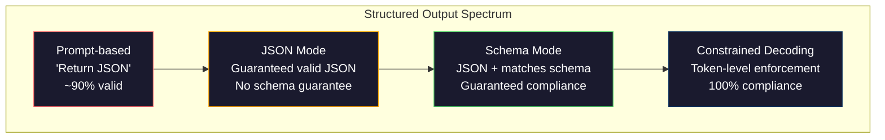
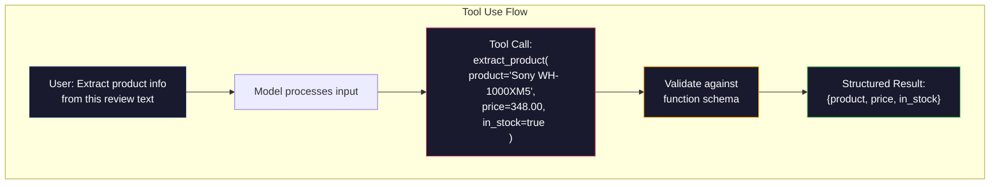

# 结构化输出：JSON、Schema 验证与约束解码

> 大语言模型（LLM）返回的是字符串，而你的应用需要的是 JSON。这个鸿沟击垮过的生产系统，比任何模型幻觉（hallucination）都多。结构化输出（structured output）是连接自然语言与类型化数据的桥梁。做好了，你的 LLM 就是一个可靠的 API；做砸了，你就会在凌晨三点用正则表达式去解析自由文本。

**类型：** 实战构建
**语言：** Python
**前置知识：** Phase 10，Lessons 01-05（LLMs from Scratch）
**时间：** 约 90 分钟
**相关课程：** Phase 5 · 20（Structured Outputs & Constrained Decoding）讲解了解码器层面的理论（FSM/CFG logit processors、Outlines、XGrammar）。本课聚焦于生产级 SDK 接口（OpenAI 的 `response_format`、Anthropic 的工具调用、Instructor）——如果你想理解 API 底层发生了什么，请先阅读 Phase 5 · 20。

## 学习目标

- 使用 OpenAI 与 Anthropic 的 API 参数实现 JSON 模式（JSON mode）和受 Schema 约束的输出
- 构建 Pydantic 验证层，拒绝格式错误的 LLM 输出，并通过错误反馈进行重试
- 解释约束解码（constrained decoding）如何在 token 级别强制生成合法 JSON，而无需后处理
- 设计稳健的抽取提示词（extraction prompts），将非结构化文本可靠地转换为类型化数据结构

## 问题背景

你问 LLM：“请从这段文本中提取产品名称、价格和库存状态。”它回答：

```
The product is the Sony WH-1000XM5 headphones, which cost $348.00 and are currently in stock.
```

这个答案完全正确，但对你的应用来说毫无用处。你的库存系统需要的是 `{"product": "Sony WH-1000XM5", "price": 348.00, "in_stock": true}`：一个具有特定键、特定类型和特定值约束的 JSON 对象，而不是一个句子。

朴素的解决方案是在提示词里加一句“请用 JSON 回复”。这在 90% 的情况下有效；但剩下 10% 的时间里，模型会把 JSON 包在 Markdown 代码围栏里，或者加上“Here's the JSON:”这样的前言，又或者因为提前闭括号而生成语法无效的 JSON。你的 JSON 解析器崩溃，流水线中断。你加上 try/except 和重试循环，重试有时会生成不同的数据——于是你在解析问题之上又多了一致性问题。

这不是提示工程（prompt engineering）问题，而是解码（decoding）问题。模型从左到右逐个生成 token；在每个位置，它都要从 10 万多个候选中挑选最可能的下一个 token。其中绝大多数 token 在特定位置都会生成非法 JSON。如果模型刚刚输出了 `{"price":`，下一个 token 只能是数字、引号（字符串）、`null`、`true`、`false` 或负号，其他任何东西都是语法灾难。没有约束时，模型完全可能选出一个语义上很合理、但语法上灾难性的英文单词。

## 核心概念

### 结构化输出的控制层级

结构化输出有四个控制层级，每一级都比上一级更可靠。



**基于提示词（prompt-based）**（“请返回合法 JSON”）：没有任何强制力。模型通常会遵守，但有时不会。可靠性：约 90%。失效模式：Markdown 代码围栏、前言文本、截断输出、结构错误。

**JSON 模式（JSON mode）**：API 保证输出是合法 JSON。OpenAI 的 `response_format: { type: "json_object" }` 可启用此模式。输出可以无错误地解析，但不一定符合你的预期模式——可能出现额外键、错误类型或缺失字段。

**Schema 模式（schema mode）**：API 接收 JSON Schema 并保证输出与之匹配。到 2026 年，主流提供商都已原生支持：OpenAI 的 `response_format: { type: "json_schema", json_schema: {...} }`（也等价于 `tool_choice="required"`）、Anthropic 带 `input_schema` 的工具调用，以及 Gemini 的 `response_schema` + `response_mime_type: "application/json"`。输出将拥有你指定的精确键、类型和约束。

**约束解码（constrained decoding）**：在生成过程中，解码器会在每个 token 位置屏蔽掉所有会导致非法输出的 token。如果 Schema 要求数字而模型即将输出字母，该 token 的概率会被设为零，模型只能生成能导向合法输出的 token。OpenAI 的结构化输出模式以及 Outlines、Guidance 等库在底层实现的就是这个。

### JSON Schema：契约语言

JSON Schema 是你告诉模型（或验证层）输出必须长成什么样的方式。所有主流结构化输出系统都用它。

```json
{
  "type": "object",
  "properties": {
    "product": { "type": "string" },
    "price": { "type": "number", "minimum": 0 },
    "in_stock": { "type": "boolean" },
    "categories": {
      "type": "array",
      "items": { "type": "string" }
    }
  },
  "required": ["product", "price", "in_stock"]
}
```

这个 Schema 表示：输出必须是一个对象，包含字符串 `product`、非负数 `price`、布尔值 `in_stock`，以及一个可选的字符串数组 `categories`。任何不匹配都会被拒绝。

Schema 能处理复杂场景：嵌套对象、带类型约束的数组、枚举（将字符串限制为特定值）、模式匹配（字符串上的正则），以及组合器（`oneOf`、`anyOf`、`allOf`，用于多态输出）。

### Pydantic 模式

在 Python 中，你不需要手写 JSON Schema。定义一个 Pydantic 模型，它会自动为你生成 Schema。

```python
from pydantic import BaseModel

class Product(BaseModel):
    product: str
    price: float
    in_stock: bool
    categories: list[str] = []
```

这会生成与上面相同的 JSON Schema。Instructor 库（以及 OpenAI 的 SDK）可以直接接收 Pydantic 模型：传入模型类，取回经过验证的实例。如果 LLM 输出不匹配，Instructor 会自动重试。

### 函数调用 / 工具调用

这是同一个问题的另一种接口。你不再让模型直接生成 JSON，而是定义带有类型参数的“工具”（函数）。模型输出一次函数调用，附带结构化的参数。OpenAI 称之为“function calling”，Anthropic 称之为“tool use”。结果是一样的：结构化数据。



当模型需要选择调用哪个函数，而不仅仅是填充参数时，工具调用更合适。如果你有 10 种不同的抽取 Schema，模型必须根据输入选择正确的那一个，工具调用能同时完成模式选择和结构化输出。

### 常见失效模式

即便有 Schema 强制执行，结构化输出仍可能以微妙的方式出错。

**幻觉值（hallucinated values）**：输出符合 Schema，但包含编造的数据。例如文本写的是 $348，模型却输出 `{"price": 299.99}`。Schema 验证无法捕捉这种错误——类型正确，但值错了。

**枚举混淆（enum confusion）**：你把字段限制为 `["in_stock", "out_of_stock", "preorder"]`，模型却输出 `"available"`——语义上没错，但不在允许集合中。优秀的约束解码能阻止这种情况，基于提示词的方法则做不到。

**嵌套对象深度**：深度嵌套的 Schema（4 层以上）更容易出错。每一层嵌套都是模型可能丢失结构的地方。

**数组长度**：模型可能生成过多或过少的数组项。Schema 支持 `minItems` 和 `maxItems`，但并非所有提供商都在解码层强制执行。

**可选字段省略**：模型会省略技术上可选、但对你的用例语义上重要的字段。即便数据有时缺失，也应在 Schema 中设为必填——强制模型显式输出 `null`。

## 动手构建

### 步骤 1：JSON Schema 验证器

从零开始构建一个验证器，检查 Python 对象是否符合 JSON Schema。这就是在输出端运行的合规性检查。

```python
import json

def validate_schema(data, schema):
    errors = []
    _validate(data, schema, "", errors)
    return errors

def _validate(data, schema, path, errors):
    schema_type = schema.get("type")

    if schema_type == "object":
        if not isinstance(data, dict):
            errors.append(f"{path}: expected object, got {type(data).__name__}")
            return
        for key in schema.get("required", []):
            if key not in data:
                errors.append(f"{path}.{key}: required field missing")
        properties = schema.get("properties", {})
        for key, value in data.items():
            if key in properties:
                _validate(value, properties[key], f"{path}.{key}", errors)

    elif schema_type == "array":
        if not isinstance(data, list):
            errors.append(f"{path}: expected array, got {type(data).__name__}")
            return
        min_items = schema.get("minItems", 0)
        max_items = schema.get("maxItems", float("inf"))
        if len(data) < min_items:
            errors.append(f"{path}: array has {len(data)} items, minimum is {min_items}")
        if len(data) > max_items:
            errors.append(f"{path}: array has {len(data)} items, maximum is {max_items}")
        items_schema = schema.get("items", {})
        for i, item in enumerate(data):
            _validate(item, items_schema, f"{path}[{i}]", errors)

    elif schema_type == "string":
        if not isinstance(data, str):
            errors.append(f"{path}: expected string, got {type(data).__name__}")
            return
        enum_values = schema.get("enum")
        if enum_values and data not in enum_values:
            errors.append(f"{path}: '{data}' not in allowed values {enum_values}")

    elif schema_type == "number":
        if not isinstance(data, (int, float)):
            errors.append(f"{path}: expected number, got {type(data).__name__}")
            return
        minimum = schema.get("minimum")
        maximum = schema.get("maximum")
        if minimum is not None and data < minimum:
            errors.append(f"{path}: {data} is less than minimum {minimum}")
        if maximum is not None and data > maximum:
            errors.append(f"{path}: {data} is greater than maximum {maximum}")

    elif schema_type == "boolean":
        if not isinstance(data, bool):
            errors.append(f"{path}: expected boolean, got {type(data).__name__}")

    elif schema_type == "integer":
        if not isinstance(data, int) or isinstance(data, bool):
            errors.append(f"{path}: expected integer, got {type(data).__name__}")
```

### 步骤 2：类 Pydantic 的模型转 Schema

构建一个最小化的类到 Schema 转换器。定义一个 Python 类并自动生成其 JSON Schema。

```python
class SchemaField:
    def __init__(self, field_type, required=True, default=None, enum=None, minimum=None, maximum=None):
        self.field_type = field_type
        self.required = required
        self.default = default
        self.enum = enum
        self.minimum = minimum
        self.maximum = maximum

def python_type_to_schema(field):
    type_map = {
        str: "string",
        int: "integer",
        float: "number",
        bool: "boolean",
    }

    schema = {}

    if field.field_type in type_map:
        schema["type"] = type_map[field.field_type]
    elif field.field_type == list:
        schema["type"] = "array"
        schema["items"] = {"type": "string"}
    elif isinstance(field.field_type, dict):
        schema = field.field_type

    if field.enum:
        schema["enum"] = field.enum
    if field.minimum is not None:
        schema["minimum"] = field.minimum
    if field.maximum is not None:
        schema["maximum"] = field.maximum

    return schema

def model_to_schema(name, fields):
    properties = {}
    required = []

    for field_name, field in fields.items():
        properties[field_name] = python_type_to_schema(field)
        if field.required:
            required.append(field_name)

    return {
        "type": "object",
        "properties": properties,
        "required": required,
    }
```

### 步骤 3：受约束的 Token 过滤器

模拟约束解码。给定一个不完整的 JSON 字符串和 Schema，判断当前位置允许哪些 token 类别。

```python
def next_valid_tokens(partial_json, schema):
    stripped = partial_json.strip()

    if not stripped:
        return ["{"]

    try:
        json.loads(stripped)
        return ["<EOS>"]
    except json.JSONDecodeError:
        pass

    last_char = stripped[-1] if stripped else ""

    if last_char == "{":
        return ['"', "}"]
    elif last_char == '"':
        if stripped.endswith('":'):
            return ['"', "0-9", "true", "false", "null", "[", "{"]
        return ["a-z", '"']
    elif last_char == ":":
        return [" ", '"', "0-9", "true", "false", "null", "[", "{"]
    elif last_char == ",":
        return [" ", '"', "{", "["]
    elif last_char in "0123456789":
        return ["0-9", ".", ",", "}", "]"]
    elif last_char == "}":
        return [",", "}", "]", "<EOS>"]
    elif last_char == "]":
        return [",", "}", "<EOS>"]
    elif last_char == "[":
        return ['"', "0-9", "true", "false", "null", "{", "[", "]"]
    else:
        return ["any"]

def demonstrate_constrained_decoding():
    partial_states = [
        '',
        '{',
        '{"product"',
        '{"product":',
        '{"product": "Sony"',
        '{"product": "Sony",',
        '{"product": "Sony", "price":',
        '{"product": "Sony", "price": 348',
        '{"product": "Sony", "price": 348}',
    ]

    print(f"{'Partial JSON':<45} {'Valid Next Tokens'}")
    print("-" * 80)
    for state in partial_states:
        valid = next_valid_tokens(state, {})
        display = state if state else "(empty)"
        print(f"{display:<45} {valid}")
```

### 步骤 4：抽取流水线

把所有内容组合成一个抽取流水线：定义 Schema，模拟 LLM 生成结构化输出，验证输出，并处理重试。

```python
def simulate_llm_extraction(text, schema, attempt=0):
    if "headphones" in text.lower() or "sony" in text.lower():
        if attempt == 0:
            return '{"product": "Sony WH-1000XM5", "price": 348.00, "in_stock": true, "categories": ["audio", "headphones"]}'
        return '{"product": "Sony WH-1000XM5", "price": 348.00, "in_stock": true}'

    if "laptop" in text.lower():
        return '{"product": "MacBook Pro 16", "price": 2499.00, "in_stock": false, "categories": ["computers"]}'

    return '{"product": "Unknown", "price": 0, "in_stock": false}'

def extract_with_retry(text, schema, max_retries=3):
    for attempt in range(max_retries):
        raw = simulate_llm_extraction(text, schema, attempt)

        try:
            data = json.loads(raw)
        except json.JSONDecodeError as e:
            print(f"  Attempt {attempt + 1}: JSON parse error -- {e}")
            continue

        errors = validate_schema(data, schema)
        if not errors:
            return data

        print(f"  Attempt {attempt + 1}: Schema validation errors -- {errors}")

    return None

product_schema = {
    "type": "object",
    "properties": {
        "product": {"type": "string"},
        "price": {"type": "number", "minimum": 0},
        "in_stock": {"type": "boolean"},
        "categories": {"type": "array", "items": {"type": "string"}},
    },
    "required": ["product", "price", "in_stock"],
}
```

### 步骤 5：运行完整流水线

```python
def run_demo():
    print("=" * 60)
    print("  Structured Output Pipeline Demo")
    print("=" * 60)

    print("\n--- Schema Definition ---")
    product_fields = {
        "product": SchemaField(str),
        "price": SchemaField(float, minimum=0),
        "in_stock": SchemaField(bool),
        "categories": SchemaField(list, required=False),
    }
    generated_schema = model_to_schema("Product", product_fields)
    print(json.dumps(generated_schema, indent=2))

    print("\n--- Schema Validation ---")
    test_cases = [
        ({"product": "Test", "price": 10.0, "in_stock": True}, "Valid object"),
        ({"product": "Test", "price": -5.0, "in_stock": True}, "Negative price"),
        ({"product": "Test", "in_stock": True}, "Missing price"),
        ({"product": "Test", "price": "ten", "in_stock": True}, "String as price"),
        ("not an object", "String instead of object"),
    ]

    for data, label in test_cases:
        errors = validate_schema(data, product_schema)
        status = "PASS" if not errors else f"FAIL: {errors}"
        print(f"  {label}: {status}")

    print("\n--- Constrained Decoding Simulation ---")
    demonstrate_constrained_decoding()

    print("\n--- Extraction Pipeline ---")
    texts = [
        "The Sony WH-1000XM5 headphones are priced at $348 and currently available.",
        "The new MacBook Pro 16-inch laptop costs $2499 but is sold out.",
        "This is a random sentence with no product info.",
    ]

    for text in texts:
        print(f"\n  Input: {text[:60]}...")
        result = extract_with_retry(text, product_schema)
        if result:
            print(f"  Output: {json.dumps(result)}")
        else:
            print(f"  Output: FAILED after retries")
```

## 投入使用

### OpenAI 结构化输出

```python
# from openai import OpenAI
# from pydantic import BaseModel
#
# client = OpenAI()
#
# class Product(BaseModel):
#     product: str
#     price: float
#     in_stock: bool
#
# response = client.beta.chat.completions.parse(
#     model="gpt-5-mini",
#     messages=[
#         {"role": "system", "content": "Extract product information."},
#         {"role": "user", "content": "Sony WH-1000XM5, $348, in stock"},
#     ],
#     response_format=Product,
# )
#
# product = response.choices[0].message.parsed
# print(product.product, product.price, product.in_stock)
```

OpenAI 的结构化输出模式在底层使用约束解码。模型生成的每一个 token 都保证产出符合 Pydantic Schema 的输出，无需重试，也无需额外验证。约束被直接烘焙进解码过程。

### Anthropic 工具调用

```python
# import anthropic
#
# client = anthropic.Anthropic()
#
# response = client.messages.create(
#     model="claude-opus-4-7",
#     max_tokens=1024,
#     tools=[{
#         "name": "extract_product",
#         "description": "Extract product information from text",
#         "input_schema": {
#             "type": "object",
#             "properties": {
#                 "product": {"type": "string"},
#                 "price": {"type": "number"},
#                 "in_stock": {"type": "boolean"},
#             },
#             "required": ["product", "price", "in_stock"],
#         },
#     }],
#     messages=[{"role": "user", "content": "Extract: Sony WH-1000XM5, $348, in stock"}],
# )
```

Anthropic 通过工具调用实现结构化输出。模型会发出一次工具调用，其结构化参数与 `input_schema` 匹配。结果相同，只是 API 形态不同。

### Instructor 库

```python
# pip install instructor
# import instructor
# from openai import OpenAI
# from pydantic import BaseModel
#
# client = instructor.from_openai(OpenAI())
#
# class Product(BaseModel):
#     product: str
#     price: float
#     in_stock: bool
#
# product = client.chat.completions.create(
#     model="gpt-5-mini",
#     response_model=Product,
#     messages=[{"role": "user", "content": "Sony WH-1000XM5, $348, in stock"}],
# )
```

Instructor 封装了任意 LLM 客户端，并添加了自动验证与重试。如果第一次尝试验证失败，它会将错误作为上下文回传给模型，要求其修正输出。它适用于任何提供商，而不仅是 OpenAI。

## 交付产出

本课会产出 `outputs/prompt-structured-extractor.md`——一个可复用的提示词模板，只要给定 Schema 定义，就能从任意文本中抽取结构化数据。传入 JSON Schema 和非结构化文本，它返回经过验证的 JSON。

它还会产出 `outputs/skill-structured-outputs.md`——一个决策框架，根据你的提供商、可靠性要求和 Schema 复杂度，选择正确的结构化输出策略。

## 练习题

1. 扩展 Schema 验证器以支持 `oneOf`（数据必须且只能匹配多个 Schema 中的一个）。这用于处理多态输出——例如，一个字段既可以是 `Product` 也可以是 `Service`，二者结构不同。

2. 构建一个“Schema 差异（schema diff）”工具，比较两个 Schema 并识别破坏性变更（删除必填字段、修改类型）与非破坏性变更（新增可选字段、放宽约束）。这对在生产环境中版本化管理抽取 Schema 至关重要。

3. 实现一个更真实的约束解码模拟器。给定一个 JSON Schema 和 100 个 token 的词表（字母、数字、标点、关键字），逐步推进生成过程，在每个位置掩码掉无效 token，并测量每一步词表中有多少比例是合法的。

4. 构建抽取评估套件。准备 50 条产品描述并手工标注 JSON 输出，在你的抽取流水线上全部跑一遍，测量精确匹配率、字段级准确率和类型合规率，找出最难正确抽取的字段。

5. 为抽取流水线添加“置信度分数（confidence scores）”。对每个抽取字段，估计模型的置信度（可基于 token 概率，或运行 3 次抽取并测量一致性），将低置信度字段标记出来供人工复核。

## 关键术语

| 术语 | 常见说法 | 实际含义 |
|------|----------|----------|
| JSON 模式（JSON mode） | “返回 JSON” | API 标志，保证输出语法合法的 JSON，但不强制任何特定 Schema |
| 结构化输出（structured output） | “带类型的 JSON” | 符合特定 JSON Schema 的输出，具有正确的键、类型和约束 |
| 约束解码（constrained decoding） | “引导式生成” | 在每个 token 位置掩码掉会导致非法输出的 token，保证 100% 符合 Schema |
| JSON Schema | “JSON 模板” | 一种声明式语言，用于描述 JSON 数据的结构、类型和约束（被 OpenAPI、JSON Forms 等使用） |
| Pydantic | “Python dataclasses+” | Python 库，用于定义带类型验证的数据模型，FastAPI 和 Instructor 都用它生成 JSON Schema |
| 函数调用（function calling） | “工具调用” | LLM 输出结构化的函数调用（名称 + 类型化参数），而非自由文本——OpenAI 和 Anthropic 都支持 |
| Instructor | “面向 LLM 的 Pydantic” | Python 库，封装 LLM 客户端以返回经过验证的 Pydantic 实例，验证失败时自动重试 |
| Token 掩码（token masking） | “过滤词表” | 在生成过程中将特定 token 的概率设为零，使模型无法生成它们 |
| Schema 合规性（schema compliance） | “匹配形状” | 输出包含所有必填字段、类型正确、值在约束范围内，且没有不允许的额外字段 |
| 重试循环（retry loop） | “重试直到成功” | 将验证错误回传给模型并要求其修正输出——Instructor 会自动执行，直到达到配置的最大次数 |

## 延伸阅读

- [OpenAI Structured Outputs Guide](https://platform.openai.com/docs/guides/structured-outputs) —— OpenAI API 中基于 JSON Schema 的约束解码官方文档
- [Willard & Louf, 2023 —— "Efficient Guided Generation for Large Language Models"](https://arxiv.org/abs/2307.09702) —— Outlines 论文，介绍如何将 JSON Schema 编译为有限状态机（FSM）以实现 token 级约束
- [Instructor documentation](https://python.useinstructor.com/) —— 从任意 LLM 获取结构化输出的标准库，支持 Pydantic 验证与自动重试
- [Anthropic Tool Use Guide](https://docs.anthropic.com/en/docs/tool-use) —— Claude 如何通过工具调用及 JSON Schema `input_schema` 实现结构化输出
- [JSON Schema specification](https://json-schema.org/) —— 所有主流结构化输出系统所使用的 Schema 语言完整规范
- [Outlines library](https://github.com/outlines-dev/outlines) —— 开源约束生成库，将正则与 JSON Schema 编译为有限状态机
- [Dong et al., "XGrammar: Flexible and Efficient Structured Generation Engine for Large Language Models" (MLSys 2025)](https://arxiv.org/abs/2411.15100) —— 当前最先进的语法引擎；下推自动机编译，可在约 100 ns / token 的速度下掩码 token
- [Beurer-Kellner et al., "Prompting Is Programming: A Query Language for Large Language Models" (LMQL)](https://arxiv.org/abs/2212.06094) —— LMQL 论文，将约束解码框架化为带有类型与值约束的查询语言
- [Microsoft Guidance (framework docs)](https://github.com/guidance-ai/guidance) —— 模板驱动的约束生成框架，与 Outlines、XGrammar 互补，不绑定特定厂商
