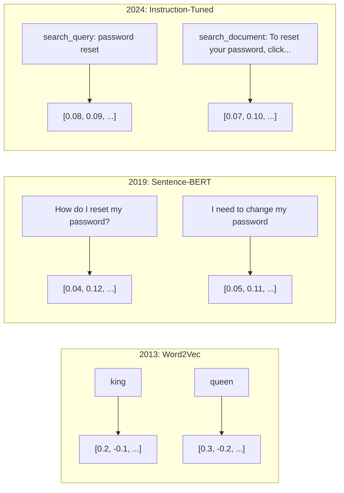
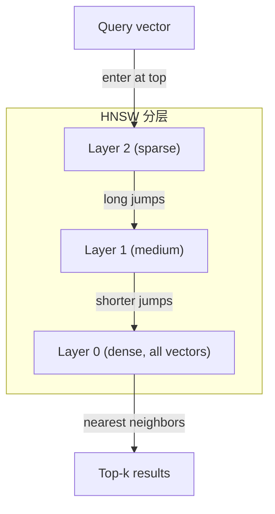

# 嵌入与向量表示

> 文本是离散的，而数学是连续的。每次你让大语言模型（LLM）查找“相似”文档、比较语义，或者进行超越关键词的搜索时，你都在依赖一座连接这两个世界的桥梁。这座桥梁就是嵌入（embedding）。如果你不理解嵌入，你就不理解现代 AI——你只是在用它。

**类型：** 实践构建
**语言：** Python
**先修知识：** 第 11 阶段第 01 课（提示工程）
**时长：** 约 75 分钟
**相关课程：** 第 5 阶段 · 22（嵌入模型深入解析）涵盖稠密、稀疏与多向量模型、Matryoshka 截断，以及各维度模型选型。本课聚焦生产级流程（向量数据库、HNSW、相似度计算）。在选择模型之前请先阅读第 5 阶段 · 22。

## 学习目标

- 使用 API 提供商与开源模型生成文本嵌入，并计算它们之间的余弦相似度
- 解释为什么嵌入能解决关键词搜索无法处理的词汇不匹配问题
- 构建一个语义搜索索引，使文档按含义而非精确关键词匹配被检索
- 使用检索基准（precision@k、召回率）评估嵌入质量，并为任务选择合适的嵌入模型

## 问题背景

你有 10,000 条客服工单。一位客户写道：“my payment didn't go through.” 你需要找到相似的过往工单。关键词搜索只能找到包含 “payment” 和 “didn't go through” 的工单，却会漏掉 “transaction failed”、“charge was declined” 和 “billing error”——这些工单用完全不同的词描述了完全相同的问题。

这就是词汇不匹配问题（vocabulary mismatch problem）。人类语言有几十种方式表达同一件事。关键词搜索把每个词都当作独立的符号，没有任何语义。它无法知道 “declined” 和 “didn't go through” 指向同一个概念。

你需要一种文本表示方式，让“含义”而非“拼写”决定相似度。你需要把 “my payment didn't go through” 和 “transaction was declined” 放到某个数学空间中彼此靠近的位置，同时把 “my payment arrived on time” 推远——尽管它包含了同一个词 “payment”。

这种表示方式就是嵌入（embedding）。

## 核心概念

### 什么是嵌入？

嵌入是一个稠密向量（dense vector），由浮点数组成，表示文本的含义。“稠密”这个词很重要——每个维度都携带信息；不像稀疏表示（词袋、TF-IDF）中大部分维度都是零。

“The cat sat on the mat” 会变成类似 `[0.023, -0.041, 0.087, ..., 0.012]` 的形式——根据模型不同，是 768 到 3072 个数字组成的列表。这些数字编码了含义。你永远不会直接查看它们，而是比较它们。

### Word2Vec 的突破

2013 年，Tomas Mikolov 及其在 Google 的同事发表了 Word2Vec。核心洞察是：训练神经网络根据上下文预测目标词（或相反），隐藏层的权重就会变成有意义的向量表示。

最著名的结果：

```
king - man + woman = queen
```

对词嵌入做向量运算可以捕捉语义关系。从 “man” 到 “woman” 的方向，与从 “king” 到 “queen” 的方向大致相同。就在这一刻，领域意识到几何可以编码意义。

Word2Vec 生成 300 维向量。每个词无论上下文如何都对应同一个向量。“river bank” 和 “bank account” 中的 “bank” 拥有相同的嵌入。这一局限推动了此后十年的研究。

### 从词到句子

词嵌入表示单个词元（token）。生产系统需要嵌入整个句子、段落或文档。于是出现了四种方法：

**平均法（Averaging）**：取句子中所有词向量的均值。便宜、有损，但对短文本 surprisingly 不错。完全丢失词序——“dog bites man” 和 “man bites dog” 会得到相同的嵌入。

**CLS 词元**：Transformer 模型（BERT，2018）输出一个特殊的 [CLS] 词元嵌入，代表整个输入。比平均法更好，但 [CLS] 词元是为下一句预测任务训练的，而不是相似度任务。

**对比学习（Contrastive learning）**：显式训练模型，让相似样本对彼此靠近、不相似样本对彼此远离。Sentence-BERT（Reimers & Gurevych，2019）采用这一方法，并成为现代嵌入模型的基础。给定 “How do I reset my password?” 和 “I need to change my password”，模型学会让它们的向量几乎相同。

**指令微调嵌入（Instruction-tuned embeddings）**：最新方法。E5、GTE 等模型接受任务前缀（“search_query:”、“search_document:”），告诉模型应该生成哪种类型的嵌入。这让同一个模型可以服务多种任务。



### 现代嵌入模型

市场已经沉淀出一批可用于生产级的选项（MTEB 分数截至 2026 年初，MTEB v2）：

| 模型 | 提供商 | 维度 | MTEB | 上下文长度 | 每 1M 词元成本 |
|-------|----------|-----------|------|---------|------------------|
| Gemini Embedding 2 | Google | 3072 (Matryoshka) | 67.7 (retrieval) | 8192 | $0.15 |
| embed-v4 | Cohere | 1024 (Matryoshka) | 65.2 | 128K | $0.12 |
| voyage-4 | Voyage AI | 1024/2048 (Matryoshka) | 66.8 | 32K | $0.12 |
| text-embedding-3-large | OpenAI | 3072 (Matryoshka) | 64.6 | 8192 | $0.13 |
| text-embedding-3-small | OpenAI | 1536 (Matryoshka) | 62.3 | 8192 | $0.02 |
| BGE-M3 | BAAI | 1024 (dense+sparse+ColBERT) | 63.0 multilingual | 8192 | Open-weight |
| Qwen3-Embedding | Alibaba | 4096 (Matryoshka) | 66.9 | 32K | Open-weight |
| Nomic-embed-v2 | Nomic | 768 (Matryoshka) | 63.1 | 8192 | Open-weight |

MTEB（Massive Text Embedding Benchmark，大规模文本嵌入基准）v2 涵盖 100 多个任务，横跨检索、分类、聚类、重排序和摘要。分数越高越好。到 2026 年，开放权重模型（Qwen3-Embedding、BGE-M3）在大多数维度上已追平或超越闭源托管模型。Gemini Embedding 2 在纯检索任务上领先；Voyage/Cohere 在特定领域（金融、法律、代码）领先。在最终选型前，一定要用自己的查询做基准测试。

### 相似度指标

给定两个嵌入向量，有三种方式衡量它们的相似程度：

**余弦相似度（Cosine similarity）**：两个向量夹角的余弦。取值范围从 -1（方向相反）到 1（方向相同）。忽略向量的模长——一个 10 词的句子和一篇 500 词的文档，只要方向相同，就可以得到 1.0。这是 90% 使用场景的默认选择。

```
cosine_sim(a, b) = dot(a, b) / (||a|| * ||b||)
```

**点积（Dot product）**：两个向量的原始内积。当向量已经归一化（单位长度）时，与余弦相似度等价。计算更快。OpenAI 的嵌入已经归一化，因此点积和余弦给出的排序相同。

```
dot(a, b) = sum(a_i * b_i)
```

**欧氏距离（Euclidean / L2 distance）**：向量空间中的直线距离。越小越相似。对模长差异敏感。适合空间中的绝对位置重要、而不仅仅是方向的场景。

```
L2(a, b) = sqrt(sum((a_i - b_i)^2))
```

如何选择：

| 指标 | 适用场景 | 避免场景 |
|--------|----------|------------|
| 余弦相似度 | 比较长度不同的文本；大多数检索任务 | 模长本身携带信息时 |
| 点积 | 嵌入已经归一化；需要最快速度 | 向量模长差异较大时 |
| 欧氏距离 | 聚类；空间最近邻问题 | 比较长度差异极大的文档 |

### 向量数据库与 HNSW

暴力相似度搜索需要将查询向量与所有存储向量逐一比较。100 万个 1536 维向量，每次查询就是 15 亿次乘加运算。太慢了。

向量数据库通过近似最近邻（Approximate Nearest Neighbor，ANN）算法解决这个问题。当前主流算法是 HNSW（Hierarchical Navigable Small World，分层可导航小世界图）：

1. 构建多层向量图
2. 上层稀疏——远距离簇之间有长连接
3. 下层稠密——邻近向量之间有细粒度连接
4. 搜索从顶层开始，贪婪下降逐步细化
5. 以 O(log n) 时间返回近似 top-k 结果，而非 O(n)

HNSW 以牺牲少量精度（通常召回率 95-99%）换取巨大的速度提升。1000 万向量时，暴力搜索需要数秒，HNSW 只需毫秒。



生产级选项：

| 数据库 | 类型 | 最佳适用 | 最大规模 |
|----------|------|----------|-----------|
| Pinecone | 托管 SaaS | 零运维生产环境 | 数十亿 |
| Weaviate | 开源 | 自托管、混合搜索 | 1 亿+ |
| Qdrant | 开源 | 高性能、过滤搜索 | 1 亿+ |
| ChromaDB | 嵌入式 | 原型开发、本地开发 | 100 万 |
| pgvector | Postgres 扩展 | 已经在用 Postgres | 1000 万 |
| FAISS | 库 | 进程内、研究场景 | 10 亿+ |

### 分块策略

文档太长，无法作为单个向量嵌入。一份 50 页的 PDF 涵盖几十个主题，它的嵌入会变成所有内容的平均，结果与任何具体主题都不相似。你需要把文档切分成块，然后分别嵌入。

**固定大小分块（Fixed-size chunking）**：每 N 个词元切一块，保留 M 个词元的重叠。简单、可预测。当文档没有清晰结构时效果很好。例如 512 词元块、50 词元重叠：第 1 块是词元 0-511，第 2 块是词元 462-973。

**基于句子的分块（Sentence-based chunking）**：在句子边界处切分，把句子组合到接近词元上限。每块至少包含一个完整句子。优于固定大小分块，因为你永远不会把一个意思切成两半。

**递归分块（Recursive chunking）**：先尝试在最大边界（章节标题）处切分。如果仍然太大，再尝试段落边界、句子边界、字符限制。这就是 LangChain 的 `RecursiveCharacterTextSplitter`，适合混合格式语料库。

**语义分块（Semantic chunking）**：先嵌入每个句子，然后把嵌入相似的连续句子归为一组。当嵌入相似度低于阈值时，开始新的一块。成本高（需要单独嵌入每个句子），但能产生最连贯的块。

| 策略 | 复杂度 | 质量 | 最佳适用 |
|----------|-----------|---------|----------|
| 固定大小 | 低 | 尚可 | 非结构化文本、日志 |
| 基于句子 | 低 | 好 | 文章、邮件 |
| 递归 | 中 | 好 | Markdown、HTML、混合文档 |
| 语义 | 高 | 最好 | 对检索质量要求极高的场景 |

大多数系统的甜点：256-512 词元的块，配合 50 词元的重叠。

### 双编码器与交叉编码器

双编码器（bi-encoder）独立地嵌入查询和文档，然后比较向量。快——你只需嵌入一次查询，再与预先计算好的文档向量比较。这就是检索阶段使用的架构。

交叉编码器（cross-encoder）把查询和文档作为单一输入一起送入模型，输出相关性分数。慢——每个查询-文档对都需要完整过一遍模型。但精度高得多，因为它能同时 attending 查询和文档词元。

生产模式：双编码器检索前 100 个候选，交叉编码器把它们重排为前 10 个。这就是“检索-再重排”（retrieve-then-rerank）流程。


重排模型：Cohere Rerank 3.5（每 1000 次查询 $2）、BGE-reranker-v2（免费开源）、Jina Reranker v2（免费开源）。

### Matryoshka 嵌入

传统嵌入是“全有或全无”的。一个 1536 维向量就是 1536 个浮点数。你不能在不重新训练的情况下截断到 256 维。

Matryoshka 表示学习（Kusupati 等人，2022）解决了这个问题。模型被训练成前 N 个维度包含最重要的信息，就像俄罗斯套娃。把 1536 维的 Matryoshka 嵌入截断到 256 维会损失一些精度，但仍然可用。

OpenAI 的 text-embedding-3-small 和 text-embedding-3-large 通过 `dimensions` 参数支持 Matryoshka 截断。请求 256 维而不是 1536 维，可将存储量减少约 6 倍，在 MTEB 基准上大约损失 3-5% 的精度。

### 二值量化

一个 1536 维的 float32 嵌入占用 6,144 字节。乘以 1000 万文档：仅向量就需 61 GB。

二值量化（binary quantization）把每个浮点数转换为 1 个比特：正数变 1，负数变 0。存储从 6,144 字节降到 192 字节——32 倍压缩。相似度通过汉明距离（Hamming distance，统计不同位数）计算，CPU 可以用一条指令完成。

检索召回率的精度损失约为 5-10%。常见模式是：先对数百万向量做二值量化初筛，然后用全精度向量对前 1000 个结果重新打分。这样可以在 32 倍内存节省下，保留 95% 以上的全精度精度。

## 动手构建

我们从零构建一个语义搜索引擎。不用向量数据库，不用外部嵌入 API。纯 Python，用 numpy 做数学运算。

### 第一步：文本分块

```python
def chunk_text(text, chunk_size=200, overlap=50):
    words = text.split()
    chunks = []
    start = 0
    while start < len(words):
        end = start + chunk_size
        chunk = " ".join(words[start:end])
        chunks.append(chunk)
        start += chunk_size - overlap
    return chunks


def chunk_by_sentences(text, max_chunk_tokens=200):
    sentences = text.replace("\n", " ").split(".")
    sentences = [s.strip() + "." for s in sentences if s.strip()]
    chunks = []
    current_chunk = []
    current_length = 0
    for sentence in sentences:
        sentence_length = len(sentence.split())
        if current_length + sentence_length > max_chunk_tokens and current_chunk:
            chunks.append(" ".join(current_chunk))
            current_chunk = []
            current_length = 0
        current_chunk.append(sentence)
        current_length += sentence_length
    if current_chunk:
        chunks.append(" ".join(current_chunk))
    return chunks
```

### 第二步：从零构建嵌入

我们实现一个简单的稠密嵌入：用 TF-IDF 加 L2 归一化。这不是神经网络嵌入，但遵循相同的契约：输入文本，输出固定大小向量，相似文本产生相似向量。

```python
import math
import numpy as np
from collections import Counter

class SimpleEmbedder:
    def __init__(self):
        self.vocab = []
        self.idf = []
        self.word_to_idx = {}

    def fit(self, documents):
        vocab_set = set()
        for doc in documents:
            vocab_set.update(doc.lower().split())
        self.vocab = sorted(vocab_set)
        self.word_to_idx = {w: i for i, w in enumerate(self.vocab)}
        n = len(documents)
        self.idf = np.zeros(len(self.vocab))
        for i, word in enumerate(self.vocab):
            doc_count = sum(1 for doc in documents if word in doc.lower().split())
            self.idf[i] = math.log((n + 1) / (doc_count + 1)) + 1

    def embed(self, text):
        words = text.lower().split()
        count = Counter(words)
        total = len(words) if words else 1
        vec = np.zeros(len(self.vocab))
        for word, freq in count.items():
            if word in self.word_to_idx:
                tf = freq / total
                vec[self.word_to_idx[word]] = tf * self.idf[self.word_to_idx[word]]
        norm = np.linalg.norm(vec)
        if norm > 0:
            vec = vec / norm
        return vec
```

### 第三步：相似度函数

```python
def cosine_similarity(a, b):
    dot = np.dot(a, b)
    norm_a = np.linalg.norm(a)
    norm_b = np.linalg.norm(b)
    if norm_a == 0 or norm_b == 0:
        return 0.0
    return float(dot / (norm_a * norm_b))


def dot_product(a, b):
    return float(np.dot(a, b))


def euclidean_distance(a, b):
    return float(np.linalg.norm(a - b))
```

### 第四步：暴力搜索的向量索引

```python
class VectorIndex:
    def __init__(self):
        self.vectors = []
        self.texts = []
        self.metadata = []

    def add(self, vector, text, meta=None):
        self.vectors.append(vector)
        self.texts.append(text)
        self.metadata.append(meta or {})

    def search(self, query_vector, top_k=5, metric="cosine"):
        scores = []
        for i, vec in enumerate(self.vectors):
            if metric == "cosine":
                score = cosine_similarity(query_vector, vec)
            elif metric == "dot":
                score = dot_product(query_vector, vec)
            elif metric == "euclidean":
                score = -euclidean_distance(query_vector, vec)
            else:
                raise ValueError(f"Unknown metric: {metric}")
            scores.append((i, score))
        scores.sort(key=lambda x: x[1], reverse=True)
        results = []
        for idx, score in scores[:top_k]:
            results.append({
                "text": self.texts[idx],
                "score": score,
                "metadata": self.metadata[idx],
                "index": idx
            })
        return results

    def size(self):
        return len(self.vectors)
```

### 第五步：语义搜索引擎

```python
class SemanticSearchEngine:
    def __init__(self, chunk_size=200, overlap=50):
        self.embedder = SimpleEmbedder()
        self.index = VectorIndex()
        self.chunk_size = chunk_size
        self.overlap = overlap

    def index_documents(self, documents, source_names=None):
        all_chunks = []
        all_sources = []
        for i, doc in enumerate(documents):
            chunks = chunk_text(doc, self.chunk_size, self.overlap)
            all_chunks.extend(chunks)
            name = source_names[i] if source_names else f"doc_{i}"
            all_sources.extend([name] * len(chunks))
        self.embedder.fit(all_chunks)
        for chunk, source in zip(all_chunks, all_sources):
            vec = self.embedder.embed(chunk)
            self.index.add(vec, chunk, {"source": source})
        return len(all_chunks)

    def search(self, query, top_k=5, metric="cosine"):
        query_vec = self.embedder.embed(query)
        return self.index.search(query_vec, top_k, metric)

    def search_with_scores(self, query, top_k=5):
        results = self.search(query, top_k)
        return [
            {
                "text": r["text"][:200],
                "source": r["metadata"].get("source", "unknown"),
                "score": round(r["score"], 4)
            }
            for r in results
        ]
```

### 第六步：比较相似度指标

```python
def compare_metrics(engine, query, top_k=3):
    results = {}
    for metric in ["cosine", "dot", "euclidean"]:
        hits = engine.search(query, top_k=top_k, metric=metric)
        results[metric] = [
            {"score": round(h["score"], 4), "preview": h["text"][:80]}
            for h in hits
        ]
    return results
```

## 实际应用

使用生产级嵌入 API 时，整体架构保持不变，只有 embedder 部分会变化：

```python
from openai import OpenAI

client = OpenAI()

def openai_embed(texts, model="text-embedding-3-small", dimensions=None):
    kwargs = {"model": model, "input": texts}
    if dimensions:
        kwargs["dimensions"] = dimensions
    response = client.embeddings.create(**kwargs)
    return [item.embedding for item in response.data]
```

OpenAI 的 Matryoshka 截断——同一个模型，更少维度，更低存储：

```python
full = openai_embed(["semantic search query"], dimensions=1536)
compact = openai_embed(["semantic search query"], dimensions=256)
```

256 维向量使用 6 倍更少的存储。1000 万文档就是 10 GB 对 61 GB。在标准基准上的精度损失大约为 3-5%。

用 Cohere 做重排序：

```python
import cohere

co = cohere.ClientV2()

results = co.rerank(
    model="rerank-v3.5",
    query="What is the refund policy?",
    documents=["Full refund within 30 days...", "No refunds after 90 days..."],
    top_n=3
)
```

不依赖 API 的本地嵌入：

```python
from sentence_transformers import SentenceTransformer

model = SentenceTransformer("BAAI/bge-small-en-v1.5")
embeddings = model.encode(["semantic search query", "another document"])
```

我们构建的 `VectorIndex` 类可以与上述任何一种嵌入函数配合使用。替换嵌入函数，保留搜索逻辑即可。

## 交付物

本课产出：
- `outputs/prompt-embedding-advisor.md` —— 一个用于为特定用例选择嵌入模型和策略的提示词
- `outputs/skill-embedding-patterns.md` —— 一个教授智能体如何在生产中有效使用嵌入的技能文档

## 练习题

1. **指标比较**：对示例文档运行相同的 5 个查询，分别使用余弦相似度、点积和欧氏距离。记录每种指标下的前 3 个结果。哪些查询的指标结果不一致？为什么？

2. **分块大小实验**：用 50、100、200、500 词的分块大小分别索引示例文档。对每个大小运行 5 个查询，记录 top-1 相似度分数。绘制分块大小与检索质量的关系图，找到更大分块开始损害效果的拐点。

3. **Matryoshka 模拟**：构建一个生成 500 维向量的 `SimpleEmbedder`。分别截断到 50、100、200、500 维，测量每次截断后的检索召回率下降程度。这样可以在不需要真实训练技巧的情况下模拟 Matryoshka 行为。

4. **二值量化**：取出搜索引擎中的嵌入，转换为二值（正数为 1，负数为 0），并实现汉明距离搜索。将前 10 个结果与全精度余弦相似度进行比较，测量重叠百分比。

5. **基于句子的分块**：用 `chunk_by_sentences` 替换固定大小分块。运行相同查询并比较检索分数。尊重句子边界是否能改善结果？

## 关键术语

| 术语 | 人们的说法 | 实际含义 |
|------|----------------|----------------------|
| Embedding | “把文本变成数字” | 一个稠密向量，其中几何 proximity 编码了语义相似度 |
| Word2Vec | “最早的嵌入” | 2013 年的模型，通过预测上下文词学习词向量；证明了向量运算可以编码语义 |
| Cosine similarity | “两个向量有多像” | 向量夹角的余弦；1 = 方向相同，0 = 正交，-1 = 方向相反 |
| HNSW | “快速向量搜索” | Hierarchical Navigable Small World 图——多层结构，实现 O(log n) 的近似最近邻搜索 |
| Bi-encoder | “分开嵌入、快速比较” | 独立编码查询和文档为向量；支持预计算和快速检索 |
| Cross-encoder | “慢但准的重排器” | 把查询-文档对一起送入完整模型；精度更高，无法预计算 |
| Matryoshka embeddings | “可截断向量” | 训练时让前 N 个维度包含最重要的信息，从而支持可变大小存储 |
| Binary quantization | “1 比特嵌入” | 把浮点向量转为二值（仅符号位），用汉明距离搜索，实现 32 倍存储压缩 |
| Chunking | “切分文档以便嵌入” | 把文档切分为 256-512 词元的段落，使每段可独立嵌入和检索 |
| Vector database | “嵌入的搜索引擎” | 专为存储向量并在规模上执行近似最近邻搜索而优化的数据存储 |
| Contrastive learning | “通过比较训练” | 让相似样本对的嵌入彼此靠近、不相似样本对的嵌入彼此远离的训练方法 |
| MTEB | “嵌入基准” | Massive Text Embedding Benchmark —— 56 个数据集、8 类任务；比较嵌入模型的标准基准 |

## 延伸阅读

- Mikolov 等人，《Efficient Estimation of Word Representations in Vector Space》（2013）—— 开启嵌入革命的 Word2Vec 论文，包含 king-queen 类比
- Reimers & Gurevych，《Sentence-BERT: Sentence Embeddings using Siamese BERT-Networks》（2019）—— 如何训练用于句子级相似度的双编码器，现代嵌入模型的基础
- Kusupati 等人，《Matryoshka Representation Learning》（2022）—— 可变维度嵌入背后的技术，OpenAI 在 text-embedding-3 中采用的方法
- Malkov & Yashunin，《Efficient and Robust Approximate Nearest Neighbor using Hierarchical Navigable Small World Graphs》（2018）—— HNSW 论文，大多数生产级向量搜索背后的算法
- OpenAI Embeddings Guide（platform.openai.com/docs/guides/embeddings）—— text-embedding-3 模型的实用参考，包括 Matryoshka 降维
- MTEB Leaderboard（huggingface.co/spaces/mteb/leaderboard）—— 比较所有嵌入模型在各任务和语言上表现的实时基准
- [Muennighoff 等人，《MTEB: Massive Text Embedding Benchmark》（EACL 2023）](https://arxiv.org/abs/2210.07316) —— 定义了 8 类任务（分类、聚类、成对分类、重排序、检索、STS、摘要、双语文本挖掘）的基准论文； leaderboard 报告的正是这些类别。在相信任何单一 MTEB 分数之前请先阅读本文。
- [Sentence Transformers documentation](https://www.sbert.net/) —— 双编码器与交叉编码器、池化策略，以及本课所实现的 ingest-split-embed-store RAG 流程的权威参考。
