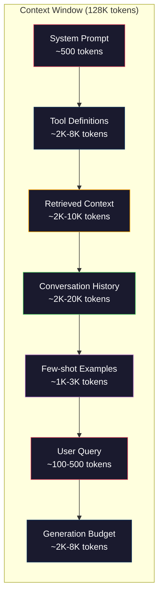
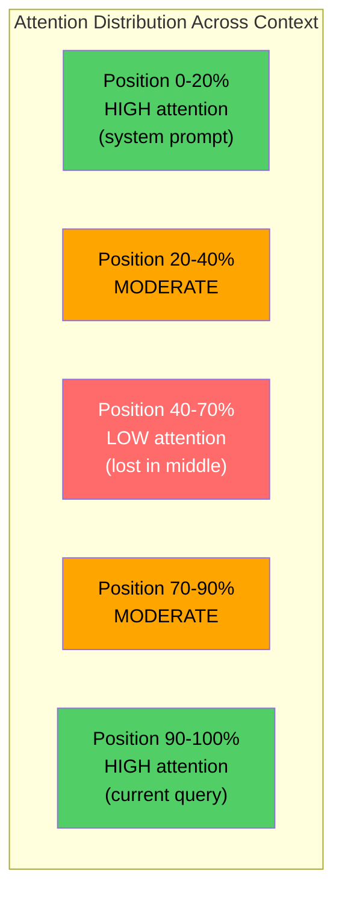
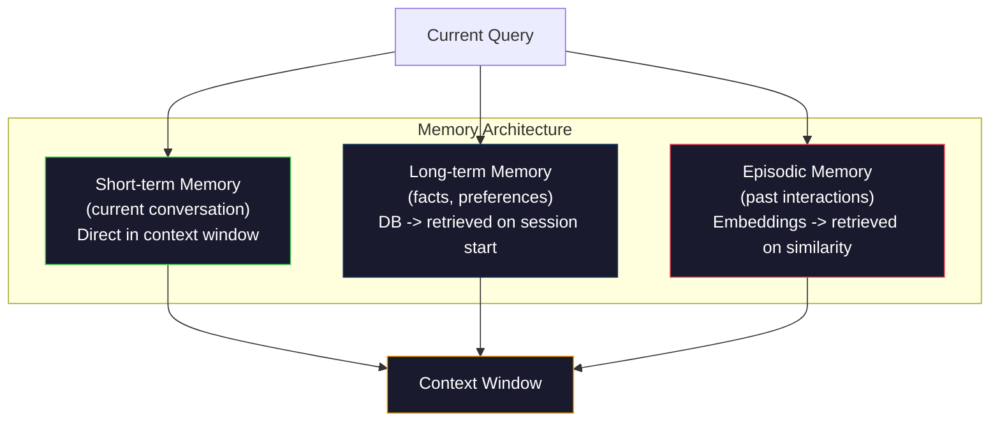

# 上下文工程：窗口、预算、内存与检索

> 提示工程（prompt engineering）只是子集。上下文工程（context engineering）才是全局。提示词是你输入的字符串；上下文则是进入模型窗口的一切：系统指令、检索到的文档、工具定义、对话历史、少样本示例（few-shot examples）以及提示词本身。2026 年最优秀的 AI 工程师都是上下文工程师：他们决定把什么放入窗口、把什么留在外面，以及按什么顺序排列。

**类型：** 构建（Build）  
**语言：** Python  
**前置要求：** Phase 10（从头开始的大语言模型）、Phase 11 第 01-02 课  
**时长：** 约 90 分钟  
**相关内容：** Phase 11 · 15（提示词缓存）—— 缓存友好的布局是上下文工程的延伸。Phase 5 · 28（长上下文评估）介绍如何用 NIAH/RULER 测量中部迷失。

## 学习目标

- 计算上下文窗口各组件的 token 预算（系统提示词、工具、历史、检索文档、生成预留）
- 实现上下文窗口管理策略：截断（truncation）、摘要和对话历史的滑动窗口
- 对上下文组件进行优先级排序，使模型把注意力（attention）集中在最相关的信息上
- 构建一个上下文组装器（context assembler），能够根据查询类型和可用窗口空间动态分配 token

## 问题所在

Claude Opus 4.7 拥有 200K token 的窗口（beta 版为 1M）。GPT-5 为 400K。Gemini 3 Pro 为 2M。Llama 4 号称 10M。这些数字听起来很大，直到你把它们填满。

下面是一个编程助手的真实拆分：系统提示词 500 token；50 个工具的工具定义 8,000 token；检索到的文档 4,000 token；对话历史（10 轮）6,000 token；当前用户查询 200 token；生成预算（最大输出）4,000 token。总计 22,700 token，仅占 128K 窗口的 18%。

但注意力（attention）并不随上下文长度线性扩展。在 128K token 上下文下，模型需要付出二次方的注意力成本（在朴素 Transformer 中为 O(n²)，尽管大多数生产模型使用更高效的注意力变体）。更重要的是，检索（retrieval）准确率会下降。"大海捞针"（Needle in a Haystack）测试表明，模型很难在长上下文中间找到信息。Liu 等人（2023）的研究显示，大语言模型（LLM）对上下文开头和结尾的信息检索准确率接近完美，但对中部位置（上下文 40%-70% 处）的信息准确率下降 10%-20%。这种"中部迷失"（lost-in-the-middle）效应因模型而异，但影响当前所有架构。

实践经验是：拥有 200K token 可用空间，并不意味着用满 200K token 就有效。一个精心策划的 10K token 上下文通常优于一股脑塞入的 100K token 上下文。上下文工程（context engineering）就是最大化上下文窗口中信噪比的学科。

窗口里的每个 token 都会挤占一个可能携带更相关信息的 token。每个无关的工具定义、每条过时的对话轮次、每段无法回答问题的检索文本——都会让模型在该任务上的表现稍微变差。

## 核心概念

### 上下文窗口是稀缺资源

把上下文窗口当成 RAM，而不是磁盘。它速度快、可直接访问，但容量有限。你不可能把所有东西都塞进去，必须做出选择。



每个组件都在争夺空间。增加工具定义就意味着对话历史的空间变少；增加检索上下文就意味着少样本示例（few-shot examples）的空间变少。上下文工程就是分配这一预算以最大化任务性能的艺术。

### 中部迷失（lost-in-the-middle）

这是上下文工程中最重要的实证发现。模型对上下文开头和结尾的信息注意力（attention）更高；中间位置的信息得分较低，更容易被忽略。

Liu 等人（2023）系统地验证了这一点。他们把一篇相关文档放在 20 篇无关文档中的不同位置，并测量回答准确率。当相关文档位于首位或末位时，准确率为 85%-90%；当位于中部（20 篇中的第 10 位）时，准确率降至 60%-70%。

这带来了直接的工程启示：

- 把最重要的信息放在最前面（系统提示词、关键指令）
- 把当前查询和最相关的上下文放在最后面（近因偏见有帮助）
- 把上下文中部视为最低优先级区域
- 如果必须把信息放在中部，在末尾重复一遍关键点



### 上下文组件

**系统提示词（system prompt）**：设定人格、约束和行为规则。它放在最前面，并在多轮对话中保持不变。Claude Code 的系统提示词（包括工具定义和行为指令）约为 6,000 token。保持精简：系统提示词中的每个词都会在每次 API 调用中重复出现。

**工具定义（tool definitions）**：每个工具增加 50-200 token（名称、描述、参数模式）。50 个工具，每个 150 token，在任何对话发生前就已占用 7,500 token。动态工具选择——只包含与当前查询相关的工具——可将这部分减少 60%-80%。

**检索上下文（retrieved context）**：来自向量数据库（vector database）的文档、搜索结果、文件内容。检索质量直接决定回答质量。糟糕的检索比没有检索更糟——它用噪声填满窗口，并主动误导模型。

**对话历史（conversation history）**：每条先前的用户消息和助手回复。随对话长度线性增长。50 轮对话，每轮 200 token，就是 10,000 token 的历史。其中大部分与当前查询无关。

**少样本示例（few-shot examples）**：展示期望行为的输入/输出对。两三个精心挑选的示例往往比数千 token 的指令更能提升输出质量，但它们也占用空间。

**生成预算（generation budget）**：为模型回复预留的 token。如果你把窗口塞满，模型就没有回答空间。至少预留 2,000-4,000 token 用于生成。

### 上下文压缩策略

**历史摘要（history summarization）**：不必逐字保留所有先前的对话轮次，而是定期对对话进行摘要。"我们讨论了 X，决定 Y，用户想要 Z" 用 100 token 就能替代原本占用 2,000 token 的 10 轮对话。当历史超过阈值（例如 5,000 token）时运行摘要。

**相关性过滤（relevance filtering）**：为每篇检索到的文档针对当前查询打分，并丢弃低于阈值的文档。如果你检索到 10 个片段，只有 3 个相关，那就扔掉另外 7 个。3 个高度相关的片段优于 10 个平庸的片段。

**工具剪枝（tool pruning）**：对用户查询意图进行分类，只包含与该意图相关的工具。代码问题不需要日历工具；日程问题不需要文件系统工具。这可以将工具定义从 8,000 token 缩减到 1,000 token。

**递归摘要（recursive summarization）**：对于非常长的文档，分阶段摘要。先对每个章节摘要，再对摘要进行摘要。一份 50 页的文档可以变成 500 token 的摘要，抓住关键要点。

### 记忆系统

上下文工程跨越三个时间尺度。

**短期记忆（short-term memory）**：当前对话。直接存储在上下文窗口中，随每轮对话增长。通过摘要和截断管理。

**长期记忆（long-term memory）**：跨对话持久存在的事实与偏好。"用户偏好 TypeScript。""项目使用 PostgreSQL。"存储在数据库中，会话开始时检索。Claude Code 将其存储在 CLAUDE.md 文件中，ChatGPT 则存储在记忆功能中。

**情景记忆（episodic memory）**：可能相关的具体过往交互。"上周二，我们在 auth 模块中调试过类似问题。"以嵌入（embeddings）形式存储，当当前对话与过往情景相似时被检索。



### 动态上下文组装

关键洞察：不同查询需要不同上下文。静态系统提示词 + 静态工具 + 静态历史是浪费。最优秀的系统会为每个查询动态组装上下文。

1. 分类查询意图
2. 选择相关工具（而非全部工具）
3. 检索相关文档（而非固定集合）
4. 包含相关历史轮次（而非全部历史）
5. 添加与任务类型匹配的少样本示例
6. 按重要性排序：关键信息放最前，重要信息放最后，可选信息放中部

这决定了 AI 应用是"好"还是"卓越"。模型本身相同，差异在于上下文。

## 动手实现

### 步骤 1：Token 计数器

你无法预算无法测量的东西。构建一个简单的 token 计数器（使用空格分割近似，因为精确数量取决于 tokenizer）。

```python
import json
import numpy as np
from collections import OrderedDict

def count_tokens(text):
    if not text:
        return 0
    return int(len(text.split()) * 1.3)

def count_tokens_json(obj):
    return count_tokens(json.dumps(obj))
```

### 步骤 2：上下文预算管理器

核心抽象。预算管理器跟踪每个组件使用的 token 数量并强制执行限制。

```python
class ContextBudget:
    def __init__(self, max_tokens=128000, generation_reserve=4000):
        self.max_tokens = max_tokens
        self.generation_reserve = generation_reserve
        self.available = max_tokens - generation_reserve
        self.allocations = OrderedDict()

    def allocate(self, component, content, max_tokens=None):
        tokens = count_tokens(content)
        if max_tokens and tokens > max_tokens:
            words = content.split()
            target_words = int(max_tokens / 1.3)
            content = " ".join(words[:target_words])
            tokens = count_tokens(content)

        used = sum(self.allocations.values())
        if used + tokens > self.available:
            allowed = self.available - used
            if allowed <= 0:
                return None, 0
            words = content.split()
            target_words = int(allowed / 1.3)
            content = " ".join(words[:target_words])
            tokens = count_tokens(content)

        self.allocations[component] = tokens
        return content, tokens

    def remaining(self):
        used = sum(self.allocations.values())
        return self.available - used

    def utilization(self):
        used = sum(self.allocations.values())
        return used / self.max_tokens

    def report(self):
        total_used = sum(self.allocations.values())
        lines = []
        lines.append(f"Context Budget Report ({self.max_tokens:,} token window)")
        lines.append("-" * 50)
        for component, tokens in self.allocations.items():
            pct = tokens / self.max_tokens * 100
            bar = "#" * int(pct / 2)
            lines.append(f"  {component:<25} {tokens:>6} tokens ({pct:>5.1f}%) {bar}")
        lines.append("-" * 50)
        lines.append(f"  {'Used':<25} {total_used:>6} tokens ({total_used/self.max_tokens*100:.1f}%)")
        lines.append(f"  {'Generation reserve':<25} {self.generation_reserve:>6} tokens")
        lines.append(f"  {'Remaining':<25} {self.remaining():>6} tokens")
        return "\n".join(lines)
```

### 步骤 3：中部迷失重排

实现重排策略：最重要的项放在最前和最后，最不重要的放在中部。

```python
def reorder_lost_in_middle(items, scores):
    paired = sorted(zip(scores, items), reverse=True)
    sorted_items = [item for _, item in paired]

    if len(sorted_items) <= 2:
        return sorted_items

    first_half = sorted_items[::2]
    second_half = sorted_items[1::2]
    second_half.reverse()

    return first_half + second_half

def score_relevance(query, documents):
    query_words = set(query.lower().split())
    scores = []
    for doc in documents:
        doc_words = set(doc.lower().split())
        if not query_words:
            scores.append(0.0)
            continue
        overlap = len(query_words & doc_words) / len(query_words)
        scores.append(round(overlap, 3))
    return scores
```

### 步骤 4：对话历史压缩器

摘要旧的对话轮次以回收 token 预算。

```python
class ConversationManager:
    def __init__(self, max_history_tokens=5000):
        self.turns = []
        self.summaries = []
        self.max_history_tokens = max_history_tokens

    def add_turn(self, role, content):
        self.turns.append({"role": role, "content": content})
        self._compress_if_needed()

    def _compress_if_needed(self):
        total = sum(count_tokens(t["content"]) for t in self.turns)
        if total <= self.max_history_tokens:
            return

        while total > self.max_history_tokens and len(self.turns) > 4:
            old_turns = self.turns[:2]
            summary = self._summarize_turns(old_turns)
            self.summaries.append(summary)
            self.turns = self.turns[2:]
            total = sum(count_tokens(t["content"]) for t in self.turns)

    def _summarize_turns(self, turns):
        parts = []
        for t in turns:
            content = t["content"]
            if len(content) > 100:
                content = content[:100] + "..."
            parts.append(f"{t['role']}: {content}")
        return "Previous: " + " | ".join(parts)

    def get_context(self):
        parts = []
        if self.summaries:
            parts.append("[Conversation Summary]")
            for s in self.summaries:
                parts.append(s)
        parts.append("[Recent Conversation]")
        for t in self.turns:
            parts.append(f"{t['role']}: {t['content']}")
        return "\n".join(parts)

    def token_count(self):
        return count_tokens(self.get_context())
```

### 步骤 5：动态工具选择器

只包含与当前查询相关的工具。先分类意图，再过滤。

```python
TOOL_REGISTRY = {
    "read_file": {
        "description": "Read contents of a file",
        "tokens": 120,
        "categories": ["code", "files"],
    },
    "write_file": {
        "description": "Write content to a file",
        "tokens": 150,
        "categories": ["code", "files"],
    },
    "search_code": {
        "description": "Search for patterns in codebase",
        "tokens": 130,
        "categories": ["code"],
    },
    "run_command": {
        "description": "Execute a shell command",
        "tokens": 140,
        "categories": ["code", "system"],
    },
    "create_calendar_event": {
        "description": "Create a new calendar event",
        "tokens": 180,
        "categories": ["calendar"],
    },
    "list_emails": {
        "description": "List recent emails",
        "tokens": 160,
        "categories": ["email"],
    },
    "send_email": {
        "description": "Send an email message",
        "tokens": 200,
        "categories": ["email"],
    },
    "web_search": {
        "description": "Search the web for information",
        "tokens": 140,
        "categories": ["research"],
    },
    "query_database": {
        "description": "Run a SQL query on the database",
        "tokens": 170,
        "categories": ["code", "data"],
    },
    "generate_chart": {
        "description": "Generate a chart from data",
        "tokens": 190,
        "categories": ["data", "visualization"],
    },
}

def classify_intent(query):
    query_lower = query.lower()

    intent_keywords = {
        "code": ["code", "function", "bug", "error", "file", "implement", "refactor", "debug", "test"],
        "calendar": ["meeting", "schedule", "calendar", "appointment", "event"],
        "email": ["email", "mail", "send", "inbox", "message"],
        "research": ["search", "find", "what is", "how does", "explain", "look up"],
        "data": ["data", "query", "database", "chart", "graph", "analytics", "sql"],
    }

    scores = {}
    for intent, keywords in intent_keywords.items():
        score = sum(1 for kw in keywords if kw in query_lower)
        if score > 0:
            scores[intent] = score

    if not scores:
        return ["code"]

    max_score = max(scores.values())
    return [intent for intent, score in scores.items() if score >= max_score * 0.5]

def select_tools(query, token_budget=2000):
    intents = classify_intent(query)
    relevant = {}
    total_tokens = 0

    for name, tool in TOOL_REGISTRY.items():
        if any(cat in intents for cat in tool["categories"]):
            if total_tokens + tool["tokens"] <= token_budget:
                relevant[name] = tool
                total_tokens += tool["tokens"]

    return relevant, total_tokens
```

### 步骤 6：完整上下文组装流水线

把所有组件串联起来。给定一个查询，动态组装最优上下文。

```python
class ContextEngine:
    def __init__(self, max_tokens=128000, generation_reserve=4000):
        self.budget = ContextBudget(max_tokens, generation_reserve)
        self.conversation = ConversationManager(max_history_tokens=5000)
        self.system_prompt = (
            "You are a helpful AI assistant. You have access to tools for "
            "code editing, file management, web search, and data analysis. "
            "Use the appropriate tools for each task. Be concise and accurate."
        )
        self.knowledge_base = [
            "Python 3.12 introduced type parameter syntax for generic classes using bracket notation.",
            "The project uses PostgreSQL 16 with pgvector for embedding storage.",
            "Authentication is handled by Supabase Auth with JWT tokens.",
            "The frontend is built with Next.js 15 using the App Router.",
            "API rate limits are set to 100 requests per minute per user.",
            "The deployment pipeline uses GitHub Actions with Docker multi-stage builds.",
            "Test coverage must be above 80% for all new modules.",
            "The codebase follows the repository pattern for data access.",
        ]

    def assemble(self, query):
        self.budget = ContextBudget(self.budget.max_tokens, self.budget.generation_reserve)

        system_content, _ = self.budget.allocate("system_prompt", self.system_prompt, max_tokens=1000)

        tools, tool_tokens = select_tools(query, token_budget=2000)
        tool_text = json.dumps(list(tools.keys()))
        tool_content, _ = self.budget.allocate("tools", tool_text, max_tokens=2000)

        relevance = score_relevance(query, self.knowledge_base)
        threshold = 0.1
        relevant_docs = [
            doc for doc, score in zip(self.knowledge_base, relevance)
            if score >= threshold
        ]

        if relevant_docs:
            doc_scores = [s for s in relevance if s >= threshold]
            reordered = reorder_lost_in_middle(relevant_docs, doc_scores)
            doc_text = "\n".join(reordered)
            doc_content, _ = self.budget.allocate("retrieved_context", doc_text, max_tokens=3000)

        history_text = self.conversation.get_context()
        if history_text.strip():
            history_content, _ = self.budget.allocate("conversation_history", history_text, max_tokens=5000)

        query_content, _ = self.budget.allocate("user_query", query, max_tokens=500)

        return self.budget

    def chat(self, query):
        self.conversation.add_turn("user", query)
        budget = self.assemble(query)
        response = f"[Response to: {query[:50]}...]"
        self.conversation.add_turn("assistant", response)
        return budget


def run_demo():
    print("=" * 60)
    print("  Context Engineering Pipeline Demo")
    print("=" * 60)

    engine = ContextEngine(max_tokens=128000, generation_reserve=4000)

    print("\n--- Query 1: Code task ---")
    budget = engine.chat("Fix the bug in the authentication module where JWT tokens expire too early")
    print(budget.report())

    print("\n--- Query 2: Research task ---")
    budget = engine.chat("What is the best approach for implementing vector search in PostgreSQL?")
    print(budget.report())

    print("\n--- Query 3: After conversation history builds up ---")
    for i in range(8):
        engine.conversation.add_turn("user", f"Follow-up question number {i+1} about the implementation details of the system")
        engine.conversation.add_turn("assistant", f"Here is the response to follow-up {i+1} with technical details about the architecture")

    budget = engine.chat("Now implement the changes we discussed")
    print(budget.report())

    print("\n--- Tool Selection Examples ---")
    test_queries = [
        "Fix the bug in auth.py",
        "Schedule a meeting with the team for Tuesday",
        "Show me the database query performance stats",
        "Search for best practices on error handling",
    ]

    for q in test_queries:
        tools, tokens = select_tools(q)
        intents = classify_intent(q)
        print(f"\n  Query: {q}")
        print(f"  Intents: {intents}")
        print(f"  Tools: {list(tools.keys())} ({tokens} tokens)")

    print("\n--- Lost-in-the-Middle Reordering ---")
    docs = ["Doc A (most relevant)", "Doc B (somewhat relevant)", "Doc C (least relevant)",
            "Doc D (relevant)", "Doc E (moderately relevant)"]
    scores = [0.95, 0.60, 0.20, 0.80, 0.50]
    reordered = reorder_lost_in_middle(docs, scores)
    print(f"  Original order: {docs}")
    print(f"  Scores:         {scores}")
    print(f"  Reordered:      {reordered}")
    print(f"  (Most relevant at start and end, least relevant in middle)")
```

## 应用实例

### Claude Code 的上下文策略

Claude Code 采用分层方式管理上下文。系统提示词包含行为规则和工具定义（约 6K token）。打开文件时，其内容被注入上下文；搜索时，结果会被加入；旧的对话轮次会被摘要；CLAUDE.md 提供跨会话的长期记忆。

关键工程决策：Claude Code 不会把整个代码库一股脑塞进上下文，而是在需要时检索相关文件。这就是上下文工程的实践。

### Cursor 的动态上下文加载

Cursor 将整个代码库索引为嵌入（embeddings）。当你输入查询时，它通过向量相似度检索最相关的文件和代码块，只有这些片段会进入上下文窗口。一个 50 万行的代码库被压缩为 5-10 个最相关的代码块。

模式是：嵌入所有内容、按需检索、只纳入重要的部分。

### ChatGPT 记忆

ChatGPT 将用户偏好和事实存储为长期记忆。每次对话开始时，相关记忆会被检索并纳入系统提示词。"用户偏好 Python" 只花 5 个 token，却能避免跨对话重复数百 token 的指令。

### RAG 即上下文工程

检索增强生成（Retrieval-Augmented Generation，RAG）是上下文工程的形式化。你不把知识硬塞进模型权重（训练）或系统提示词（静态上下文），而是在查询时检索相关文档并注入上下文窗口。整个 RAG 流水线——分块、嵌入、检索、重排序——只为解决一个问题：把正确的信息放进上下文窗口。

## 交付产出

本课生成 `outputs/prompt-context-optimizer.md` —— 一个可复用的提示词，用于审计上下文组装策略并推荐优化方案。向它提供你的系统提示词、工具数量、平均历史长度和检索策略，它会识别 token 浪费并给出改进建议。

同时生成 `outputs/skill-context-engineering.md` —— 一个设计上下文组装流水线的决策框架，依据任务类型、上下文窗口大小和延迟预算。

## 练习

1. 为 `ContextBudget` 类添加"token 浪费检测器"。当某个组件占用超过 30% 的预算时发出标记，并针对每种组件类型给出具体压缩策略（摘要历史、剪枝工具、重排文档）。

2. 为检索上下文实现语义去重。如果两篇检索到的文档相似度超过 80%（按词重叠或嵌入的余弦相似度），只保留得分更高的一篇。测量这能回收多少 token 预算。

3. 构建一个"上下文回放"工具。给定一段对话记录，逐轮通过 `ContextEngine` 回放，并可视化预算分配如何逐轮变化。绘制各组件的 token 使用量随时间变化曲线，找出上下文开始被压缩的那一轮。

4. 实现基于优先级的工具选择器。不采用简单的包含/排除，而是为每个工具分配与当前查询的相关性得分。按得分降序纳入工具，直到工具预算耗尽。比较包含 5、10、20、50 个工具时的任务表现。

5. 构建多策略上下文压缩器。实现三种压缩策略（截断、摘要、提取关键句），并在 20 篇文档上 benchmark。衡量压缩比与信息保留率之间的权衡（压缩版本是否仍包含查询答案？）。

## 关键术语

| 术语 | 通常的说法 | 实际含义 |
|------|------------|----------|
| 上下文窗口（context window） | "模型能读多少" | 模型在单次前向传播中处理的最多 token 数（输入 + 输出）——GPT-5 为 400K，Claude Opus 4.7 为 200K（beta 版 1M），Gemini 3 Pro 为 2M |
| 上下文工程（context engineering） | "高级提示工程" | 决定什么进入上下文窗口、以什么顺序、什么优先级的学科——涵盖检索、压缩、工具选择和记忆管理 |
| 中部迷失（lost-in-the-middle） | "模型会忘掉中间内容" | 实证发现：大语言模型（LLM）对上下文开头和结尾的注意力更高，中部信息准确率下降 10%-20% |
| Token 预算（token budget） | "还剩多少 token" | 对上下文窗口容量在各组件（系统提示词、工具、历史、检索、生成）之间的显式分配，并设有每部分上限 |
| 动态上下文（dynamic context） | "动态加载内容" | 根据意图分类、相关工具选择和检索结果，为每次查询不同地组装上下文窗口 |
| 历史摘要（history summarization） | "压缩对话" | 用简洁摘要替代逐字的旧对话轮次，降低 token 成本同时保留关键信息 |
| 工具剪枝（tool pruning） | "只包含相关工具" | 对查询意图分类，只纳入匹配的工具定义，可将工具 token 成本降低 60%-80% |
| 长期记忆（long-term memory） | "跨会话记住" | 存储在数据库中、在会话开始时检索的事实与偏好——如 CLAUDE.md、ChatGPT Memory 等系统 |
| 情景记忆（episodic memory） | "记住具体过去事件" | 以嵌入（embeddings）形式存储的过往交互，当当前查询与某次过去对话相似时被检索 |
| 生成预算（generation budget） | "给答案留空间" | 为模型输出预留的 token——如果上下文完全填满窗口，模型就没有空间作答 |

## 延伸阅读

- [Liu et al., 2023 -- "Lost in the Middle: How Language Models Use Long Contexts"](https://arxiv.org/abs/2307.03172) -- 关于位置依赖注意力的权威研究，表明模型难以处理长上下文中间的信息
- [Anthropic's Contextual Retrieval blog post](https://www.anthropic.com/news/contextual-retrieval) -- Anthropic 如何处理上下文感知分块检索，将检索失败率降低 49%
- [Simon Willison's "Context Engineering"](https://simonwillison.net/2025/Jun/27/context-engineering/) -- 命名该学科并区分上下文工程与提示工程的文章
- [LangChain documentation on RAG](https://python.langchain.com/docs/tutorials/rag/) -- 将检索增强生成作为上下文工程模式的实践实现
- [Greg Kamradt's Needle in a Haystack test](https://github.com/gkamradt/LLMTest_NeedleInAHaystack) -- 揭示所有主流模型位置依赖检索失败的基准测试
- [Pope et al., "Efficiently Scaling Transformer Inference" (2022)](https://arxiv.org/abs/2211.05102) -- 上下文长度如何驱动内存与延迟，以及 KV 缓存、MQA 和 GQA 如何改变预算计算
- [Agrawal et al., "SARATHI: Efficient LLM Inference by Piggybacking Decodes with Chunked Prefills" (2023)](https://arxiv.org/abs/2308.16369) -- 解释长提示在 TTFT 中昂贵而在 TPOT 中便宜的推理两阶段，是上下文打包权衡的本质
- [Ainslie et al., "GQA: Training Generalized Multi-Query Transformer Models from Multi-Head Checkpoints" (EMNLP 2023)](https://arxiv.org/abs/2305.13245) -- 在生产级解码器中将 KV 内存降低 8 倍且无损质量的 grouped-query attention 论文
