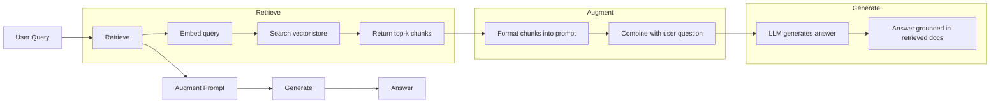
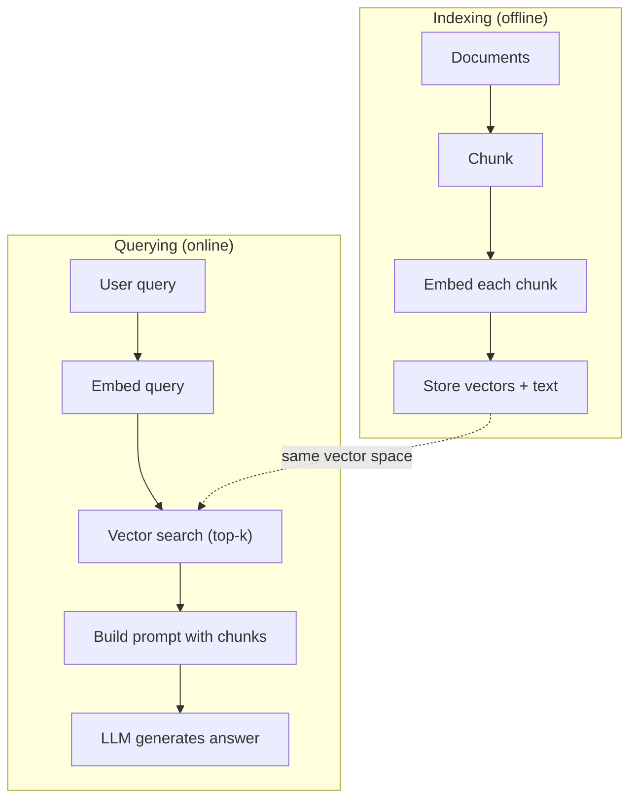

# RAG（检索增强生成，Retrieval-Augmented Generation）

> 你的大语言模型（LLM）只知道训练截止日期之前的所有信息。它对你公司的文档、你的代码库，或者上周的会议纪要一无所知。RAG 通过检索相关文档并将它们塞进提示词（prompt）来解决这个问题。它是生产级 AI 中最常部署的模式。如果你只能从这门课里学会一样东西，那就学会搭建 RAG 流程（pipeline）。

**类型：** Build
**语言：** Python
**前置要求：** Phase 10（LLMs from Scratch），Phase 11 第 01-05 课
**时间：** 约 90 分钟
**相关：** Phase 5 · 23（RAG 分块策略）了解六种分块算法及各自适用场景。Phase 5 · 22（嵌入模型深度解析）了解如何选择嵌入模型。Phase 11 · 07（高级 RAG）了解混合搜索、重排序和查询改写。

## 学习目标

- 搭建完整的 RAG 流程：文档加载、分块、嵌入、向量存储、检索和生成
- 使用向量数据库（ChromaDB、FAISS 或 Pinecone）实现语义搜索并建立合适的索引
- 解释为什么面向知识的应用更偏好 RAG 而非微调（fine-tuning）（成本、时效性、可溯源）
- 使用检索指标（精确率 precision、召回率 recall）和生成指标（忠实度 faithfulness、相关性 relevance）评估 RAG 质量

## 问题背景

你为公司搭建了一个聊天机器人。客户问："企业版的退款政策是什么？" LLM 给出一个关于典型 SaaS 退款政策的通用回答。实际政策埋藏在 200 页的内部 Wiki 里，上面写着企业客户有 60 天窗口期，按比例退款。LLM 从未见过这份文档。它不可能知道自己没被训练过的内容。

微调（fine-tuning）是一种解决方案。拿一个 LLM，用你的内部文档训练它，然后部署更新后的模型。这可行，但有几个严重问题。微调每次训练要花费数千美元算力。一旦文档变更，模型就会立刻过时。你无法知道模型引用了哪条来源。如果公司下个月收购另一条产品线，你还得再微调一次。

RAG 是另一种方案。保持模型不变。当问题进来时，从文档库中搜索相关段落，把它们贴在问题之前作为上下文，让模型基于这些上下文作答。文档库可以在几分钟内更新。你能清楚看到检索到了哪些文档。模型本身从不改变。这就是 RAG 成为生产主流模式的原因：更便宜、更新鲜、更可审计，而且适用于任何 LLM。

## 核心概念

### RAG 模式

整个模式可以概括为四步：



查询 -> 检索 -> 增强提示词 -> 生成。每个 RAG 系统都遵循这一模式。生产级 RAG 系统之间的差异在于每一步的细节：如何分块、如何嵌入、如何搜索、如何构造提示词。

### 为什么 RAG 胜过微调

| 关注点 | 微调（Fine-tuning） | RAG |
|---------|------------|-----|
| 成本 | 每次训练 1,000-100,000+ 美元 | 每次查询 0.01-0.10 美元（嵌入 + LLM） |
| 时效性 | 直到重新训练前都会过时 | 通过重新索引文档，几分钟内更新 |
| 可审计性 | 无法追溯答案来源 | 可以展示精确检索到的段落 |
| 幻觉（hallucination） | 仍然自由幻觉 | 基于检索到的文档作答 |
| 数据隐私 | 训练数据被固化进权重 | 文档保留在你的向量存储中 |

微调会永久改变模型的权重。RAG 只是临时改变模型的上下文。对大多数应用来说，临时上下文才是你想要的。

微调唯一占优的情况：当你需要模型采用某种无法仅通过提示词实现的特定风格、语气或推理模式时。对于事实知识检索，RAG 每次都赢。

### 嵌入模型

嵌入模型（embedding model）将文本转换为稠密向量（dense vector）。相似的文本在这个高维空间中会产生彼此靠近的向量。"如何重置密码？"和"我需要修改密码"共享的词很少，但产生的向量几乎相同。"猫坐在垫子上"则会产生非常不同的向量。

常见嵌入模型（2026 年阵容 —— 完整分析见 Phase 5 · 22）：

| 模型 | 维度 | 提供商 | 说明 |
|-------|-----------|----------|-------|
| text-embedding-3-small | 1536（Matryoshka） | OpenAI | 大多数用例的最佳性价比 |
| text-embedding-3-large | 3072（Matryoshka） | OpenAI | 精度更高，可截断至 256/512/1024 |
| Gemini Embedding 2 | 3072（Matryoshka） | Google | MTEB 检索榜首；8K 上下文 |
| voyage-4 | 1024/2048（Matryoshka） | Voyage AI | 领域变体（代码、金融、法律） |
| Cohere embed-v4 | 1024（Matryoshka） | Cohere | 多语言能力强，128K 上下文 |
| BGE-M3 | 1024（稠密 + 稀疏 + ColBERT） | BAAI（开源权重） | 一个模型三种表示 |
| Qwen3-Embedding | 4096（Matryoshka） | Alibaba（开源权重） | 开源权重检索分数最高 |
| all-MiniLM-L6-v2 | 384 | 开源权重（Sentence Transformers） | 原型基线 |

本课我们将用 TF-IDF 构建一个简单的嵌入。不是因为 TF-IDF 是生产系统使用的方案，而是因为它能把概念具象化：文本进去，向量出来，相似文本产生相似向量。

### 向量相似度

给定两个向量，如何衡量相似度？三种选择：

**余弦相似度（cosine similarity）**：两个向量夹角的余弦。取值范围 -1（方向相反）到 1（完全相同）。忽略模长，只关心方向。这是 RAG 的默认选择。

```
cosine_sim(a, b) = dot(a, b) / (||a|| * ||b||)
```

**点积（dot product）**：原始内积。模长更大的向量得分更高。当模长携带信息时很有用（更长的文档可能更相关）。

```
dot(a, b) = sum(a_i * b_i)
```

**L2（欧氏）距离**：向量空间中的直线距离。距离越小越相似。对模长差异敏感。

```
L2(a, b) = sqrt(sum((a_i - b_i)^2))
```

余弦相似度是标准做法。它通过对模长做归一化，能优雅处理不同长度的文档。当有人说"向量搜索"时，几乎总是指余弦相似度。

### 分块策略

文档太长，无法作为单个向量嵌入。一份 50 页的 PDF 可能会产生糟糕的嵌入，因为它包含几十个主题。相反，你要把文档切分成块（chunk），然后分别嵌入每一块。

**固定大小分块（fixed-size chunking）**：每 N 个词元（token）切一块。简单且可预测。512 词元的块、50 词元的重叠意味着：第 1 块是词元 0-511，第 2 块是词元 462-973，依此类推。重叠能确保你不会在不幸的边界处把句子切断。

**语义分块（semantic chunking）**：在自然边界处切分。段落、章节或 Markdown 标题。每个块都是一个连贯的意义单元。实现更复杂，但检索效果更好。

**递归分块（recursive chunking）**：先尝试在最大边界处切分（章节标题）。如果章节仍然太大，就在段落边界切分。如果段落仍然太大，就在句子边界切分。这就是 LangChain 的 RecursiveCharacterTextSplitter 思路，实践中效果很好。

分块大小比人们想象的更重要：

- 太小（64-128 词元）：每个块缺乏上下文。"它上季度增长了 15%"如果不知道"它"指什么，就毫无意义。
- 太大（2048+ 词元）：每个块覆盖多个主题，稀释相关性。当你搜索营收数据时，得到的块可能 10% 讲营收、90% 讲员工数。
- 甜点区间（256-512 词元）：足以自包含，又足够聚焦。

大多数生产级 RAG 系统使用 256-512 词元的块，并设置 50 词元的重叠。Anthropic 的 RAG 指南也推荐这一范围。

### 向量数据库

有了嵌入后，你需要一个地方来存储和搜索它们。可选方案：

| 数据库 | 类型 | 最佳适用 |
|----------|------|----------|
| FAISS | 库（进程内） | 原型设计、小到中型数据集 |
| Chroma | 轻量数据库 | 本地开发、小规模部署 |
| Pinecone | 托管服务 | 不想承担运维成本的生产环境 |
| Weaviate | 开源数据库 | 自托管生产环境 |
| pgvector | Postgres 扩展 | 已经在用 Postgres |
| Qdrant | 开源数据库 | 高性能自托管 |

本课我们将构建一个简单的内存向量存储。它把向量存在列表里，并做暴力余弦相似度搜索。这等价于使用扁平索引的 FAISS。它在变慢之前大概能撑到 10 万个向量。生产系统使用近似最近邻（ANN）算法（如 HNSW）在毫秒内搜索数百万向量。

### 完整流程



索引阶段每个文档只运行一次（或文档更新时运行）。查询阶段在每个用户请求时运行。在生产中，索引阶段可能要处理数百万文档，耗时数小时。查询阶段必须在 1 秒内响应。

### 真实数字

大多数生产级 RAG 系统使用以下参数：

- **k = 5 到 10**：每次查询检索的块数
- **分块大小 = 256 到 512 词元**，重叠 50 词元
- **上下文预算（context budget）**：每次查询 2,500-5,000 词元的检索内容
- **总提示词**：约 8,000-16,000 词元（系统提示词 + 检索块 + 对话历史 + 用户查询）
- **嵌入维度**：根据模型不同为 384-3072
- **索引吞吐**：使用 API 嵌入时每秒 100-1,000 份文档
- **查询延迟**：检索 50-200ms，生成 500-3000ms

## 动手实现

### 第一步：文档分块

```python
def chunk_text(text, chunk_size=200, overlap=50):
    words = text.split()
    chunks = []
    start = 0
    while start < len(words):
        end = start + chunk_size
        chunk = " ".join(words[start:end])
        chunks.append(chunk)
        start += chunk_size - overlap
    return chunks
```

### 第二步：TF-IDF 嵌入

我们构建一个简单的嵌入函数。TF-IDF（词频-逆文档频率，Term Frequency-Inverse Document Frequency）不是神经嵌入，但它能把文本转换成向量，并捕捉词语重要性。某个词在文档中出现越频繁，TF 越高。某个词在整个语料库中越罕见，IDF 越高。二者相乘得到一个向量：重要且具区分度的词拥有较高值。

```python
import math
from collections import Counter

def build_vocabulary(documents):
    vocab = set()
    for doc in documents:
        vocab.update(doc.lower().split())
    return sorted(vocab)

def compute_tf(text, vocab):
    words = text.lower().split()
    count = Counter(words)
    total = len(words)
    return [count.get(word, 0) / total for word in vocab]

def compute_idf(documents, vocab):
    n = len(documents)
    idf = []
    for word in vocab:
        doc_count = sum(1 for doc in documents if word in doc.lower().split())
        idf.append(math.log((n + 1) / (doc_count + 1)) + 1)
    return idf

def tfidf_embed(text, vocab, idf):
    tf = compute_tf(text, vocab)
    return [t * i for t, i in zip(tf, idf)]
```

### 第三步：余弦相似度搜索

```python
def cosine_similarity(a, b):
    dot = sum(x * y for x, y in zip(a, b))
    norm_a = math.sqrt(sum(x * x for x in a))
    norm_b = math.sqrt(sum(x * x for x in b))
    if norm_a == 0 or norm_b == 0:
        return 0.0
    return dot / (norm_a * norm_b)

def search(query_embedding, stored_embeddings, top_k=5):
    scores = []
    for i, emb in enumerate(stored_embeddings):
        sim = cosine_similarity(query_embedding, emb)
        scores.append((i, sim))
    scores.sort(key=lambda x: x[1], reverse=True)
    return scores[:top_k]
```

### 第四步：提示词构造

这就是 RAG 中"增强"（augmented）的部分。把检索到的块格式化成提示词，然后让 LLM 基于提供的上下文作答。

```python
def build_rag_prompt(query, retrieved_chunks):
    context = "\n\n---\n\n".join(
        f"[Source {i+1}]\n{chunk}"
        for i, chunk in enumerate(retrieved_chunks)
    )
    return f"""Answer the question based ONLY on the following context.
If the context doesn't contain enough information, say "I don't have enough information to answer that."

Context:
{context}

Question: {query}

Answer:"""
```

### 第五步：完整 RAG 流程

```python
class RAGPipeline:
    def __init__(self):
        self.chunks = []
        self.embeddings = []
        self.vocab = []
        self.idf = []

    def index(self, documents):
        all_chunks = []
        for doc in documents:
            all_chunks.extend(chunk_text(doc))
        self.chunks = all_chunks
        self.vocab = build_vocabulary(all_chunks)
        self.idf = compute_idf(all_chunks, self.vocab)
        self.embeddings = [
            tfidf_embed(chunk, self.vocab, self.idf)
            for chunk in all_chunks
        ]

    def query(self, question, top_k=5):
        query_emb = tfidf_embed(question, self.vocab, self.idf)
        results = search(query_emb, self.embeddings, top_k)
        retrieved = [(self.chunks[i], score) for i, score in results]
        prompt = build_rag_prompt(
            question, [chunk for chunk, _ in retrieved]
        )
        return prompt, retrieved
```

### 第六步：生成（模拟）

生产中，这里就是你调用 LLM API 的地方。本课我们通过从检索到的上下文中提取最相关的句子来模拟生成。

```python
def simple_generate(prompt, retrieved_chunks):
    query_words = set(prompt.lower().split("question:")[-1].split())
    best_sentence = ""
    best_score = 0
    for chunk in retrieved_chunks:
        for sentence in chunk.split("."):
            sentence = sentence.strip()
            if not sentence:
                continue
            words = set(sentence.lower().split())
            overlap = len(query_words & words)
            if overlap > best_score:
                best_score = overlap
                best_sentence = sentence
    return best_sentence if best_sentence else "I don't have enough information."
```

## 应用它

如果使用真实的嵌入模型和 LLM，代码几乎不变：

```python
from openai import OpenAI

client = OpenAI()

def embed(text):
    response = client.embeddings.create(
        model="text-embedding-3-small",
        input=text
    )
    return response.data[0].embedding

def generate(prompt):
    response = client.chat.completions.create(
        model="gpt-4o-mini",
        messages=[{"role": "user", "content": prompt}],
        temperature=0
    )
    return response.choices[0].message.content
```

或者用 Anthropic：

```python
import anthropic

client = anthropic.Anthropic()

def generate(prompt):
    response = client.messages.create(
        model="claude-sonnet-4-20250514",
        max_tokens=1024,
        messages=[{"role": "user", "content": prompt}]
    )
    return response.content[0].text
```

流程是一样的。替换嵌入函数，替换生成函数。检索逻辑、分块、提示词构造——无论你用哪种模型，这些全都一样。

对于大规模向量存储，把暴力搜索换成真正的向量数据库：

```python
import chromadb

client = chromadb.Client()
collection = client.create_collection("my_docs")

collection.add(
    documents=chunks,
    ids=[f"chunk_{i}" for i in range(len(chunks))]
)

results = collection.query(
    query_texts=["What is the refund policy?"],
    n_results=5
)
```

Chroma 在内部处理嵌入（默认使用 all-MiniLM-L6-v2），并把向量存在本地数据库里。同样的模式，不同的底层实现。

## 交付物

本课产出：
- `outputs/prompt-rag-architect.md` —— 一个用于为特定用例设计 RAG 系统的提示词
- `outputs/skill-rag-pipeline.md` —— 一个教授智能体如何搭建和调试 RAG 流程的技能文档

## 练习

1. 把 TF-IDF 嵌入换成简单的词袋（bag-of-words）方法（二值化：词出现为 1，否则为 0）。在样本文档上比较检索质量。TF-IDF 应该表现更好，因为它会给罕见词更高权重。

2. 实验不同分块大小：在相同文档集上尝试 50、100、200、500 词。对每个大小，运行同样的 5 个查询，统计有多少查询能在 top-3 中返回相关块。找到检索质量达到峰值的最佳点。

3. 为每个块添加元数据（源文档名称、块位置）。修改提示词模板以包含来源归属（source attribution），让 LLM 在回答时引用来源。

4. 实现简单评估：给定 10 个问答对，把每个问题输入 RAG 流程，测量检索到的块中有多少包含答案。这就是 k 召回率（recall at k）。

5. 构建支持对话的 RAG 流程：维护最近 3 轮交换的历史，并把它们和检索到的块一起放进提示词。用后续问题测试，比如在询问定价后问"企业版呢？"

## 关键术语

| 术语 | 大家怎么说 | 实际含义 |
|------|----------------|----------------------|
| RAG | "能读文档的 AI" | 检索相关文档，把它们贴进提示词，然后基于这些文档生成有依据的答案 |
| Embedding | "把文本变成数字" | 文本的稠密向量表示，相似含义产生相似向量 |
| Vector database | "AI 搜索引擎" | 专为存储向量并通过相似度寻找最近邻而优化的数据存储 |
| Chunking | "把文档切成小块" | 把文档拆成更小的段（通常 256-512 词元），以便独立嵌入和检索 |
| Cosine similarity | "两个向量有多像" | 两个向量夹角的余弦；1 = 方向相同，0 = 正交，-1 = 相反 |
| Top-k retrieval | "拿前 k 个最佳匹配" | 从向量存储中返回与查询最相似的 k 个块 |
| Context window | "LLM 一次能看多少文本" | LLM 单次请求能处理的最大词元数；检索到的块必须能放进这个窗口 |
| Augmented generation | "用给定上下文作答" | 利用检索到的文档作为上下文生成回答，而非仅依赖训练知识 |
| TF-IDF | "词重要性打分" | 词频（TF）乘以逆文档频率（IDF）；按词语在语料库中的区分度加权 |
| Indexing | "为搜索准备文档" | 离线的分块、嵌入和存储文档过程，以便在查询时能被搜索 |

## 延伸阅读

- Lewis et al., "Retrieval-Augmented Generation for Knowledge-Intensive NLP Tasks" (2020) —— 来自 Facebook AI Research 的原始 RAG 论文，正式提出了"先检索再生成"的模式
- Anthropic 的 RAG 文档（docs.anthropic.com） —— 关于分块大小、提示词构造和评估的实用指南
- Pinecone Learning Center, "What is RAG?" —— 用清晰的视觉解释 RAG 流程及生产注意事项
- Sentence-BERT: Reimers & Gurevych (2019) —— all-MiniLM 嵌入模型背后的论文，展示了如何训练双编码器（bi-encoders）用于语义相似度
- [Karpukhin et al., "Dense Passage Retrieval for Open-Domain Question Answering" (EMNLP 2020)](https://arxiv.org/abs/2004.04906) —— DPR 论文，证明了稠密双编码器检索在开放域问答上击败 BM25，奠定了现代 RAG 检索器的模式。
- [LlamaIndex High-Level Concepts](https://docs.llamaindex.ai/en/stable/getting_started/concepts.html) —— 搭建 RAG 流程时需要了解的核心概念：数据加载器、节点解析器、索引、检索器、响应合成器。
- [LangChain RAG tutorial](https://python.langchain.com/docs/tutorials/rag/) —— 另一种风格的编排器；同一个"先检索再生成"模式的 runnables 链式视角。
