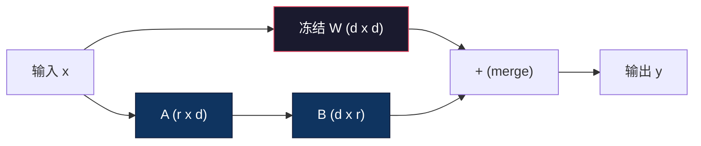
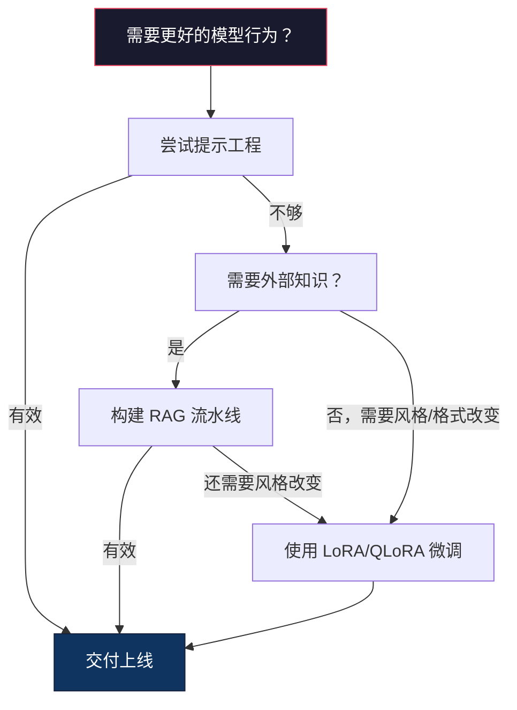

# 使用 LoRA 与 QLoRA 进行微调

> 全量微调一个 7B 模型需要 56GB 显存。你没有。大多数公司也没有。LoRA 能让你只训练不到 1% 的参数，在 6GB 显存下完成同样的模型微调。这不是妥协——它在大多数任务上都能达到全量微调的质量。整个开源微调生态都建立在这一技巧之上。

**类型：** Build（实战构建）
**语言：** Python
**前置知识：** Phase 10, Lesson 06（指令微调 / SFT）
**时长：** 约 75 分钟
**相关课程：** Phase 10 从零讲解了 SFT/DPO 流程。本课将这些流程接入 2026 年的 PEFT 工具链（PEFT、TRL、Unsloth、Axolotl、LLaMA-Factory）。

## 学习目标

- 通过向预训练模型注意力层注入低秩适配矩阵（A 和 B）来实现 LoRA
- 计算 LoRA 相比全量微调的参数量节省：在 d_model 维度下，秩 r 只训练 2*r*d 个参数，而不是 d^2
- 使用 QLoRA（4-bit 量化基座 + LoRA 适配器）在消费级显卡显存内完成微调
- 将 LoRA 权重合并回基座模型以部署，并比较带与不带适配器时的推理速度

## 问题所在

你有一个基座模型，比如 Llama 3 8B。你希望它用你们公司的语气回复客户支持工单。SFT（监督微调）是答案，但 SFT 有一个成本问题。

全量微调会更新模型中的每一个参数。Llama 3 8B 有 80 亿参数。在 fp16 下，每个参数占 2 字节。仅加载权重就需要 16GB。训练时还需要梯度（16GB）、Adam 优化器状态（动量 + 方差共 32GB）以及激活值。总计：单个 8B 模型大约需要 56GB 显存。

一块 A100 80GB 才刚刚装下。两块 A100 在云平台上的价格约为每小时 3–4 美元。在 50,000 条样本上训练 3 个 epoch 需要 6–10 小时。每次实验花费 30–40 美元。跑 10 次实验来调整超参数，还没部署就已经花了 400 美元。

如果扩展到 Llama 3 70B，数字会变得荒谬：仅权重就需要 140GB。你需要一个集群。每次实验 100 美元以上。

还有更深层的问题。全量微调会修改模型中的每一个权重。如果你在客户支持数据上微调，可能会损害模型的通用能力，这被称为灾难性遗忘（catastrophic forgetting）。模型在你的任务上变得更好，在其他方面却变得更差。

你需要一种训练参数更少、占用显存更少、且不会破坏模型已有知识的方法。

## 核心概念

### LoRA：低秩适配（Low-Rank Adaptation）

微软的 Edward Hu 等人于 2021 年 6 月发表了 LoRA 论文。其核心洞察是：微调过程中的权重更新具有低内在秩。你不需要更新 4096×4096 权重矩阵中的全部 1670 万个参数，更新中的有效信息可以被一个秩为 16 或 32 的矩阵捕捉。

数学原理如下。标准线性层计算：

```
y = Wx
```

其中 W 是一个 d_out × d_in 矩阵。对于 4096×4096 的注意力投影，共有 16,777,216 个参数。

LoRA 冻结 W，并添加一个低秩分解：

```
y = Wx + BAx
```

其中 B 为 (d_out × r)，A 为 (r × d_in)。秩 r 远小于 d，通常取 8、16 或 32。

对于 4096×4096 层、r=16 的情况：
- 原始参数：4096 × 4096 = 16,777,216
- LoRA 参数：(4096 × 16) + (16 × 4096) = 65,536 + 65,536 = 131,072
- 比例：131,072 / 16,777,216 = 0.78%

你只训练 0.78% 的参数，却能获得 95–100% 的质量。



A 使用随机高斯初始化，B 初始化为零。这意味着 LoRA 的初始贡献为零——模型从原始行为开始训练，并逐渐学习适配。

### 缩放因子：Alpha

LoRA 引入了一个缩放因子 alpha，用于控制低秩更新对输出的影响：

```
y = Wx + (alpha / r) * BAx
```

当 alpha = r 时，缩放为 1 倍；当 alpha = 2r（常见默认值）时，缩放为 2 倍。该超参数独立于基座学习率，控制 LoRA 路径的学习速度。

实用建议：
- alpha = 2 * rank 是社区常见约定（原论文大多数实验使用 alpha = rank）
- alpha = rank 提供 1 倍缩放，保守但更稳定
- alpha 越大，每步更新越大，可能加速收敛，也可能导致不稳定

### 在何处应用 LoRA

Transformer 包含许多线性层，不需要全部添加 LoRA。原论文测试了不同组合：

| 目标层 | 可训练参数（7B） | 质量 |
|--------------|----------------------|---------|
| q_proj only | 4.7M | 良好 |
| q_proj + v_proj | 9.4M | 更好 |
| q_proj + k_proj + v_proj + o_proj | 18.9M | 注意力层最佳 |
| All linear（attention + MLP） | 37.7M | 收益有限，参数翻倍 |

大多数任务的最佳选择：q_proj + v_proj。这针对自注意力中的查询和值投影，控制模型关注什么以及提取什么信息。对于代码生成等复杂任务，加入 MLP 层有帮助，但在简单任务上收益递减且参数翻倍。

### 秩的选择

秩 r 控制适配的表达能力：

| 秩 | 每层可训练参数 | 最适合 |
|------|---------------------------|----------|
| 4 | 32,768 | 简单分类、情感分析 |
| 8 | 65,536 | 单领域问答、摘要 |
| 16 | 131,072 | 多领域任务、指令跟随 |
| 32 | 262,144 | 复杂推理、代码生成 |
| 64 | 524,288 | 大多数任务收益递减 |
| 128 | 1,048,576 | 很少有必要 |

Hu 等人证明，对于简单任务，r=4 已经能捕捉大部分适配信息。实践中 r=8 和 r=16 最常见。超过 r=64 很少提升质量，反而会削弱 LoRA 的显存优势。

### QLoRA：4-bit 量化 + LoRA

华盛顿大学的 Tim Dettmers 等人于 2023 年 5 月发表了 QLoRA。思路是：将冻结的基座模型量化到 4-bit 精度，然后在其上附加 fp16 的 LoRA 适配器。

这极大地改变了显存等式：

| 方法 | 权重显存（7B） | 训练显存（7B） | 所需 GPU |
|--------|-------------------|---------------------|-------------|
| 全量微调（fp16） | 14GB | ~56GB | 1x A100 80GB |
| LoRA（fp16 基座） | 14GB | ~18GB | 1x A100 40GB |
| QLoRA（4-bit 基座） | 3.5GB | ~6GB | 1x RTX 3090 24GB |

QLoRA 有三项技术贡献：

**NF4（Normal Float 4-bit，正态浮点 4-bit）**：专为神经网络权重设计的新数据类型。神经网络权重近似服从正态分布。NF4 将 16 个量化级别放在标准正态分布的分位数上，从信息论角度对正态分布数据最优，比均匀 4-bit 量化（INT4）或标准 Float4 损失更少信息。

**Double quantization（双重量化）**：量化常数本身也占用显存。每 64 个权重的块需要一个 fp32 缩放因子（4 字节）。对于 7B 模型，这额外增加约 0.4GB。双重量化将这些常数量化到 fp8，将开销降至 0.1GB。看起来小，但累积起来很可观。

**Paged optimizers（分页优化器）**：训练过程中，长序列上的优化器状态（Adam 的动量和方差）可能超出 GPU 显存。分页优化器利用 NVIDIA 的统一内存，在 GPU 显存不足时自动将优化器状态换页到 CPU 内存，需要时再换回 GPU。这以防止 OOM 崩溃为代价，牺牲部分吞吐。

### 质量是否受损？

减少参数或量化基座是否会影响质量？多篇论文的结果如下：

| 方法 | MMLU（5-shot） | MT-Bench | HumanEval |
|--------|--------------|----------|-----------|
| 全量微调（Llama 2 7B） | 48.3 | 6.72 | 14.6 |
| LoRA r=16 | 47.9 | 6.68 | 14.0 |
| QLoRA r=16（NF4） | 47.5 | 6.61 | 13.4 |
| QLoRA r=64（NF4） | 48.1 | 6.70 | 14.2 |

在大多数基准上，r=16 的 LoRA 与全量微调差距在 1% 以内。r=16 的 QLoRA 再损失零点几个百分点。r=64 的 QLoRA 基本追平全量微调，同时显存减少 90%。

### 真实成本

在 50,000 条样本上微调 Llama 3 8B（3 个 epoch）：

| 方法 | GPU | 时间 | 成本 |
|--------|-----|------|------|
| 全量微调 | 2x A100 80GB | 8 小时 | ~$32 |
| LoRA r=16 | 1x A100 40GB | 4 小时 | ~$8 |
| QLoRA r=16 | 1x RTX 4090 24GB | 6 小时 | ~$5 |
| QLoRA r=16（Unsloth） | 1x RTX 4090 24GB | 2.5 小时 | ~$2 |
| QLoRA r=16 | 1x T4 16GB | 12 小时 | ~$4 |

在单张消费级 GPU 上运行 QLoRA 的成本比一顿午餐还低。这就是 2023 年开放权重微调社区爆发的原因，也是下面每个训练框架在 2026 年默认提供 QLoRA 的原因。

### 2026 年的 PEFT 工具栈

| 框架 | 是什么 | 何时选择 |
|-----------|-----------|-----------|
| **Hugging Face PEFT** | LoRA/QLoRA/DoRA/IA3 的标准库 | 你想要完全控制，且训练循环已基于 `transformers.Trainer` |
| **TRL** | HF 的反馈强化学习训练器（SFT、DPO、GRPO、PPO、ORPO） | SFT 之后需要 DPO/GRPO；构建在 PEFT 之上 |
| **Unsloth** | 用 Triton kernel 重写前向/反向传播 | 你想在不损失精度的情况下获得 2–5 倍加速和减半显存；适用于 Llama/Mistral/Qwen 系列 |
| **Axolotl** | 基于 PEFT + TRL + DeepSpeed + Unsloth 的 YAML 配置封装 | 你想要可复现、版本控制的训练流程 |
| **LLaMA-Factory** | PEFT + TRL 的 GUI/CLI/API | 你想要零代码微调；支持 100+ 模型家族 |
| **torchtune** | 原生 PyTorch recipe，不依赖 `transformers` | 你想要最小依赖，且你的组织已标准化使用 PyTorch |

经验法则：研究用途或一次性实验 → PEFT。可复现的生产流水线 → 启用 Unsloth kernel 的 Axolotl。临时原型 → LLaMA-Factory。

### 合并适配器

训练完成后，你会得到两样东西：冻结的基座模型和一个小型 LoRA 适配器（通常 10–100MB）。你可以选择：

1. **保持分离**：加载基座模型，再在其上加载适配器。可为不同任务切换适配器。这就是如何从一个基座模型服务多个微调版本。

2. **永久合并**：计算 W' = W + (alpha/r) * BA，并将结果保存为一个完整模型。合并后的模型与原始模型大小相同，没有推理开销，也无需管理适配器。

如果要服务多个任务（客户支持适配器、代码适配器、翻译适配器），保持分离。如果部署单个专用模型，选择合并。

合并多个适配器的高级技术：

- **TIES-Merging**（Yadav et al. 2023）：裁剪小幅值参数、解决符号冲突后再合并。可减少适配器之间的干扰。
- **DARE**（Yu et al. 2023）：合并前随机丢弃适配器参数并重新缩放其余参数。在能力组合上出奇有效。
- **Task arithmetic（任务算术）**：直接相加或相减适配器权重。将“代码”适配器和“数学”适配器相加，通常能得到同时擅长两者的新模型。

### 何时不要微调

微调是第三种选择，不是第一选择。

**第一：提示工程（prompt engineering）。** 写更好的系统提示词，加入少样本示例，使用思维链（chain-of-thought）。这零成本，只需几分钟。如果提示工程能帮你达到 80% 的目标，你可能不需要微调。

**第二：RAG（检索增强生成）。** 如果模型需要了解你的特定数据（文档、知识库、产品目录），检索比把知识固化到权重中更便宜、更易维护。参见 Lesson 06。

**第三：微调。** 当你需要模型掌握特定的风格、格式或推理模式，而无法通过提示工程实现时。当你需要一致的格式化输出。当你需要将大模型蒸馏到小模型。当延迟敏感，无法承担少样本提示带来的额外 token 开销时。



## 动手实现

我们用纯 PyTorch 从零实现 LoRA。不用任何库，不依赖任何黑魔法。你会构建 LoRA 层、将其注入模型、训练它，并将权重合并回去。

### 步骤 1：LoRA 层

```python
import torch
import torch.nn as nn
import math

class LoRALayer(nn.Module):
    def __init__(self, in_features, out_features, rank=8, alpha=16):
        super().__init__()
        self.rank = rank
        self.alpha = alpha
        self.scaling = alpha / rank

        self.A = nn.Parameter(torch.randn(in_features, rank) * (1 / math.sqrt(rank)))
        self.B = nn.Parameter(torch.zeros(rank, out_features))

    def forward(self, x):
        return (x @ self.A @ self.B) * self.scaling
```

A 使用缩放后的随机值初始化，B 初始化为零。BA 的乘积初始为零，因此模型从原始行为开始训练。

### 步骤 2：包装 LoRA 的线性层

```python
class LinearWithLoRA(nn.Module):
    def __init__(self, linear, rank=8, alpha=16):
        super().__init__()
        self.linear = linear
        self.lora = LoRALayer(
            linear.in_features, linear.out_features, rank, alpha
        )

        for param in self.linear.parameters():
            param.requires_grad = False

    def forward(self, x):
        return self.linear(x) + self.lora(x)
```

原始线性层被冻结，只有 LoRA 参数（A 和 B）可训练。

### 步骤 3：将 LoRA 注入模型

```python
def inject_lora(model, target_modules, rank=8, alpha=16):
    for param in model.parameters():
        param.requires_grad = False

    lora_layers = {}
    for name, module in model.named_modules():
        if isinstance(module, nn.Linear):
            if any(t in name for t in target_modules):
                parent_name = ".".join(name.split(".")[:-1])
                child_name = name.split(".")[-1]
                parent = dict(model.named_modules())[parent_name]
                lora_linear = LinearWithLoRA(module, rank, alpha)
                setattr(parent, child_name, lora_linear)
                lora_layers[name] = lora_linear
    return lora_layers
```

首先冻结模型中的每一个参数。然后遍历模型树，找到与目标名称匹配的线性层，并用 LoRA 包装版本替换它们。整个模型中只有 LoRA 的 A 和 B 矩阵是可训练的。

### 步骤 4：统计参数

```python
def count_parameters(model):
    total = sum(p.numel() for p in model.parameters())
    trainable = sum(p.numel() for p in model.parameters() if p.requires_grad)
    frozen = total - trainable
    return {
        "total": total,
        "trainable": trainable,
        "frozen": frozen,
        "trainable_pct": 100 * trainable / total if total > 0 else 0
    }
```

### 步骤 5：合并权重

```python
def merge_lora_weights(model):
    for name, module in model.named_modules():
        if isinstance(module, LinearWithLoRA):
            with torch.no_grad():
                merged = (
                    module.lora.A @ module.lora.B
                ) * module.lora.scaling
                module.linear.weight.data += merged.T
            parent_name = ".".join(name.split(".")[:-1])
            child_name = name.split(".")[-1]
            if parent_name:
                parent = dict(model.named_modules())[parent_name]
            else:
                parent = model
            setattr(parent, child_name, module.linear)
```

合并后，LoRA 层消失。模型大小与原始模型相同，适配已被烘焙进权重，没有推理开销。

### 步骤 6：模拟 QLoRA 量化

```python
def quantize_to_nf4(tensor, block_size=64):
    blocks = tensor.reshape(-1, block_size)
    scales = blocks.abs().max(dim=1, keepdim=True).values / 7.0
    scales = torch.clamp(scales, min=1e-8)
    quantized = torch.round(blocks / scales).clamp(-8, 7).to(torch.int8)
    return quantized, scales

def dequantize_from_nf4(quantized, scales, original_shape):
    dequantized = quantized.float() * scales
    return dequantized.reshape(original_shape)
```

这段代码通过将权重映射到 64 个权重一组的 16 个离散级别来模拟 4-bit 量化。生产级 QLoRA 使用 bitsandbytes 库在 GPU 上实现真正的 NF4。

### 步骤 7：训练循环

```python
def train_lora(model, data, epochs=5, lr=1e-3, batch_size=4):
    optimizer = torch.optim.AdamW(
        [p for p in model.parameters() if p.requires_grad], lr=lr
    )
    criterion = nn.MSELoss()

    losses = []
    for epoch in range(epochs):
        epoch_loss = 0.0
        n_batches = 0
        indices = torch.randperm(len(data["inputs"]))

        for i in range(0, len(indices), batch_size):
            batch_idx = indices[i:i + batch_size]
            x = data["inputs"][batch_idx]
            y = data["targets"][batch_idx]

            output = model(x)
            loss = criterion(output, y)

            optimizer.zero_grad()
            loss.backward()
            optimizer.step()

            epoch_loss += loss.item()
            n_batches += 1

        avg_loss = epoch_loss / n_batches
        losses.append(avg_loss)

    return losses
```

### 步骤 8：完整演示

```python
def demo():
    torch.manual_seed(42)
    d_model = 256
    n_classes = 10

    model = nn.Sequential(
        nn.Linear(d_model, 512),
        nn.ReLU(),
        nn.Linear(512, 512),
        nn.ReLU(),
        nn.Linear(512, n_classes),
    )

    n_samples = 500
    x = torch.randn(n_samples, d_model)
    y = torch.randint(0, n_classes, (n_samples,))
    y_onehot = torch.zeros(n_samples, n_classes).scatter_(1, y.unsqueeze(1), 1.0)

    data = {"inputs": x, "targets": y_onehot}

    params_before = count_parameters(model)

    lora_layers = inject_lora(
        model, target_modules=["0", "2"], rank=8, alpha=16
    )

    params_after = count_parameters(model)

    losses = train_lora(model, data, epochs=20, lr=1e-3)

    merge_lora_weights(model)
    params_merged = count_parameters(model)

    return {
        "params_before": params_before,
        "params_after": params_after,
        "params_merged": params_merged,
        "losses": losses,
    }
```

该演示创建一个小模型，向其中两层注入 LoRA，训练，然后将权重合并回去。参数数量从全量可训练下降到 LoRA 训练期间约 1% 可训练，合并后恢复到原始架构。

## 应用它

借助 Hugging Face 生态，在真实模型上使用 LoRA 大约只需 20 行代码：

```python
from transformers import AutoModelForCausalLM, AutoTokenizer
from peft import LoraConfig, get_peft_model, TaskType

model = AutoModelForCausalLM.from_pretrained("meta-llama/Llama-3.1-8B")
tokenizer = AutoTokenizer.from_pretrained("meta-llama/Llama-3.1-8B")

lora_config = LoraConfig(
    task_type=TaskType.CAUSAL_LM,
    r=16,
    lora_alpha=32,
    lora_dropout=0.05,
    target_modules=["q_proj", "v_proj"],
)

model = get_peft_model(model, lora_config)
model.print_trainable_parameters()
```

对于 QLoRA，添加 bitsandbytes 量化配置：

```python
from transformers import BitsAndBytesConfig

bnb_config = BitsAndBytesConfig(
    load_in_4bit=True,
    bnb_4bit_quant_type="nf4",
    bnb_4bit_compute_dtype=torch.bfloat16,
    bnb_4bit_use_double_quant=True,
)

model = AutoModelForCausalLM.from_pretrained(
    "meta-llama/Llama-3.1-8B",
    quantization_config=bnb_config,
    device_map="auto",
)

model = get_peft_model(model, lora_config)
```

就是这样。同样的训练循环，同样的数据流水线。基座模型现在以 4-bit 驻留，LoRA 适配器以 fp16 训练，整套系统能装进 6GB 显存。

使用 Hugging Face Trainer 训练：

```python
from transformers import TrainingArguments, Trainer
from datasets import load_dataset

dataset = load_dataset("tatsu-lab/alpaca", split="train[:5000]")

training_args = TrainingArguments(
    output_dir="./lora-llama",
    num_train_epochs=3,
    per_device_train_batch_size=4,
    gradient_accumulation_steps=4,
    learning_rate=2e-4,
    fp16=True,
    logging_steps=10,
    save_strategy="epoch",
    optim="paged_adamw_8bit",
)

trainer = Trainer(
    model=model,
    args=training_args,
    train_dataset=dataset,
)

trainer.train()

model.save_pretrained("./lora-adapter")
```

保存的适配器只有 10–100MB。基座模型保持原样。你可以在 Hugging Face Hub 上分享适配器，而无需重新分发完整模型。

## 交付物

本课产出：
- `outputs/prompt-lora-advisor.md` —— 一个帮助你为特定任务决策 LoRA 秩、目标模块和超参数的提示词
- `outputs/skill-fine-tuning-guide.md` —— 一个教授智能体何时以及如何微调的决策树技能

## 练习题

1. **秩消融研究。** 使用 2、4、8、16、32、64 的秩分别运行演示。绘制最终损失与秩的关系图，找到收益递减点——即秩翻倍但损失不再减半的位置。对于 256 维特征上的简单分类任务，这个点大约在 r=8–16。

2. **目标模块对比。** 修改 `inject_lora`，仅针对层 "0"、仅层 "2"、仅层 "4"，以及全部三层。每种变体训练 20 个 epoch。比较收敛速度和最终损失。这对应真实场景中只针对 q_proj、v_proj 或全部线性层的决策。

3. **量化误差分析。** 取训练后模型的权重矩阵，在应用 `quantize_to_nf4` / `dequantize_from_nf4` 前后，计算均方误差、最大绝对误差，以及原始权重与重建权重的相关性。尝试 block_size 为 32、64、128、256 的情况。

4. **多适配器服务。** 在不同数据子集（偶数索引 vs 奇数索引）上训练两个 LoRA 适配器。保存两个适配器。只加载一次基座模型，然后切换适配器，验证它们在相同输入上产生不同输出。这就是生产系统如何从一个基座服务多个微调模型。

5. **合并 vs 未合并推理。** 比较 `merge_lora_weights` 前后 LoRA 模型在相同 100 个输入上的输出。验证两者在 1e-5 的浮点误差范围内相同。然后对两者进行推理速度基准测试——合并后的版本应该稍快，因为它是单次矩阵乘法而不是两次。

## 关键术语

| 术语 | 人们常说 | 实际含义 |
|------|----------------|----------------------|
| LoRA | “高效微调” | Low-Rank Adaptation：冻结基座权重，训练两个小矩阵 A 和 B，使其乘积近似完整的权重更新 |
| QLoRA | “在笔记本上微调” | Quantized LoRA：以 4-bit NF4 加载基座模型，在其上以 fp16 训练 LoRA 适配器，使 7B 微调可在 6GB 显存内完成 |
| Rank（r） | “模型能学多少” | A 和 B 矩阵的内部维度；控制表达能力与参数数量之间的权衡 |
| Alpha | “LoRA 学习率” | 应用于 LoRA 输出的缩放因子；alpha/r 缩放适配对最终输出的贡献 |
| NF4 | “4-bit 量化” | Normal Float 4：一种 4-bit 数据类型，量化级别位于正态分布分位数上，对神经网络权重最优 |
| Adapter | “训练出的小部分” | 作为单独文件保存的 LoRA A 和 B 矩阵（10–100MB），可加载到任意基座模型副本之上 |
| Target modules | “对哪些层做 LoRA” | 注入 LoRA 适配器的具体线性层（q_proj、v_proj 等） |
| Merging | “把它烘焙进去” | 计算 W + (alpha/r) * BA 并替换原始权重，消除推理时的适配器开销 |
| Paged optimizers | “训练时别 OOM” | 当 GPU 显存耗尽时，将优化器状态（Adam 动量、方差）卸载到 CPU |
| Catastrophic forgetting | “微调把其他能力搞坏了” | 更新所有权重导致模型丢失先前学到的能力 |

## 扩展阅读

- Hu et al., "LoRA: Low-Rank Adaptation of Large Language Models" (2021) —— 提出低秩分解方法的原始论文，在 GPT-3 175B 上测试了低至 4 的秩
- Dettmers et al., "QLoRA: Efficient Finetuning of Quantized Language Models" (2023) —— 提出 NF4、双重量化和分页优化器，使单张 48GB GPU 上微调 65B 模型成为可能
- PEFT library documentation (huggingface.co/docs/peft) —— Hugging Face 生态中 LoRA、QLoRA 和其他参数高效方法的标准库文档
- Yadav et al., "TIES-Merging: Resolving Interference When Merging Models" (2023) —— 在合并多个 LoRA 适配器时减少质量损失的技术
- [Rafailov et al., "Direct Preference Optimization: Your Language Model is Secretly a Reward Model" (NeurIPS 2023)](https://arxiv.org/abs/2305.18290) —— DPO 的推导；SFT 之后的偏好微调阶段，无需奖励模型
- [TRL documentation](https://huggingface.co/docs/trl/) —— `SFTTrainer`、`DPOTrainer`、`KTOTrainer` 以及 PEFT/bitsandbytes/Unsloth 集成的官方参考
- [Unsloth documentation](https://docs.unsloth.ai/) —— 融合 kernel，将微调吞吐翻倍、显存减半；是 TRL 下方的性能层
- [Axolotl documentation](https://axolotl-ai-cloud.github.io/axolotl/) —— 通过 YAML 配置的多 GPU SFT/DPO/QLoRA 训练器；手写脚本的配置即代码替代方案
