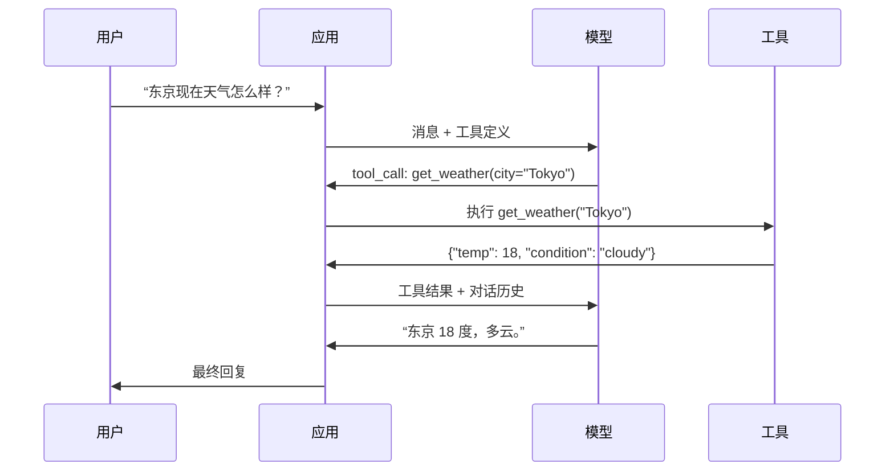

# 函数调用与工具使用（Function Calling & Tool Use）

> 大语言模型（LLM）本身什么都做不了。它们只会生成文本。这就是它们全部的能力。它们不能查天气、查询数据库、发送邮件、运行代码或读取文件。你见过的每一个“AI 智能体（agent）”，本质上都是 LLM 在生成一段 JSON，说明要调用哪个函数——然后由你的代码真正去执行它。模型是大脑，工具是双手，函数调用就是连接它们的神经系统。

**类型：** Build
**语言：** Python
**前置知识：** Phase 11 Lesson 03（结构化输出）
**时间：** 约 75 分钟
**相关内容：** Phase 11 · 14（模型上下文协议）—— 当某个工具需要在多个宿主之间共享时，你应该从内敛式函数调用升级到 MCP 服务器。本课介绍内敛式情况，MCP 则介绍协议化情况。

## 学习目标

- 实现一个函数调用循环：定义工具模式（tool schema）、解析模型的工具调用 JSON、执行函数、返回结果
- 设计描述清晰、参数类型明确的工具模式，让模型能够稳定可靠地调用
- 构建一个多轮智能体循环，通过链式多次函数调用来回答复杂查询
- 处理函数调用的边界情况：并行工具调用、错误传播以及防止无限工具循环

## 问题所在

你做了一个聊天机器人。用户问：“东京现在天气怎么样？”

模型回答：“我无法获取实时天气数据，但根据季节判断，东京可能在 15 摄氏度左右……”

这是一种披着免责声明的幻觉（hallucination）。模型并不知道天气，也永远不会知道。天气每小时都在变，而模型的训练数据是几个月前的。

正确答案需要调用 OpenWeatherMap API，获取当前温度，再返回真实数字。模型不能调用 API，但你的代码可以。缺失的环节是一种结构化协议：让模型说出“我需要用这些参数调用天气 API”，然后由你的代码执行，并把结果反馈回去。

这就是函数调用（function calling）。模型输出结构化 JSON，描述要调用哪个函数、传入哪些参数；你的应用执行该函数；结果回到对话中；模型再用它生成最终答案。

没有函数调用，LLM 只是百科全书；有了它，它们才成为智能体。

## 核心概念

### 函数调用循环

每一次工具使用交互都遵循相同的 5 步循环。



第 1 步：用户发送消息。第 2 步：模型收到消息以及工具定义（用 JSON Schema 描述可用函数）。第 3 步：模型不是直接回复文本，而是输出一个工具调用——一个结构化的 JSON 对象，包含函数名和参数。第 4 步：你的代码执行该函数并捕获结果。第 5 步：结果返回给模型，模型现在有了真实数据来生成最终答案。

模型永远不会执行任何操作。它只决定调用什么、用什么参数调用。你的代码才是真正的执行者。

### 工具定义：JSON Schema 契约

每个工具都由一个 JSON Schema 定义，它告诉模型这个函数是做什么的、接受哪些参数、这些参数必须是什么类型。

```json
{
  "type": "function",
  "function": {
    "name": "get_weather",
    "description": "Get current weather for a city. Returns temperature in Celsius and conditions.",
    "parameters": {
      "type": "object",
      "properties": {
        "city": {
          "type": "string",
          "description": "City name, e.g. 'Tokyo' or 'San Francisco'"
        },
        "units": {
          "type": "string",
          "enum": ["celsius", "fahrenheit"],
          "description": "Temperature units"
        }
      },
      "required": ["city"]
    }
  }
}
```

`description` 字段至关重要。模型通过它来决定何时以及如何使用工具。像 “gets weather” 这样模糊的描述，会比 “Get current weather for a city. Returns temperature in Celsius and conditions.” 产生更差的工具选择效果。描述就是用于工具选择的提示词。

### 各平台对比

所有主流提供商都支持函数调用，但 API 表面有所不同。

| 提供商 | API 参数 | 工具调用格式 | 并行调用 | 强制调用 |
|----------|--------------|-----------------|---------------|----------------|
| OpenAI (GPT-5, o4) | `tools` | `tool_calls[].function` | 是（每轮多个） | `tool_choice="required"` |
| Anthropic (Claude 4.6/4.7) | `tools` | `content[].type="tool_use"` | 是（多个块） | `tool_choice={"type":"any"}` |
| Google (Gemini 3) | `function_declarations` | `functionCall` | 是 | `function_calling_config` |
| 开源模型 (Llama 4, Qwen3, DeepSeek-V3) | Llama 4 原生支持 `tools`；其他使用 Hermes 或 ChatML | 混合 | 取决于模型 | 基于提示词或 `tool_choice`（若支持） |

到 2026 年，三家闭源提供商已经收敛到几乎相同的基于 JSON Schema 的格式。Llama 4 自带原生 `tools` 字段，形状与 OpenAI 一致。开源微调模型仍然参差不齐——NousResearch 的 Hermes 格式是第三方微调中最常见的。如果需要在多个宿主之间共享工具，优先选择 MCP（Phase 11 · 14），而不是内敛式函数调用——服务器对所有人都是一样的。

### 工具选择：Auto、Required、Specific

你可以控制模型在什么时候使用工具。

**Auto**（默认）：模型自己决定是否调用工具或直接回复。“2+2 等于几？”——直接回复。“天气怎么样？”——调用工具。

**Required**：模型必须至少调用一个工具。当你确定用户意图需要工具时使用。可以防止模型在应该查询真实数据时胡乱猜测。

**指定函数**：强制模型调用某个特定函数。`tool_choice={"type":"function", "function": {"name": "get_weather"}}` 会保证无论查询是什么，都会调用天气工具。适用于路由场景——上游逻辑已经决定了需要哪个工具。

### 并行函数调用

GPT-4o 和 Claude 可以在单轮中同时调用多个函数。用户问：“东京和纽约天气怎么样？”模型会同时输出两个工具调用：

```json
[
  {"name": "get_weather", "arguments": {"city": "Tokyo"}},
  {"name": "get_weather", "arguments": {"city": "New York"}}
]
```

你的代码同时执行这两个调用（最好并发），返回两个结果，然后模型综合成单一回复。这能把往返次数从 2 次降到 1 次。对于每轮查询需要 5-10 次工具调用的智能体，并行调用可以降低 60-80% 的延迟。

### 结构化输出 vs 函数调用

第 03 课讲过结构化输出（structured outputs）。函数调用使用同样的 JSON Schema 机制，但目的不同。

**结构化输出**：强制模型按特定格式生成数据。输出就是最终产物。例如：从文本中提取产品信息为 `{name, price, in_stock}`。

**函数调用**：模型声明执行某个动作的意图。输出只是一个中间步骤。例如：`get_weather(city="Tokyo")`——模型是在请求执行一个动作，而不是生成最终答案。

需要数据提取时用结构化输出；需要模型与外部系统交互时用函数调用。

### 安全：不可妥协的规则

函数调用是你能赋予 LLM 的最危险的能力。模型选择执行什么。如果你的工具集包含数据库查询，模型就会构造查询；如果包含 shell 命令，模型就会写出命令。

**规则 1：绝对不要把模型生成的 SQL 直接传给数据库。** 模型完全可能生成 `DROP TABLE`、UNION 注入，或者返回所有行的查询。始终参数化、始终验证、始终使用操作白名单。

**规则 2：函数白名单。** 模型只能调用你显式定义的函数。永远不要构建一个“按名字执行任意函数”的通用工具。如果你有 50 个内部函数，只暴露用户需要的那 5 个。

**规则 3：验证参数。** 模型可能传入城市名 `"; DROP TABLE users; --"`。在执行前，必须根据期望的类型、范围和格式验证每个参数。

**规则 4：净化工具结果。** 如果工具返回敏感数据（API 密钥、个人身份信息、内部错误），在返回给模型之前先过滤。模型会原封不动地把工具结果包含进回复中。

**规则 5：限制工具调用速率。** 处于循环中的模型可能调用工具数百次。设置一个上限（每次对话 10-20 次比较合理），防止无限循环。

### 错误处理

工具会失败。API 会超时。数据库会宕机。文件可能不存在。模型需要知道工具何时失败以及原因。

把错误作为结构化的工具结果返回，而不是抛出异常：

```json
{
  "error": true,
  "message": "City 'Toky' not found. Did you mean 'Tokyo'?",
  "code": "CITY_NOT_FOUND"
}
```

模型读取到这个结果后会调整参数并重试。模型擅长从结构化错误信息中自我修复，但面对空响应或“出错了”这种泛泛错误时很难恢复。

### MCP：模型上下文协议

MCP 是 Anthropic 提出的工具互操作性开放标准。与其让每个应用自己定义工具，MCP 提供了一种通用协议：工具由 MCP 服务器提供，由 MCP 客户端（如 Claude Code、Cursor 或你自己的应用）消费。

一个 MCP 服务器可以把工具暴露给任何兼容的客户端。Postgres MCP 服务器让任何兼容 MCP 的智能体都能访问数据库。GitHub MCP 服务器让任何智能体都能访问仓库。工具定义一次，到处使用。

MCP 之于函数调用，就像 HTTP 之于网络。它标准化了传输层，使工具变得可移植。

## 动手实现

### 第 1 步：定义工具注册表

构建一个注册表，保存工具定义及其实现。每个工具都包含一个 JSON Schema 定义（模型看到的）和一个 Python 函数（你的代码执行的）。

```python
import json
import math
import time
import hashlib


TOOL_REGISTRY = {}


def register_tool(name, description, parameters, function):
    TOOL_REGISTRY[name] = {
        "definition": {
            "type": "function",
            "function": {
                "name": name,
                "description": description,
                "parameters": parameters,
            },
        },
        "function": function,
    }
```

### 第 2 步：实现 5 个工具

构建一个计算器、天气查询、网页搜索模拟器、文件读取器和代码运行器。

```python
def calculator(expression, precision=2):
    allowed = set("0123456789+-*/.() ")
    if not all(c in allowed for c in expression):
        return {"error": True, "message": f"Invalid characters in expression: {expression}"}
    try:
        result = eval(expression, {"__builtins__": {}}, {"math": math})
        return {"result": round(float(result), precision), "expression": expression}
    except Exception as e:
        return {"error": True, "message": str(e)}


WEATHER_DB = {
    "tokyo": {"temp_c": 18, "condition": "cloudy", "humidity": 72, "wind_kph": 14},
    "new york": {"temp_c": 22, "condition": "sunny", "humidity": 45, "wind_kph": 8},
    "london": {"temp_c": 12, "condition": "rainy", "humidity": 88, "wind_kph": 22},
    "san francisco": {"temp_c": 16, "condition": "foggy", "humidity": 80, "wind_kph": 18},
    "sydney": {"temp_c": 25, "condition": "sunny", "humidity": 55, "wind_kph": 10},
}


def get_weather(city, units="celsius"):
    key = city.lower().strip()
    if key not in WEATHER_DB:
        suggestions = [c for c in WEATHER_DB if c.startswith(key[:3])]
        return {
            "error": True,
            "message": f"City '{city}' not found.",
            "suggestions": suggestions,
            "code": "CITY_NOT_FOUND",
        }
    data = WEATHER_DB[key].copy()
    if units == "fahrenheit":
        data["temp_f"] = round(data["temp_c"] * 9 / 5 + 32, 1)
        del data["temp_c"]
    data["city"] = city
    return data


SEARCH_DB = {
    "python function calling": [
        {"title": "OpenAI Function Calling Guide", "url": "https://platform.openai.com/docs/guides/function-calling", "snippet": "Learn how to connect LLMs to external tools."},
        {"title": "Anthropic Tool Use", "url": "https://docs.anthropic.com/en/docs/tool-use", "snippet": "Claude can interact with external tools and APIs."},
    ],
    "MCP protocol": [
        {"title": "Model Context Protocol", "url": "https://modelcontextprotocol.io", "snippet": "An open standard for connecting AI models to data sources."},
    ],
    "weather API": [
        {"title": "OpenWeatherMap API", "url": "https://openweathermap.org/api", "snippet": "Free weather API with current, forecast, and historical data."},
    ],
}


def web_search(query, max_results=3):
    key = query.lower().strip()
    for db_key, results in SEARCH_DB.items():
        if db_key in key or key in db_key:
            return {"query": query, "results": results[:max_results], "total": len(results)}
    return {"query": query, "results": [], "total": 0}


FILE_SYSTEM = {
    "data/config.json": '{"model": "gpt-4o", "temperature": 0.7, "max_tokens": 4096}',
    "data/users.csv": "name,email,role\nAlice,alice@example.com,admin\nBob,bob@example.com,user",
    "README.md": "# My Project\nA tool-use agent built from scratch.",
}


def read_file(path):
    if ".." in path or path.startswith("/"):
        return {"error": True, "message": "Path traversal not allowed.", "code": "FORBIDDEN"}
    if path not in FILE_SYSTEM:
        available = list(FILE_SYSTEM.keys())
        return {"error": True, "message": f"File '{path}' not found.", "available_files": available, "code": "NOT_FOUND"}
    content = FILE_SYSTEM[path]
    return {"path": path, "content": content, "size_bytes": len(content), "lines": content.count("\n") + 1}


def run_code(code, language="python"):
    if language != "python":
        return {"error": True, "message": f"Language '{language}' not supported. Only 'python' is available."}
    forbidden = ["import os", "import sys", "import subprocess", "exec(", "eval(", "__import__", "open("]
    for pattern in forbidden:
        if pattern in code:
            return {"error": True, "message": f"Forbidden operation: {pattern}", "code": "SECURITY_VIOLATION"}
    try:
        local_vars = {}
        exec(code, {"__builtins__": {"print": print, "range": range, "len": len, "str": str, "int": int, "float": float, "list": list, "dict": dict, "sum": sum, "min": min, "max": max, "abs": abs, "round": round, "sorted": sorted, "enumerate": enumerate, "zip": zip, "map": map, "filter": filter, "math": math}}, local_vars)
        result = local_vars.get("result", None)
        return {"success": True, "result": result, "variables": {k: str(v) for k, v in local_vars.items() if not k.startswith("_")}}
    except Exception as e:
        return {"error": True, "message": f"{type(e).__name__}: {e}"}
```

### 第 3 步：注册所有工具

```python
def register_all_tools():
    register_tool(
        "calculator", "Evaluate a mathematical expression. Supports +, -, *, /, parentheses, and decimals. Returns the numeric result.",
        {"type": "object", "properties": {"expression": {"type": "string", "description": "Math expression, e.g. '(10 + 5) * 3'"}, "precision": {"type": "integer", "description": "Decimal places in result", "default": 2}}, "required": ["expression"]},
        calculator,
    )
    register_tool(
        "get_weather", "Get current weather for a city. Returns temperature, condition, humidity, and wind speed.",
        {"type": "object", "properties": {"city": {"type": "string", "description": "City name, e.g. 'Tokyo' or 'San Francisco'"}, "units": {"type": "string", "enum": ["celsius", "fahrenheit"], "description": "Temperature units, defaults to celsius"}}, "required": ["city"]},
        get_weather,
    )
    register_tool(
        "web_search", "Search the web for information. Returns a list of results with title, URL, and snippet.",
        {"type": "object", "properties": {"query": {"type": "string", "description": "Search query"}, "max_results": {"type": "integer", "description": "Maximum results to return", "default": 3}}, "required": ["query"]},
        web_search,
    )
    register_tool(
        "read_file", "Read the contents of a file. Returns the file content, size, and line count.",
        {"type": "object", "properties": {"path": {"type": "string", "description": "Relative file path, e.g. 'data/config.json'"}}, "required": ["path"]},
        read_file,
    )
    register_tool(
        "run_code", "Execute Python code in a sandboxed environment. Set a 'result' variable to return output.",
        {"type": "object", "properties": {"code": {"type": "string", "description": "Python code to execute"}, "language": {"type": "string", "enum": ["python"], "description": "Programming language"}}, "required": ["code"]},
        run_code,
    )
```

### 第 4 步：构建函数调用循环

这是核心引擎。它模拟模型决定调用哪个工具、执行工具、并将结果反馈回去。

```python
def simulate_model_decision(user_message, tools, conversation_history):
    msg = user_message.lower()

    if any(word in msg for word in ["weather", "temperature", "forecast"]):
        cities = []
        for city in WEATHER_DB:
            if city in msg:
                cities.append(city)
        if not cities:
            for word in msg.split():
                if word.capitalize() in [c.title() for c in WEATHER_DB]:
                    cities.append(word)
        if not cities:
            cities = ["tokyo"]
        calls = []
        for city in cities:
            calls.append({"name": "get_weather", "arguments": {"city": city.title()}})
        return calls

    if any(word in msg for word in ["calculate", "compute", "math", "what is", "how much"]):
        for token in msg.split():
            if any(c in token for c in "+-*/"):
                return [{"name": "calculator", "arguments": {"expression": token}}]
        if "+" in msg or "-" in msg or "*" in msg or "/" in msg:
            expr = "".join(c for c in msg if c in "0123456789+-*/.() ")
            if expr.strip():
                return [{"name": "calculator", "arguments": {"expression": expr.strip()}}]
        return [{"name": "calculator", "arguments": {"expression": "0"}}]

    if any(word in msg for word in ["search", "find", "look up", "google"]):
        query = msg.replace("search for", "").replace("look up", "").replace("find", "").strip()
        return [{"name": "web_search", "arguments": {"query": query}}]

    if any(word in msg for word in ["read", "file", "open", "cat", "show"]):
        for path in FILE_SYSTEM:
            if path.split("/")[-1].split(".")[0] in msg:
                return [{"name": "read_file", "arguments": {"path": path}}]
        return [{"name": "read_file", "arguments": {"path": "README.md"}}]

    if any(word in msg for word in ["run", "execute", "code", "python"]):
        return [{"name": "run_code", "arguments": {"code": "result = 'Hello from the sandbox!'", "language": "python"}}]

    return []


def execute_tool_call(tool_call):
    name = tool_call["name"]
    args = tool_call["arguments"]

    if name not in TOOL_REGISTRY:
        return {"error": True, "message": f"Unknown tool: {name}", "code": "UNKNOWN_TOOL"}

    tool = TOOL_REGISTRY[name]
    func = tool["function"]
    start = time.time()

    try:
        result = func(**args)
    except TypeError as e:
        result = {"error": True, "message": f"Invalid arguments: {e}"}

    elapsed_ms = round((time.time() - start) * 1000, 2)
    return {"tool": name, "result": result, "execution_time_ms": elapsed_ms}


def run_function_calling_loop(user_message, max_iterations=5):
    conversation = [{"role": "user", "content": user_message}]
    tool_definitions = [t["definition"] for t in TOOL_REGISTRY.values()]
    all_tool_results = []

    for iteration in range(max_iterations):
        tool_calls = simulate_model_decision(user_message, tool_definitions, conversation)

        if not tool_calls:
            break

        results = []
        for call in tool_calls:
            result = execute_tool_call(call)
            results.append(result)

        conversation.append({"role": "assistant", "content": None, "tool_calls": tool_calls})

        for result in results:
            conversation.append({"role": "tool", "content": json.dumps(result["result"]), "tool_name": result["tool"]})

        all_tool_results.extend(results)
        break

    return {"conversation": conversation, "tool_results": all_tool_results, "iterations": iteration + 1 if tool_calls else 0}
```

### 第 5 步：参数验证

构建一个验证器，在执行前根据 JSON Schema 检查工具调用参数。

```python
def validate_tool_arguments(tool_name, arguments):
    if tool_name not in TOOL_REGISTRY:
        return [f"Unknown tool: {tool_name}"]

    schema = TOOL_REGISTRY[tool_name]["definition"]["function"]["parameters"]
    errors = []

    if not isinstance(arguments, dict):
        return [f"Arguments must be an object, got {type(arguments).__name__}"]

    for required_field in schema.get("required", []):
        if required_field not in arguments:
            errors.append(f"Missing required argument: {required_field}")

    properties = schema.get("properties", {})
    for arg_name, arg_value in arguments.items():
        if arg_name not in properties:
            errors.append(f"Unknown argument: {arg_name}")
            continue

        prop_schema = properties[arg_name]
        expected_type = prop_schema.get("type")

        type_checks = {"string": str, "integer": int, "number": (int, float), "boolean": bool, "array": list, "object": dict}
        if expected_type in type_checks:
            if not isinstance(arg_value, type_checks[expected_type]):
                errors.append(f"Argument '{arg_name}': expected {expected_type}, got {type(arg_value).__name__}")

        if "enum" in prop_schema and arg_value not in prop_schema["enum"]:
            errors.append(f"Argument '{arg_name}': '{arg_value}' not in {prop_schema['enum']}")

    return errors
```

### 第 6 步：运行演示

```python
def run_demo():
    register_all_tools()

    print("=" * 60)
    print("  Function Calling & Tool Use Demo")
    print("=" * 60)

    print("\n--- Registered Tools ---")
    for name, tool in TOOL_REGISTRY.items():
        desc = tool["definition"]["function"]["description"][:60]
        params = list(tool["definition"]["function"]["parameters"].get("properties", {}).keys())
        print(f"  {name}: {desc}...")
        print(f"    params: {params}")

    print(f"\n--- Argument Validation ---")
    validation_tests = [
        ("get_weather", {"city": "Tokyo"}, "Valid call"),
        ("get_weather", {}, "Missing required arg"),
        ("get_weather", {"city": "Tokyo", "units": "kelvin"}, "Invalid enum value"),
        ("calculator", {"expression": 123}, "Wrong type (int for string)"),
        ("unknown_tool", {"x": 1}, "Unknown tool"),
    ]
    for tool_name, args, label in validation_tests:
        errors = validate_tool_arguments(tool_name, args)
        status = "VALID" if not errors else f"ERRORS: {errors}"
        print(f"  {label}: {status}")

    print(f"\n--- Tool Execution ---")
    direct_tests = [
        {"name": "calculator", "arguments": {"expression": "(10 + 5) * 3 / 2"}},
        {"name": "get_weather", "arguments": {"city": "Tokyo"}},
        {"name": "get_weather", "arguments": {"city": "Mars"}},
        {"name": "web_search", "arguments": {"query": "python function calling"}},
        {"name": "read_file", "arguments": {"path": "data/config.json"}},
        {"name": "read_file", "arguments": {"path": "../etc/passwd"}},
        {"name": "run_code", "arguments": {"code": "result = sum(range(1, 101))"}},
        {"name": "run_code", "arguments": {"code": "import os; os.system('rm -rf /')"}},
    ]
    for call in direct_tests:
        result = execute_tool_call(call)
        print(f"\n  {call['name']}({json.dumps(call['arguments'])})")
        print(f"    -> {json.dumps(result['result'], indent=None)[:100]}")
        print(f"    time: {result['execution_time_ms']}ms")

    print(f"\n--- Full Function Calling Loop ---")
    test_queries = [
        "What's the weather in Tokyo?",
        "Calculate (100 + 250) * 0.15",
        "Search for MCP protocol",
        "Read the config file",
        "Run some Python code",
        "Tell me a joke",
    ]
    for query in test_queries:
        print(f"\n  User: {query}")
        result = run_function_calling_loop(query)
        if result["tool_results"]:
            for tr in result["tool_results"]:
                print(f"    Tool: {tr['tool']} ({tr['execution_time_ms']}ms)")
                print(f"    Result: {json.dumps(tr['result'], indent=None)[:90]}")
        else:
            print(f"    [No tool called -- direct response]")
        print(f"    Iterations: {result['iterations']}")

    print(f"\n--- Parallel Tool Calls ---")
    multi_city_query = "What's the weather in tokyo and london?"
    print(f"  User: {multi_city_query}")
    result = run_function_calling_loop(multi_city_query)
    print(f"  Tool calls made: {len(result['tool_results'])}")
    for tr in result["tool_results"]:
        city = tr["result"].get("city", "unknown")
        temp = tr["result"].get("temp_c", "N/A")
        print(f"    {city}: {temp}C, {tr['result'].get('condition', 'N/A')}")

    print(f"\n--- Security Checks ---")
    security_tests = [
        ("read_file", {"path": "../../etc/passwd"}),
        ("run_code", {"code": "import subprocess; subprocess.run(['ls'])}"}),
        ("calculator", {"expression": "__import__('os').system('ls')"}),
    ]
    for tool_name, args in security_tests:
        result = execute_tool_call({"name": tool_name, "arguments": args})
        blocked = result["result"].get("error", False)
        print(f"  {tool_name}({list(args.values())[0][:40]}): {'BLOCKED' if blocked else 'ALLOWED'}")
```

## 应用它

### OpenAI 函数调用

```python
# from openai import OpenAI
#
# client = OpenAI()
#
# tools = [{
#     "type": "function",
#     "function": {
#         "name": "get_weather",
#         "description": "Get current weather for a city",
#         "parameters": {
#             "type": "object",
#             "properties": {
#                 "city": {"type": "string"},
#                 "units": {"type": "string", "enum": ["celsius", "fahrenheit"]}
#             },
#             "required": ["city"]
#         }
#     }
# }]
#
# response = client.chat.completions.create(
#     model="gpt-4o",
#     messages=[{"role": "user", "content": "Weather in Tokyo?"}],
#     tools=tools,
#     tool_choice="auto",
# )
#
# tool_call = response.choices[0].message.tool_calls[0]
# args = json.loads(tool_call.function.arguments)
# result = get_weather(**args)
#
# final = client.chat.completions.create(
#     model="gpt-4o",
#     messages=[
#         {"role": "user", "content": "Weather in Tokyo?"},
#         response.choices[0].message,
#         {"role": "tool", "tool_call_id": tool_call.id, "content": json.dumps(result)},
#     ],
# )
# print(final.choices[0].message.content)
```

OpenAI 返回的工具调用位于 `response.choices[0].message.tool_calls`。每个调用都有一个 `id`，返回结果时必须包含它，模型靠这个 ID 把结果和调用对应起来。GPT-4o 可以在单次响应中返回多个工具调用——遍历并全部执行即可。

### Anthropic 工具使用

```python
# import anthropic
#
# client = anthropic.Anthropic()
#
# response = client.messages.create(
#     model="claude-sonnet-4-20250514",
#     max_tokens=1024,
#     tools=[{
#         "name": "get_weather",
#         "description": "Get current weather for a city",
#         "input_schema": {
#             "type": "object",
#             "properties": {
#                 "city": {"type": "string"},
#                 "units": {"type": "string", "enum": ["celsius", "fahrenheit"]}
#             },
#             "required": ["city"]
#         }
#     }],
#     messages=[{"role": "user", "content": "Weather in Tokyo?"}],
# )
#
# tool_block = next(b for b in response.content if b.type == "tool_use")
# result = get_weather(**tool_block.input)
#
# final = client.messages.create(
#     model="claude-sonnet-4-20250514",
#     max_tokens=1024,
#     tools=[...],
#     messages=[
#         {"role": "user", "content": "Weather in Tokyo?"},
#         {"role": "assistant", "content": response.content},
#         {"role": "user", "content": [{"type": "tool_result", "tool_use_id": tool_block.id, "content": json.dumps(result)}]},
#     ],
# )
```

Anthropic 返回的工具调用是 `type: "tool_use"` 的内容块（content block）。工具结果放在一条用户消息中，类型为 `type: "tool_result"`。注意关键区别：Anthropic 使用 `input_schema` 定义工具参数，而 OpenAI 使用 `parameters`。

### MCP 集成

```python
# MCP servers expose tools over a standardized protocol.
# Any MCP-compatible client can discover and call these tools.
#
# Example: connecting to a Postgres MCP server
#
# from mcp import ClientSession, StdioServerParameters
# from mcp.client.stdio import stdio_client
#
# server_params = StdioServerParameters(
#     command="npx",
#     args=["-y", "@modelcontextprotocol/server-postgres", "postgresql://localhost/mydb"],
# )
#
# async with stdio_client(server_params) as (read, write):
#     async with ClientSession(read, write) as session:
#         await session.initialize()
#         tools = await session.list_tools()
#         result = await session.call_tool("query", {"sql": "SELECT count(*) FROM users"})
```

MCP 把工具实现与工具消费解耦。Postgres 服务器懂 SQL，GitHub 服务器懂 API，你的智能体只需要发现并调用工具——不需要为每个集成写特定于提供商的代码。

## 交付成果

本课会生成 `outputs/prompt-tool-designer.md`——一个可复用的提示词模板，用于设计工具定义。你向它描述想让某个工具做什么，它就会输出完整的 JSON Schema 定义，包括描述、类型和约束。

它还会生成 `outputs/skill-function-calling-patterns.md`——一个用于在生产环境中实现函数调用的决策框架，涵盖工具设计、错误处理、安全和各平台特定模式。

## 练习

1. **添加第 6 个工具：数据库查询。** 实现一个带内存表的模拟 SQL 工具。工具接受表名和过滤条件（不是原始 SQL）。验证表名在白名单中，且过滤操作符仅限于 `=`、`>`、`<`、`>=`、`<=`。将匹配行以 JSON 形式返回。

2. **实现带错误反馈的重试。** 当工具调用失败（例如城市未找到）时，把错误信息反馈给模型决策函数，让它修正参数。记录每个调用重试了多少次。设置每个工具调用最多 3 次重试。

3. **构建一个多步智能体。** 有些查询需要链式工具调用：“读取配置文件，告诉我配置的是什么模型，然后上网搜索该模型的定价。”实现一个循环，在模型决定不再需要工具之前持续运行，并把累积结果传入每一步决策。限制为 10 次迭代，防止无限循环。

4. **测量工具选择准确率。** 创建 30 条测试查询，并标注期望的工具名。在所有查询上运行你的决策函数，统计正确选择工具的百分比。找出最容易让工具之间混淆的查询。

5. **实现工具调用缓存。** 如果同一个工具在 60 秒内以相同参数被调用，直接返回缓存结果而不是重新执行。用字典以 `(tool_name, frozenset(args.items()))` 作为键。在一段包含 20 条查询的对话中测量缓存命中率。

## 关键术语

| 术语 | 俗称 | 实际含义 |
|------|----------------|----------------------|
| Function calling（函数调用） | “工具使用” | 模型输出结构化 JSON，描述要调用哪个函数及参数——由你的代码执行，而非模型自己执行 |
| Tool definition（工具定义） | “函数模式” | 一个 JSON Schema 对象，描述工具的名称、用途、参数和类型——模型据此决定何时以及如何使用该工具 |
| Tool choice（工具选择） | “调用模式” | 控制模型是否必须调用工具（required）、可以调用工具（auto），还是必须调用某个特定工具（named） |
| Parallel calling（并行调用） | “多工具” | 模型在单轮输出多个工具调用，减少往返次数——GPT-4o 和 Claude 都支持 |
| Tool result（工具结果） | “函数输出” | 执行工具后的返回值，作为消息发回模型，让模型能在回复中使用真实数据 |
| Argument validation（参数验证） | “输入检查” | 在执行工具前，验证模型生成的参数是否符合期望的类型、范围和约束 |
| MCP | “工具协议” | Model Context Protocol——Anthropic 的开放标准，通过服务器暴露工具，任何兼容客户端都能发现并调用 |
| Agent loop（智能体循环） | “ReAct 循环” | 模型决定工具、代码执行工具、结果反馈给模型的迭代循环，直到模型获得足够信息来回复 |
| Tool poisoning（工具投毒） | “通过工具进行提示注入” | 工具结果中包含操纵模型行为的指令——必须净化所有工具输出 |
| Rate limiting（速率限制） | “调用预算” | 为每次对话设置最大工具调用次数，防止无限循环和失控的 API 费用 |

## 延伸阅读

- [OpenAI Function Calling Guide](https://platform.openai.com/docs/guides/function-calling) —— GPT-4o 工具使用的权威参考，包括并行调用、强制调用和结构化参数
- [Anthropic Tool Use Guide](https://docs.anthropic.com/en/docs/tool-use) —— Claude 的工具使用实现，涵盖 input_schema、多工具响应和 tool_choice 配置
- [Model Context Protocol Specification](https://modelcontextprotocol.io) —— AI 应用间工具互操作的开放标准，包含服务器/客户端架构
- [Schick et al., 2023 -- "Toolformer: Language Models Can Teach Themselves to Use Tools"](https://arxiv.org/abs/2302.04761) —— 训练 LLM 自主决定何时以及如何调用外部工具的基础论文
- [Patil et al., 2023 -- "Gorilla: Large Language Model Connected with Massive APIs"](https://arxiv.org/abs/2305.15334) —— 针对 1,645 个 API 进行精确 API 调用微调的 LLM，并减少幻觉
- [Berkeley Function Calling Leaderboard](https://gorilla.cs.berkeley.edu/leaderboard.html) —— 实时对比 GPT-4o、Claude、Gemini 和开源模型函数调用准确率的基准
- [Yao et al., "ReAct: Synergizing Reasoning and Acting in Language Models" (ICLR 2023)](https://arxiv.org/abs/2210.03629) —— 围绕每一次工具调用的“思考-行动-观察”外部智能体循环；本课到此结束，Phase 14 将继续深入
- [Anthropic — Building effective agents (Dec 2024)](https://www.anthropic.com/research/building-effective-agents) —— 从单一工具使用原语构建出的五种可组合模式：提示链、路由、并行化、编排器-工作者、评估器-优化器
